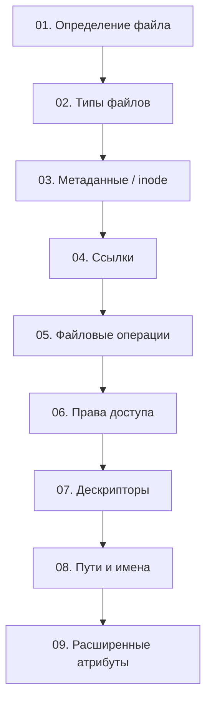

# Часть I. Файлы как элемент файловой системы

## О чём эта часть

Первая часть посвящена файлам **«снаружи»**: как операционная система видит, организует и защищает файлы.

### Файл — это не только данные

Когда разработчик слышит «файл», он обычно думает о **содержимом** — тексте, коде, изображении. Но для операционной системы файл — это целая **инфраструктура**:

```
┌────────────────────────────────────────────────────────────┐
│                        ФАЙЛ                                │
├────────────────────────────────────────────────────────────┤
│                                                            │
│  ┌──────────────┐  ┌──────────────┐  ┌──────────────┐      │
│  │    Имя       │  │   Данные     │  │  Метаданные  │      │
│  │ (в каталоге) │  │ (на диске)   │  │  (в inode)   │      │
│  └──────────────┘  └──────────────┘  └──────────────┘      │
│                                                            │
│  ┌──────────────┐  ┌──────────────┐  ┌──────────────┐      │
│  │   Права      │  │ Дескрипторы  │  │   Ссылки     │      │
│  │  доступа     │  │   (fd)       │  │ hard/soft    │      │
│  └──────────────┘  └──────────────┘  └──────────────┘      │
│                                                            │
└────────────────────────────────────────────────────────────┘
```

Каждый из этих элементов — отдельная тема. В этой части мы разберём их все.

### Что мы изучим

1. **Формальное определение файла** — что такое файл с точки зрения ОС, чем он отличается от директории, сокета, устройства

2. **Типы файлов** — 7 типов файлов Unix (regular, directory, symlink, block/char device, pipe, socket) и их содержимое

3. **Метаданные и inode** — структура inode, временные метки, размер, владелец — всё, что хранит ФС помимо данных

4. **Ссылки** — hard links и symbolic links: как один файл может иметь несколько имён, и чем указатель отличается от копии

5. **Файловые операции** — создание, копирование, перемещение, удаление. Почему `mv` мгновенный, а `cp` — нет

6. **Права доступа** — модель rwx, chmod, chown, SUID/SGID, sticky bit, umask

7. **Дескрипторы** — файловые дескрипторы, таблица процесса, stdin/stdout/stderr — мост между файлами и программами

8. **Пути и имена** — абсолютные и относительные пути, ограничения имён, Unicode в именах файлов

9. **Расширенные атрибуты** — xattr, ACL, SELinux/AppArmor, file capabilities — механизмы безопасности поверх базовой модели

### Практическая ценность

Понимание файлового уровня ОС критично для:

- **Разработчиков** — правильная работа с дескрипторами, обработка ошибок, переносимый код
- **Системных администраторов** — диагностика проблем с правами, ссылками, inode
- **DevOps-инженеров** — автоматизация файловых операций, настройка прав в контейнерах
- **Data-инженеров** — понимание ограничений ФС при работе с большими объёмами файлов

## Структура части

| № | Раздел | Описание |
|---|--------|----------|
| 01 | [Что такое файл](01-file-definition.md) | Формальное определение, файл vs другие объекты ФС |
| 02 | [Типы файлов](02-file-types-content.md) | 7 типов файлов Unix, содержимое каждого типа |
| 03 | [Метаданные и inode](03-metadata-inode.md) | Структура inode, `stat`, временные метки |
| 04 | [Ссылки](04-links.md) | Hard links, symbolic links, счётчик ссылок |
| 05 | [Файловые операции](05-file-operations.md) | touch, cp, mv, rm, mkdir — что происходит «под капотом» |
| 06 | [Права доступа](06-permissions.md) | rwx, chmod, chown, SUID/SGID, umask |
| 07 | [Дескрипторы](07-descriptors.md) | File descriptors, таблица процесса, stdin/stdout/stderr |
| 08 | [Пути и имена](08-paths-names.md) | Абсолютные/относительные пути, ограничения имён |
| 09 | [Расширенные атрибуты](09-extended-attrs.md) | xattr, ACL, SELinux, AppArmor |

## Карта части



!!! abstract "Везде, где уместно, сравниваем Unix/Linux и Windows"
    Основной фокус — POSIX-совместимые системы (Linux, macOS, FreeBSD), но для каждой темы мы показываем, как те же концепции реализованы в Windows (NTFS, ACL, Security Descriptors).

---

Начнём с фундамента — [что такое файл](01-file-definition.md) с точки зрения операционной системы.
