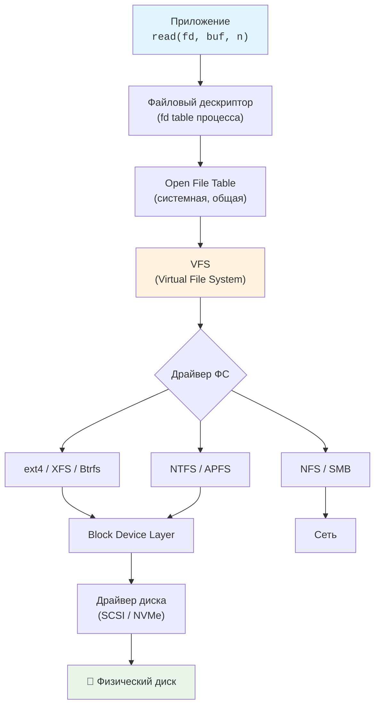

# Глава 7. Дескрипторы и потоки

## Введение

До сих пор мы говорили о файлах как о статических объектах в файловой системе. Но как **процессы** работают с файлами? Как программа читает и пишет данные?

Для этого используются **файловые дескрипторы** (file descriptors, fd).

!!! note "Ключевая идея"
    Файловый дескриптор — это **число**, которое процесс использует для обращения к открытому файлу. Это уровень абстракции между программой и ядром.

### Путь байта: от приложения до диска



---

## 7.1 Что такое файловый дескриптор

### Определение

**Файловый дескриптор (fd)** — это неотрицательное целое число, которое ядро присваивает открытому файлу в контексте процесса.

```
┌─────────────────────────────────────────────────────────────┐
│                     Процесс (PID 1234)                      │
├─────────────────────────────────────────────────────────────┤
│  Таблица файловых дескрипторов:                             │
│                                                             │
│    fd │ Указывает на                                        │
│   ────┼───────────────────────────────────────              │
│    0  │ → stdin  (терминал /dev/pts/0)                      │
│    1  │ → stdout (терминал /dev/pts/0)                      │
│    2  │ → stderr (терминал /dev/pts/0)                      │
│    3  │ → /home/user/data.txt (открыт для чтения)           │
│    4  │ → /var/log/app.log (открыт для записи)              │
│    5  │ → socket (соединение с сервером)                    │
└─────────────────────────────────────────────────────────────┘
```

### Стандартные дескрипторы

Каждый процесс при запуске получает три открытых дескриптора:

| fd | Имя | Константа | Назначение |
|----|-----|-----------|------------|
| 0 | stdin | STDIN_FILENO | Стандартный ввод (standard input) |
| 1 | stdout | STDOUT_FILENO | Стандартный вывод (standard output) |
| 2 | stderr | STDERR_FILENO | Стандартный вывод ошибок (standard error) |

=== "Linux"

    ```bash
    # Просмотр дескрипторов текущего shell-процесса
    $ ls -l /proc/$$/fd
    lrwx------ 1 user user 64 Feb  4 10:00 0 -> /dev/pts/0
    lrwx------ 1 user user 64 Feb  4 10:00 1 -> /dev/pts/0
    lrwx------ 1 user user 64 Feb  4 10:00 2 -> /dev/pts/0
    
    # Или через lsof
    $ lsof -p $$
    ```

=== "FreeBSD / macOS"

    ```bash
    # Просмотр дескрипторов через fstat
    $ fstat -p $$
    USER     CMD          PID   FD MOUNT      INUM MODE
    user     bash        1234    0 /dev         12 crw--w----
    user     bash        1234    1 /dev         12 crw--w----
    user     bash        1234    2 /dev         12 crw--w----
    
    # Или через lsof (устанавливается отдельно на FreeBSD)
    $ lsof -p $$
    ```

### Жизненный цикл дескриптора

```
open() ──────► использование ──────► close()
   │               │                    │
   │               │                    │
   ▼               ▼                    ▼
ядро выделяет   read(fd, ...)      ядро освобождает
   fd           write(fd, ...)          fd
```

---

## 7.2 Открытие и закрытие файлов

### Системный вызов open()

```c
#include <fcntl.h>

// Открыть для чтения
int fd = open("file.txt", O_RDONLY);

// Открыть для записи (создать если нет, обрезать если есть)
int fd = open("file.txt", O_WRONLY | O_CREAT | O_TRUNC, 0644);

// Открыть для добавления
int fd = open("log.txt", O_WRONLY | O_CREAT | O_APPEND, 0644);

// Закрыть
close(fd);
```

**Флаги открытия:**

| Флаг | Описание |
|------|----------|
| O_RDONLY | Только чтение |
| O_WRONLY | Только запись |
| O_RDWR | Чтение и запись |
| O_CREAT | Создать если не существует |
| O_TRUNC | Обрезать до нуля |
| O_APPEND | Писать в конец |
| O_EXCL | Ошибка если файл существует (с O_CREAT) |

### Python: open() и файловые объекты

```python
# Высокоуровневый API (рекомендуется)
with open('file.txt', 'r') as f:
    content = f.read()

# Получить fd из файлового объекта
f = open('file.txt', 'r')
print(f.fileno())  # 3 (или другое число)
f.close()

# Низкоуровневый API (os module)
import os
fd = os.open('file.txt', os.O_RDONLY)
data = os.read(fd, 1024)
os.close(fd)
```

### Нумерация дескрипторов

Ядро всегда выделяет **минимальный свободный номер**:

```python
import os

fd1 = os.open('a.txt', os.O_RDONLY)  # fd = 3
fd2 = os.open('b.txt', os.O_RDONLY)  # fd = 4
fd3 = os.open('c.txt', os.O_RDONLY)  # fd = 5

os.close(fd2)  # Освободили fd = 4

fd4 = os.open('d.txt', os.O_RDONLY)  # fd = 4 (переиспользован!)
```

---

## 7.3 Чтение и запись

### Системные вызовы read() и write()

```c
#include <unistd.h>

char buffer[1024];

// Чтение: вернёт количество прочитанных байт
ssize_t bytes_read = read(fd, buffer, sizeof(buffer));

// Запись: вернёт количество записанных байт
ssize_t bytes_written = write(fd, "Hello", 5);
```

### Позиция в файле (file offset)

Каждый открытый файл имеет текущую позицию:

```c
#include <unistd.h>

// Получить текущую позицию
off_t pos = lseek(fd, 0, SEEK_CUR);

// Перейти в начало
lseek(fd, 0, SEEK_SET);

// Перейти в конец
lseek(fd, 0, SEEK_END);

// Перейти на 100 байт от текущей позиции
lseek(fd, 100, SEEK_CUR);
```

```python
# Python
f = open('file.txt', 'r')
f.tell()        # Текущая позиция
f.seek(0)       # В начало
f.seek(0, 2)    # В конец (2 = SEEK_END)
f.seek(100, 1)  # +100 от текущей (1 = SEEK_CUR)
```

---

## 7.4 Перенаправление в Shell

### Базовое перенаправление

```bash
# Перенаправить stdout в файл
$ command > output.txt

# Перенаправить stdout (добавление)
$ command >> output.txt

# Перенаправить stdin из файла
$ command < input.txt

# Перенаправить stderr в файл
$ command 2> errors.txt

# Перенаправить stdout и stderr в один файл
$ command > all.txt 2>&1
$ command &> all.txt      # Bash shortcut
```

### Что происходит при перенаправлении

```bash
$ echo "Hello" > output.txt

# Shell выполняет:
# 1. fork() — создаёт дочерний процесс
# 2. В дочернем процессе:
#    close(1)                      # Закрыть stdout
#    open("output.txt", O_WRONLY|O_CREAT|O_TRUNC, 0644)  # Открыть файл (получит fd=1!)
# 3. exec("echo", "Hello")        # Запустить echo
# 4. echo пишет в fd=1, не зная что это файл
```

### Дублирование дескрипторов

```bash
# 2>&1 означает: "fd 2 указывает туда же, куда fd 1"
$ command > output.txt 2>&1

# Порядок важен!
$ command 2>&1 > output.txt   # stderr идёт в терминал!
```

```c
#include <unistd.h>

// dup2(oldfd, newfd) — сделать newfd копией oldfd
dup2(fd, STDOUT_FILENO);  // Теперь stdout указывает на fd
```

### Here documents и here strings

```bash
# Here document
$ cat << EOF
Line 1
Line 2
EOF

# Here string
$ cat <<< "Single line input"
```

---

## 7.5 Pipe: связь между процессами

### Анонимные pipe

```bash
$ ls -la | grep ".txt" | wc -l
```

```
┌─────────────┐    ┌─────────────┐    ┌─────────────┐
│   ls -la    │ ──►│    grep     │ ──►│    wc -l    │
│ stdout=pipe │    │ stdin=pipe  │    │ stdin=pipe  │
│             │    │ stdout=pipe │    │ stdout=tty  │
└─────────────┘    └─────────────┘    └─────────────┘
```

### Как работает pipe

```c
#include <unistd.h>

int pipefd[2];
pipe(pipefd);
// pipefd[0] — для чтения
// pipefd[1] — для записи

// Данные, записанные в pipefd[1], читаются из pipefd[0]
```

```python
import os

# Создание pipe
read_fd, write_fd = os.pipe()

# В родительском процессе
os.write(write_fd, b"Hello from parent")
os.close(write_fd)

# В дочернем процессе (после fork)
data = os.read(read_fd, 1024)
print(data)  # b"Hello from parent"
```

### Named pipes (FIFO)

В отличие от анонимных, named pipes существуют в файловой системе:

```bash
$ mkfifo /tmp/mypipe

# Терминал 1 (блокируется до появления читателя)
$ echo "Hello" > /tmp/mypipe

# Терминал 2
$ cat /tmp/mypipe
Hello
```

---

## 7.6 Сокеты: файловые дескрипторы для сети

В Unix **всё — файл**, включая сетевые соединения. Сокет (socket) — это файловый дескриптор для обмена данными между процессами, локально или по сети.

### Два типа сокетов

| Характеристика | Unix Domain Socket | TCP/IP Socket |
|----------------|-------------------|---------------|
| **Адресация** | Путь в ФС (`/tmp/app.sock`) | IP + порт (`127.0.0.1:8080`) |
| **Сеть** | Только локально | Локально и по сети |
| **Производительность** | Быстрее (нет TCP-стека) | Медленнее (IP → TCP → ...) |
| **Права доступа** | Файловые permissions! | Нет (любой может подключиться) |
| **Типы файла** | `s` в `ls -l` | Не виден в ФС |
| **Буферизация** | Ядро | Ядро + TCP буферы |

### Unix Domain Socket — файл в файловой системе

```bash
# Docker, MySQL, PostgreSQL используют unix-сокеты
$ ls -l /var/run/docker.sock
srw-rw---- 1 root docker 0 Feb 14 10:00 /var/run/docker.sock
^                                         ^^^^^^^^^^^^^^^^^^^^^^
тип = s (socket)                          путь — это адрес сокета

# Права доступа работают как для обычных файлов!
$ chmod 660 /var/run/docker.sock     # Только owner и группа
$ chown root:docker /var/run/docker.sock

# MySQL
$ ls -l /var/run/mysqld/mysqld.sock
srwxrwxrwx 1 mysql mysql 0 Feb 14 10:00 /var/run/mysqld/mysqld.sock
```

```python
import socket

# Unix Domain Socket (SOCK_STREAM = TCP-like, упорядоченный)
server = socket.socket(socket.AF_UNIX, socket.SOCK_STREAM)
server.bind('/tmp/myapp.sock')  # Адрес — путь в ФС
server.listen(1)

# TCP/IP Socket
server = socket.socket(socket.AF_INET, socket.SOCK_STREAM)
server.bind(('127.0.0.1', 8080))  # Адрес — IP + порт
server.listen(1)
```

### UDP: без гарантии порядка

```python
# TCP (SOCK_STREAM) — упорядоченный поток байт
# Данные приходят в том порядке, в каком отправлены
tcp = socket.socket(socket.AF_INET, socket.SOCK_STREAM)

# UDP (SOCK_DGRAM) — отдельные датаграммы
# Порядок НЕ гарантирован, доставка НЕ гарантирована
udp = socket.socket(socket.AF_INET, socket.SOCK_DGRAM)
udp.sendto(b"packet 1", ('127.0.0.1', 9999))
udp.sendto(b"packet 2", ('127.0.0.1', 9999))
# Получатель может получить: packet 2, packet 1 — или ни одного!

# Unix Domain Socket тоже поддерживает SOCK_DGRAM
unix_dgram = socket.socket(socket.AF_UNIX, socket.SOCK_DGRAM)
```

!!! tip "Когда что использовать"
    - **Unix socket** — для связи процессов на одной машине (Docker, nginx ↔ PHP-FPM, PostgreSQL).
      Безопаснее (файловые права) и быстрее (нет сетевого стека).
    - **TCP socket** — для сетевого взаимодействия или когда клиент на другой машине.
    - **UDP socket** — для стриминга, DNS, игр — где скорость важнее гарантии доставки.

---

## 7.7 Лимиты и утечки дескрипторов

### Лимит открытых файлов

```bash
# Мягкий лимит (можно увеличить)
$ ulimit -n
1024

# Жёсткий лимит (максимум)
$ ulimit -Hn
65536

# Увеличить лимит (для текущей сессии)
$ ulimit -n 4096

# Системный лимит
$ cat /proc/sys/fs/file-max
9223372036854775807
```

### Утечка дескрипторов

```python
# ❌ Плохо: утечка дескрипторов
def read_file(path):
    f = open(path, 'r')
    return f.read()    # f не закрыт!

# При многократном вызове:
for i in range(10000):
    read_file('file.txt')
# OSError: [Errno 24] Too many open files
```

```python
# ✅ Хорошо: with автоматически закрывает
def read_file(path):
    with open(path, 'r') as f:
        return f.read()

# ✅ Или явно закрывать
def read_file(path):
    f = open(path, 'r')
    try:
        return f.read()
    finally:
        f.close()
```

### Диагностика

```bash
# Сколько файлов открыто процессом
$ ls /proc/1234/fd | wc -l

# Какие файлы открыты
$ lsof -p 1234

# Найти процессы с большим количеством открытых файлов
$ lsof | awk '{print $2}' | sort | uniq -c | sort -rn | head
```

---

## 7.8 Windows: Handles

### Отличия от Unix

Windows использует **handles** вместо file descriptors:

| Unix | Windows |
|------|---------|
| int fd | HANDLE hFile |
| open() | CreateFile() |
| read() | ReadFile() |
| write() | WriteFile() |
| close() | CloseHandle() |

```c
// Windows API
HANDLE hFile = CreateFile(
    "file.txt",
    GENERIC_READ,
    FILE_SHARE_READ,
    NULL,
    OPEN_EXISTING,
    FILE_ATTRIBUTE_NORMAL,
    NULL
);

char buffer[1024];
DWORD bytesRead;
ReadFile(hFile, buffer, sizeof(buffer), &bytesRead, NULL);

CloseHandle(hFile);
```

### Python на Windows

```python
# Python абстрагирует различия
# Тот же код работает на Unix и Windows
with open('file.txt', 'r') as f:
    content = f.read()

# Получить Windows handle
import msvcrt
handle = msvcrt.get_osfhandle(f.fileno())
```

---

## 7.9 Продвинутые операции

### fcntl — управление дескриптором

```c
#include <fcntl.h>

// Сделать дескриптор неблокирующим
int flags = fcntl(fd, F_GETFL);
fcntl(fd, F_SETFL, flags | O_NONBLOCK);

// Установить close-on-exec
fcntl(fd, F_SETFD, FD_CLOEXEC);
```

```python
import fcntl
import os

# Неблокирующий режим
flags = fcntl.fcntl(fd, fcntl.F_GETFL)
fcntl.fcntl(fd, fcntl.F_SETFL, flags | os.O_NONBLOCK)
```

### Файловые блокировки (File Locking)

Когда несколько процессов работают с одним файлом, возникают **race conditions**:

```python
# Процесс A и B одновременно:
count = int(open('counter.txt').read())
count += 1
open('counter.txt', 'w').write(str(count))

# Результат: вместо +2 получаем +1 (lost update)
```

**Два типа блокировок:**

| Тип | Описание | Инструмент |
|-----|----------|------------|
| **Advisory** | Рекомендательная, процессы должны сами проверять | `flock`, `fcntl` |
| **Mandatory** | Обязательная, ядро блокирует доступ | Редко используется |

**flock (BSD-стиль):**

```bash
# В shell — использовать flock
$ flock /tmp/my.lock command_to_run

# Эксклюзивная блокировка с таймаутом
$ flock -x -w 10 /tmp/my.lock ./script.sh
```

```python
import fcntl

with open('file.txt', 'r+') as f:
    # Эксклюзивная блокировка (ждать)
    fcntl.flock(f.fileno(), fcntl.LOCK_EX)
    
    # Работаем с файлом
    data = f.read()
    f.seek(0)
    f.write(new_data)
    f.truncate()
    
    # Снять блокировку (автоматически при close)
    fcntl.flock(f.fileno(), fcntl.LOCK_UN)
```

**fcntl (POSIX-стиль):**

```python
import fcntl
import struct

# Блокировка диапазона байт
lockdata = struct.pack('hhllhh', fcntl.F_WRLCK, 0, 0, 0, 0, 0)
fcntl.fcntl(fd, fcntl.F_SETLKW, lockdata)
```

| Аспект | flock | fcntl |
|--------|-------|-------|
| Гранулярность | Весь файл | Диапазон байт |
| NFS | Не работает | Работает |
| Стиль | BSD | POSIX |

### Атомарность операций

POSIX гарантирует атомарность некоторых операций:

```python
# O_APPEND — атомарное добавление
# Безопасно для логов из нескольких процессов
with open('log.txt', 'a') as f:
    f.write('log entry\n')

# rename() — атомарная замена файла
import os
os.rename('new_file.txt', 'target.txt')
```

**Паттерн безопасной записи:**

```python
import os
import tempfile

def atomic_write(path, content):
    """Записать файл атомарно: полностью или никак."""
    dir_name = os.path.dirname(path) or '.'
    
    # 1. Записать во временный файл
    fd, tmp = tempfile.mkstemp(dir=dir_name)
    try:
        os.write(fd, content.encode())
        os.fsync(fd)  # 2. Сбросить на диск
        os.close(fd)
        os.rename(tmp, path)  # 3. Атомарное переименование
    except:
        os.unlink(tmp)
        raise
```

!!! warning "write() не всегда атомарен"
    Запись больше PIPE_BUF (обычно 4KB) может быть разбита на части. Для гарантированной атомарности используйте `O_APPEND` или блокировки.

### select / poll / epoll — мультиплексирование

```python
import select

# Ждать, пока один из дескрипторов станет готов
readable, writable, errors = select.select(
    [fd1, fd2],  # Ждём чтения
    [fd3],       # Ждём записи
    [],          # Ошибки
    timeout=5.0  # Таймаут в секундах
)

for fd in readable:
    data = os.read(fd, 1024)
```

### mmap — отображение файла в память

```python
import mmap

with open('large_file.bin', 'r+b') as f:
    # Отобразить файл в память
    mm = mmap.mmap(f.fileno(), 0)
    
    # Теперь можно работать как с массивом байт
    print(mm[0:10])      # Первые 10 байт
    mm[0:5] = b'Hello'   # Записать в начало
    
    mm.close()
```

---

## 7.10 Практические примеры

### Пример 1: Копирование файла

```python
import os

def copy_file(src, dst, buffer_size=64*1024):
    src_fd = os.open(src, os.O_RDONLY)
    dst_fd = os.open(dst, os.O_WRONLY | os.O_CREAT | os.O_TRUNC, 0o644)
    
    try:
        while True:
            data = os.read(src_fd, buffer_size)
            if not data:
                break
            os.write(dst_fd, data)
    finally:
        os.close(src_fd)
        os.close(dst_fd)
```

### Пример 1b: os.sendfile — копирование без user space

`os.sendfile()` копирует данные **напрямую в ядре** (zero-copy), минуя user space. Это значительно быстрее для передачи файлов по сети или между дескрипторами:

```python
import os

def copy_file_fast(src, dst):
    """Копирование через sendfile — zero-copy в ядре."""
    src_fd = os.open(src, os.O_RDONLY)
    dst_fd = os.open(dst, os.O_WRONLY | os.O_CREAT | os.O_TRUNC, 0o644)
    
    try:
        # Узнаём размер
        size = os.fstat(src_fd).st_size
        # Копируем напрямую в ядре — данные не проходят через user space
        os.sendfile(dst_fd, src_fd, 0, size)
    finally:
        os.close(src_fd)
        os.close(dst_fd)
```

```
┌──────────────────────────────────────────────────────┐
│  Обычное копирование: read() + write()               │
│  Диск → [ядро] → [user space] → [ядро] → Диск        │
│         ^^^^^^^^^^^^^^^^^^^^^^^^^^^^^^^^              │
│         4 переключения контекста, 2 копии данных      │
├──────────────────────────────────────────────────────┤
│  sendfile():                                         │
│  Диск → [ядро] ──────────────→ [ядро] → Диск         │
│         ^^^^^^^^^^^^^^^^^^^^^^^^^^^^^^^              │
│         2 переключения контекста, 0 копий в user space│
└──────────────────────────────────────────────────────┘
```

!!! info "Кто использует sendfile / zero-copy"
    - **nginx, Apache** — отдача статических файлов (директива `sendfile on;`)
    - **Apache Kafka** — именно zero-copy делает Kafka такой быстрой: данные из файла сегмента
      лога отправляются потребителю напрямую через `sendfile()`, без копирования в user space.
      Это позволяет Kafka обрабатывать **гигабайты в секунду** на обычном железе.
    - **HAProxy, Envoy** — проксирование трафика с минимальными накладными расходами
    - В Python 3.8+ `shutil.copyfile()` автоматически использует `os.sendfile()` на Linux
    
    ```
    # nginx.conf
    http {
        sendfile on;      # Включить zero-copy для отдачи файлов
        tcp_nopush on;    # Оптимизация: отправить заголовки и файл одним пакетом
    }
    ```

### Пример 2: Логирование в файл и терминал

```bash
# Вывод в файл И на экран одновременно
$ command 2>&1 | tee output.log

# То же самое с помощью process substitution
$ command > >(tee output.log) 2>&1
```

### Пример 3: Атомарная запись

```python
import os
import tempfile

def atomic_write(path, content):
    # Создаём временный файл в той же директории
    dir_name = os.path.dirname(path) or '.'
    fd, tmp_path = tempfile.mkstemp(dir=dir_name)
    
    try:
        os.write(fd, content.encode())
        os.fsync(fd)  # Убедиться, что данные на диске
        os.close(fd)
        os.rename(tmp_path, path)  # Атомарная операция
    except:
        os.unlink(tmp_path)
        raise
```

---

## Резюме

| Понятие | Описание |
|---------|----------|
| **fd** | Число, идентифицирующее открытый файл в процессе |
| **stdin (0)** | Стандартный ввод |
| **stdout (1)** | Стандартный вывод |
| **stderr (2)** | Стандартный вывод ошибок |
| **pipe** | Однонаправленный канал между процессами |
| **dup2()** | Дублирование дескриптора |

| Команда | Описание |
|---------|----------|
| `cmd > file` | Перенаправить stdout |
| `cmd 2> file` | Перенаправить stderr |
| `cmd &> file` | Перенаправить stdout и stderr |
| `cmd1 \| cmd2` | Pipe между процессами |
| `lsof -p PID` | Показать открытые файлы процесса |
| `ulimit -n` | Лимит открытых файлов |

!!! warning "Всегда закрывайте файлы"
    Используйте `with` в Python или `try/finally` для гарантированного закрытия. Утечка дескрипторов приводит к ошибке "Too many open files".

### Восстановление удалённого файла через открытый дескриптор

Если файл был удалён (`rm`), но какой-то процесс всё ещё держит его открытым, данные **не уничтожены** — ядро хранит inode, пока существует хотя бы один открытый fd:

```bash
# 1. Находим процесс, который держит удалённый файл
$ lsof 2>/dev/null | grep '(deleted)'
app    12345  user  3r  REG  8,1  1048576  654321  /var/log/app.log (deleted)
#      ^^^^^            ^^                          ^^^^^^^^^^^^^^^^^
#      PID              fd=3                        файл удалён, но fd открыт

# 2. Восстанавливаем через /proc символическую ссылку
$ cp /proc/12345/fd/3 /var/log/app.log.recovered

# 3. Проверяем
$ file /var/log/app.log.recovered
/var/log/app.log.recovered: ASCII text
$ wc -l /var/log/app.log.recovered
52340 /var/log/app.log.recovered
```

!!! tip "Практический пример"
    Это часто спасает лог-файлы: если сервер пишет в `app.log`, а кто-то случайно
    удалил файл — данные доступны через `/proc/<PID>/fd/<N>`, пока процесс жив.
    
    На macOS `/proc` нет, но можно использовать `lsof -p <PID>` для поиска и затем
    перенаправить вывод программы в новый файл (если это, например, сервер с логированием).


??? question "Упражнения"
    **Задание 1.** Выполните `ls -l /proc/self/fd/` (Linux) или `lsof -p $$` (macOS). Какие файловые дескрипторы открыты у вашего shell? Что за файлы стоят за 0, 1, 2?
    
    **Задание 2.** Напишите Python-скрипт, открывающий 1000 файлов без закрытия. Что произойдёт? Найдите лимит: `ulimit -n`. Перепишите с `with` statement.
    
    **Задание 3.** Создайте pipe между двумя процессами на Python с помощью `os.pipe()`: один процесс пишет, другой читает.

!!! tip "Следующая глава"
    Дескрипторы работают с файлами по путям. Разберёмся с **путями и именами файлов** → [Пути и имена](08-paths-names.md)
