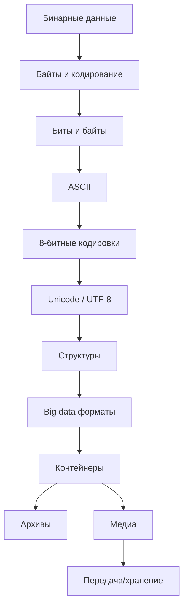

# Часть II. Файлы как контейнеры данных

## О чём эта глава

В первой главе мы рассматривали файл «снаружи» — как элемент файловой системы. Изучали метаданные: права доступа, владельцев, временные метки, inode, ссылки и дескрипторы. Файловая система отвечала на вопросы «где?», «кому?», «когда?».

Теперь заглянем **внутрь файла** и ответим на вопрос «что?». Файл — это последовательность байтов, но как эти байты превращаются в текст, изображение, видео или таблицу данных?

### От байтов к смыслу

Любой файл — это просто байты. Но одни и те же байты могут означать разное:

```
Байты:  48 65 6C 6C 6F

Как текст ASCII:     "Hello"
Как числа:           72, 101, 108, 108, 111
Как часть JPEG:      фрагмент изображения
Как машинный код:    инструкции процессора
```

Интерпретация зависит от **формата** — соглашения о том, как читать байты. В этой главе мы изучим:

1. **Бинарное представление** — как данные хранятся на уровне байтов, порядок байтов (endianness), магические числа для идентификации форматов

2. **Текстовые кодировки** — путь от ASCII через хаос 8-битных кодировок (KOI8, CP1251) к Unicode и UTF-8

3. **Структурированные форматы** — как текст организуется в JSON, YAML, XML, CSV, и как бинарные форматы (Protobuf) решают проблемы производительности

4. **Форматы больших данных** — колоночные форматы Parquet, ORC, Avro для аналитики

5. **Контейнеры** — архивы (TAR, ZIP, 7z) и медиаконтейнеры (MP4, MKV, WebM)

6. **Медиаформаты** — как кодируются изображения, аудио и видео

7. **Передача и хранение** — протоколы (SFTP, rsync) и облачные хранилища (S3)

## Структура главы

| Раздел | Тема |
|--------|------|
| [01-binary-levels](10-binary-levels.md) | Байты, endianness, magic numbers, sparse files |
| [02-bytes-encoding](11-bytes-encoding.md) | Биты, байты, системы счисления, сетевые форматы |
| [03-ascii](12-ascii.md) | ASCII — фундамент текстовых данных |
| [04-encodings-babel](13-encodings-babel.md) | 8-битные кодировки, KOI8, CP1251 |
| [05-unicode-utf8](14-unicode-utf8.md) | Unicode, UTF-8, UTF-16, нормализация |
| [06-structures](../ch3/16-json.md) | JSON, YAML, XML, CSV, Protobuf |
| [07-bigdata-formats](../ch3/23-bigdata-formats.md) | Parquet, ORC, Avro |
| [08-archives](../ch3/24-archives.md) | TAR, ZIP, 7z, ISO, медиаконтейнеры |
| [09-media](../ch3/25-media.md) | Изображения, аудио, видео, кодеки |
| [10-protocols-storage](../ch5/34-architecture.md) | SFTP, rsync, S3, облачные хранилища |

## Карта главы



---

??? example "Попробуйте сами: задания по Части II"
    Эти задания объединяют материал нескольких глав. Выполняйте после прочтения всей части.

    **1. Кодировочный детектив (исследование)**
    Найдите на своём компьютере файлы в разных кодировках (подсказка: старые `.srt` субтитры, конфиги из Windows). Определите кодировку каждого файла тремя способами: `file --mime-encoding`, Python `chardet`, ручной анализ через `xxd`. Совпали ли результаты?

    **2. Конвертер кодировок (кодинг)**
    Напишите Python-скрипт, который принимает файл и целевую кодировку, автоматически определяет исходную кодировку и конвертирует. Обработайте edge cases: BOM, смешанные кодировки, бинарные файлы.

    **3. Визуализация байтов (практика)**
    Создайте файл, содержащий символ «Ш» в трёх кодировках: UTF-8, CP1251, KOI8-R. Сравните байтовые представления через `xxd`. Почему один символ занимает 2 байта в UTF-8, но 1 байт в CP1251?

    **4. Стресс-тест Unicode (сквозное задание)**
    Создайте файл с именем, содержащим emoji (🔥), запишите в него текст на 3 языках с RTL-скриптом (арабский/иврит). Откройте его в Python, прочитайте, посчитайте символы vs байты vs кодовые точки. Какие сюрпризы обнаружились?
