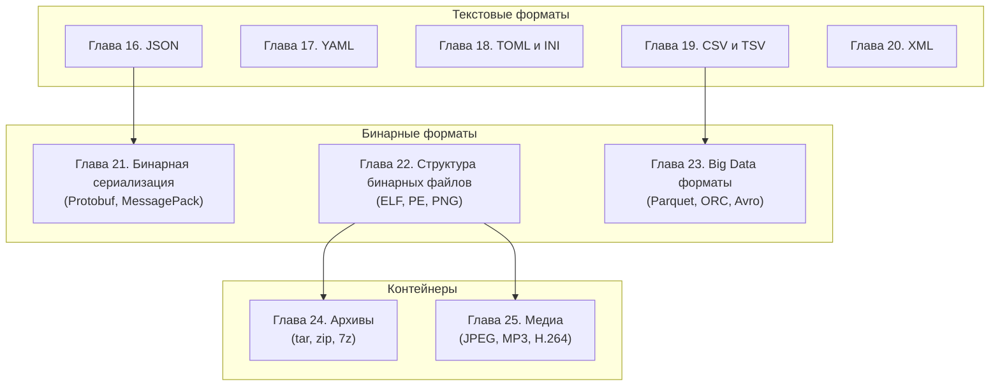

# Часть III. Форматы файлов

## О чём эта часть

В предыдущей части мы изучили, как байты кодируют символы — от ASCII до UTF-8. Теперь поднимемся на уровень выше: как из символов и байтов строятся **форматы файлов** — соглашения о структуре данных.

### От символов к структурам

Кодировка говорит нам, что байт `0x41` — это буква "A". Но что означает файл, полный таких букв?

```
{"name": "Alice", "age": 30}
```

Это **JSON** — формат для обмена структурированными данными. Зная формат, мы можем извлечь имя "Alice" и возраст 30.

### Карта форматов



### Что мы изучим

| № | Раздел | Описание |
|---|--------|----------|
| 16 | [JSON](16-json.md) | Синтаксис, JSON Schema, JSON Lines, jq |
| 17 | [YAML](17-yaml.md) | Якоря, алиасы, подводные камни (Norway problem) |
| 18 | [TOML и INI](18-toml-ini.md) | Конфигурационные форматы, pyproject.toml |
| 19 | [CSV и TSV](19-csv-tsv.md) | RFC 4180, диалекты, Excel-совместимость |
| 20 | [XML](20-xml.md) | Пространства имён, DTD/XSD, XPath, XSLT |
| 21 | [Бинарная сериализация](21-binary-serialization.md) | Protobuf, MessagePack, BSON, FlatBuffers |
| 22 | [Структура бинарных файлов](22-binary-structure.md) | Magic numbers, ELF, PE, Mach-O |
| 23 | [Big Data форматы](23-bigdata-formats.md) | Parquet, ORC, Avro — строковые vs колоночные |
| 24 | [Архивы](24-archives.md) | tar, gzip, zip, 7z, zstd — архив vs контейнер |
| 25 | [Медиа-форматы](25-media.md) | Контейнер vs кодек; JPEG, MP3, H.264 |

### Текст vs бинарный формат

Фундаментальный выбор при проектировании формата:

| Критерий | Текстовый (JSON, CSV) | Бинарный (Protobuf, Parquet) |
|----------|----------------------|------------------------------|
| Читаемость | ✅ Человеком | ❌ Только программой |
| Размер | Больше | Меньше (в 2–10 раз) |
| Скорость парсинга | Медленнее | Быстрее |
| Редактирование | Любым текстовым редактором | Специальным ПО |
| Отладка | Просто — `cat file.json` | `hexdump`, специальные утилиты |
| Типизация | Слабая (всё — строки) | Строгая (схема) |

!!! abstract "Ключевой принцип"
    **Текстовые форматы** — для конфигураций, API, обмена данными между людьми.  
    **Бинарные форматы** — для производительности, больших данных, внутренних протоколов.

### Практическая ценность

Понимание форматов критично для:

- **Разработчиков** — парсинг конфигов, сериализация данных, работа с API
- **Data-инженеров** — выбор формата хранения (Parquet vs CSV), оптимизация запросов
- **DevOps** — чтение конфигураций (YAML для Kubernetes, TOML для Cargo)
- **Любого IT-специалиста** — понимание структуры данных, с которыми работаешь

## Начинаем

Готовы? Начнём с самого популярного формата обмена данными — [JSON](16-json.md).

---

??? example "Попробуйте сами: задания по Части III"
    Эти задания объединяют материал нескольких глав. Выполняйте после прочтения всей части.

    **1. Один датасет — пять форматов (практика)**
    Возьмите таблицу из 1000 строк (например, CSV с Kaggle). Конвертируйте в JSON, YAML, Parquet, SQLite. Сравните: размер файла, время чтения, удобство редактирования. Оформите результат как таблицу.

    **2. Формат-детектив (исследование)**
    Скачайте 5 файлов с разными расширениями. Не доверяя расширению, определите реальный формат через magic bytes (`file`, `xxd | head`). Сколько файлов «соврали» о своём типе?

    **3. Конфиг-парсер (кодинг)**
    Напишите Python-функцию `load_config(path)`, которая автоматически определяет формат (JSON, YAML, TOML, INI) по содержимому и возвращает словарь. Обработайте ошибки парсинга с понятными сообщениями.

    **4. Protobuf vs JSON (сквозное задание)**
    Опишите структуру «сообщение в чате» (автор, текст, timestamp, вложения) в Protobuf `.proto` и JSON Schema. Сериализуйте 10 000 сообщений в обоих форматах. Сравните размер и скорость десериализации.
