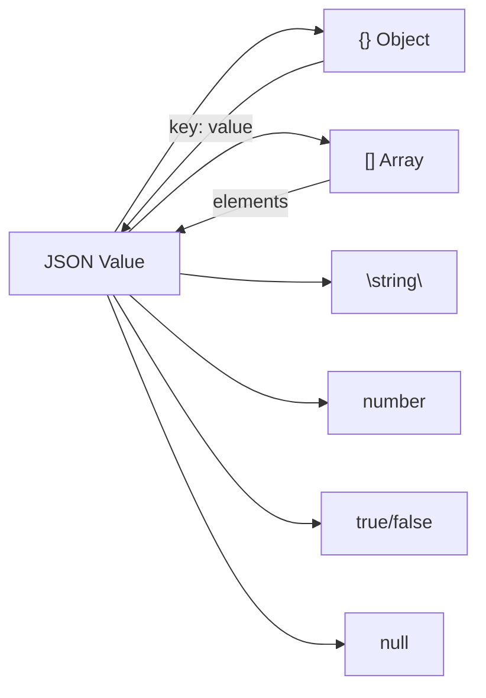

# Глава 16. JSON: JavaScript Object Notation

## Введение

**JSON** (JavaScript Object Notation) — текстовый формат обмена данными, основанный на синтаксисе объектов JavaScript. Несмотря на название, JSON используется практически во всех языках программирования и стал стандартом де-факто для API и конфигураций.



---

## 16.1 Синтаксис JSON

### Типы данных

JSON поддерживает шесть типов данных:

```json
{
  "string": "Hello, World!",
  "number": 42,
  "float": 3.14159,
  "boolean_true": true,
  "boolean_false": false,
  "null_value": null,
  "array": [1, 2, 3],
  "object": {"key": "value"}
}
```

| Тип | Примеры | Примечания |
|-----|---------|------------|
| String | `"hello"`, `"line\nbreak"` | Только двойные кавычки |
| Number | `42`, `3.14`, `-17`, `1e10` | Нет Infinity, NaN |
| Boolean | `true`, `false` | Только lowercase |
| Null | `null` | Только lowercase |
| Array | `[1, "two", null]` | Произвольные типы |
| Object | `{"key": "value"}` | Ключи — только строки |

### Экранирование

```json
{
  "quote": "He said \"Hello\"",
  "backslash": "C:\\Users\\name",
  "newline": "Line 1\nLine 2",
  "tab": "Column1\tColumn2",
  "unicode": "Emoji: \u263A"
}
```

### Форматирование

```json
{"name":"Alice","age":30,"active":true}
```

Или с отступами (pretty-printed):

```json
{
  "name": "Alice",
  "age": 30,
  "active": true
}
```

---

## 16.2 Ограничения JSON

### Нет комментариев

```json
{
  "name": "Alice"  // ОШИБКА: комментарии запрещены
}
```

### Нет trailing comma

```json
{
  "name": "Alice",
  "age": 30,       // ОШИБКА: запятая после последнего элемента
}
```

### Ключи — только строки

```json
{
  1: "one",        // ОШИБКА
  "1": "one"       // OK
}
```

### Нет специальных числовых значений

```json
{
  "infinity": Infinity,   // ОШИБКА
  "nan": NaN              // ОШИБКА
}
```

---

## 16.3 JSON в Python

### Базовые операции

```python
import json

# Сериализация (Python → JSON)
data = {"name": "Alice", "age": 30, "scores": [95, 87, 92]}
json_string = json.dumps(data)
# '{"name": "Alice", "age": 30, "scores": [95, 87, 92]}'

# Десериализация (JSON → Python)
parsed = json.loads(json_string)
# {'name': 'Alice', 'age': 30, 'scores': [95, 87, 92]}

# Запись в файл
with open('data.json', 'w', encoding='utf-8') as f:
    json.dump(data, f, ensure_ascii=False, indent=2)

# Чтение из файла
with open('data.json', 'r', encoding='utf-8') as f:
    loaded = json.load(f)
```

### Форматирование вывода

```python
data = {"name": "Иван", "items": [1, 2, 3]}

# Compact
json.dumps(data)
# '{"name": "\\u0418\\u0432\\u0430\\u043d", "items": [1, 2, 3]}'

# С отступами
json.dumps(data, indent=2)

# Без ASCII-экранирования
json.dumps(data, ensure_ascii=False)
# '{"name": "Иван", "items": [1, 2, 3]}'

# Сортировка ключей
json.dumps(data, sort_keys=True)
```

### Обработка типов

```python
import json
from datetime import datetime
from decimal import Decimal

# Стандартный encoder не знает datetime и Decimal
data = {"time": datetime.now(), "price": Decimal("19.99")}
# json.dumps(data)  # TypeError!

# Решение 1: custom encoder function
def json_encoder(obj):
    if isinstance(obj, datetime):
        return obj.isoformat()
    if isinstance(obj, Decimal):
        return float(obj)
    raise TypeError(f"Object of type {type(obj)} is not JSON serializable")

json.dumps(data, default=json_encoder)

# Решение 2: custom JSONEncoder class
class CustomEncoder(json.JSONEncoder):
    def default(self, obj):
        if isinstance(obj, datetime):
            return obj.isoformat()
        if isinstance(obj, Decimal):
            return float(obj)
        return super().default(obj)

json.dumps(data, cls=CustomEncoder)
```

---

## 16.4 JSON Schema

**JSON Schema** — спецификация для описания структуры JSON-документов:

```json
{
  "$schema": "https://json-schema.org/draft/2020-12/schema",
  "type": "object",
  "properties": {
    "name": {
      "type": "string",
      "minLength": 1
    },
    "age": {
      "type": "integer",
      "minimum": 0
    },
    "email": {
      "type": "string",
      "format": "email"
    }
  },
  "required": ["name", "email"]
}
```

### Валидация в Python

```python
from jsonschema import validate, ValidationError

schema = {
    "type": "object",
    "properties": {
        "name": {"type": "string"},
        "age": {"type": "integer", "minimum": 0}
    },
    "required": ["name"]
}

# Валидация
data = {"name": "Alice", "age": 30}
validate(instance=data, schema=schema)  # OK

# Ошибка валидации
invalid_data = {"age": -5}
try:
    validate(instance=invalid_data, schema=schema)
except ValidationError as e:
    print(e.message)  # 'name' is a required property
```

---

## 16.5 JSON Lines (JSONL)

**JSON Lines** — формат, где каждая строка является отдельным JSON-объектом:

```
{"name": "Alice", "age": 30}
{"name": "Bob", "age": 25}
{"name": "Charlie", "age": 35}
```

### Преимущества

- Потоковая обработка (не нужно загружать весь файл)
- Простое добавление записей (append)
- Параллельная обработка строк

### Работа с JSONL

```python
# Запись
records = [
    {"name": "Alice", "age": 30},
    {"name": "Bob", "age": 25},
]

with open('data.jsonl', 'w', encoding='utf-8') as f:
    for record in records:
        f.write(json.dumps(record, ensure_ascii=False) + '\n')

# Чтение (потоковое)
def read_jsonl(path):
    with open(path, 'r', encoding='utf-8') as f:
        for line in f:
            if line.strip():
                yield json.loads(line)

for record in read_jsonl('data.jsonl'):
    print(record['name'])
```

---

## 16.6 Инструменты командной строки

### jq — процессор JSON

```bash
# Красивый вывод
cat data.json | jq .

# Извлечение поля
echo '{"name": "Alice", "age": 30}' | jq '.name'
# "Alice"

# Без кавычек
echo '{"name": "Alice"}' | jq -r '.name'
# Alice

# Фильтрация массива
echo '[{"n":1},{"n":2},{"n":3}]' | jq '.[] | select(.n > 1)'
# {"n": 2}
# {"n": 3}

# Преобразование
echo '{"items": [1, 2, 3]}' | jq '.items | map(. * 2)'
# [2, 4, 6]
```

### python -m json.tool

```bash
# Форматирование JSON
echo '{"name":"Alice","age":30}' | python -m json.tool
```

---

## 16.7 Подводные камни и edge cases

### Числа с потерей точности

JSON не различает int и float. Большие числа теряют точность в JavaScript:

```python
import json

# ❗ Проблема: ID из базы данных > 2^53
 big_id = 9007199254740993  # 2^53 + 1
print(json.dumps({"id": big_id}))  # {"id": 9007199254740993}
# ❗ JavaScript округлит это до 9007199254740992!

# ✅ Решение: передавать как строку
print(json.dumps({"id": str(big_id)}))  # {"id": "9007199254740993"}
```

### Порядок ключей

JSON-спецификация не гарантирует порядок ключей. Не полагайтесь на него при сравнении:

```python
# ❗ Ненадёжное сравнение
assert json.dumps(a) == json.dumps(b)  # может сломаться!

# ✅ Надёжно
assert json.dumps(a, sort_keys=True) == json.dumps(b, sort_keys=True)
# Или просто: assert a == b  (сравнение словарей)
```

### Даты и время

JSON не имеет типа даты. Каждый проект кодирует даты по-своему:

```json
{"created": "2024-01-15T10:30:00Z"}     // ISO 8601 (рекомендуется)
{"created": 1705312200}                   // Unix timestamp
{"created": "15/01/2024"}                 // амбиг.
```

!!! warning "Осторожно с NaN и Infinity"
    JSON не поддерживает `NaN`, `Infinity`, `-Infinity`. Python `json.dumps(float('nan'))` выбросит ошибку с `allow_nan=False` или создаст невалидный JSON по умолчанию.

---

## 16.8 JSON Schema — валидация структуры

JSON Schema описывает **ожидаемую структуру** JSON-документа: типы полей, обязательные свойства, ограничения значений.

```json
{
  "$schema": "https://json-schema.org/draft/2020-12/schema",
  "type": "object",
  "required": ["name", "age"],
  "properties": {
    "name": {
      "type": "string",
      "minLength": 1
    },
    "age": {
      "type": "integer",
      "minimum": 0,
      "maximum": 150
    },
    "email": {
      "type": "string",
      "format": "email"
    },
    "tags": {
      "type": "array",
      "items": { "type": "string" },
      "uniqueItems": true
    }
  }
}
```

### Валидация в Python

```python
from jsonschema import validate, ValidationError

schema = {
    "type": "object",
    "required": ["name", "version"],
    "properties": {
        "name": {"type": "string"},
        "version": {"type": "string", "pattern": "^\\d+\\.\\d+\\.\\d+$"}
    }
}

# Валидный документ
validate({"name": "myapp", "version": "1.2.3"}, schema)  # OK

# Невалидный
try:
    validate({"name": "myapp", "version": "latest"}, schema)
except ValidationError as e:
    print(e.message)  # 'latest' does not match '^\\d+\\.\\d+\\.\\d+$'
```

!!! tip "Аналогия с XML"
    JSON Schema для JSON — это то же самое, что **XSD** (XML Schema Definition) для XML. Но JSON Schema проще, читабельнее и не требует отдельного языка описания.

### Где используется

| Применение | Пример |
|-----------|--------|
| **API** | OpenAPI/Swagger описывает request/response через JSON Schema |
| **Конфигурации** | VS Code `settings.json` валидируется по схеме |
| **CI/CD** | GitHub Actions, GitLab CI — валидация workflow-файлов |
| **Формы** | Генерация UI-форм из JSON Schema (react-jsonschema-form) |

---

## 16.9 Бинарные альтернативы JSON

Когда JSON слишком медленный или объёмный, существуют бинарные форматы с семантикой JSON:

| Формат | Размер vs JSON | Скорость парсинга | Схема | Особенности |
|--------|---------------|-------------------|-------|-------------|
| **MessagePack** | ~50-70% | 2-5× быстрее | Нет | Drop-in замена JSON, поддержка бинарных данных |
| **CBOR** (RFC 8949) | ~50-70% | 2-5× быстрее | Нет | Стандарт IETF, поддержка тегов (даты, bignum) |
| **BSON** | ~80-100% | 1.5-2× быстрее | Нет | Формат MongoDB, поддержка дат и ObjectId |
| **UBJSON** | ~60-80% | 2-3× быстрее | Нет | «Universal Binary JSON» — типизирован |

### MessagePack — самая популярная альтернатива

```python
import msgpack

data = {"name": "Файл", "size": 1048576, "tags": ["important", "backup"]}

# Сериализация
packed = msgpack.packb(data)
print(len(packed))  # ~45 байт (vs ~75 в JSON)

# Десериализация  
unpacked = msgpack.unpackb(packed)
print(unpacked)  # {'name': 'Файл', 'size': 1048576, 'tags': ['important', 'backup']}
```

### Когда переходить на бинарный формат

```
┌──────────────────────────────────────────────────────────────┐
│  Остаться на JSON, если:           Перейти на бинарный, если:│
│  • Нужна человекочитаемость        • Миллионы сообщений/с   │
│  • Отладка важнее скорости         • Трафик = деньги (мобил)│
│  • Совместимость с браузерами      • Есть бинарные данные   │
│  • Файлы конфигурации              • Внутренний IPC/RPC     │
└──────────────────────────────────────────────────────────────┘
```

---

## Резюме

| Характеристика | Значение |
|----------------|----------|
| Расширение | `.json`, `.jsonl` |
| MIME-тип | `application/json` |
| Кодировка | UTF-8 (рекомендуется) |
| Комментарии | Нет |
| Типизация | Слабая (6 типов) |
| Применение | API, конфигурации, обмен данными |


??? question "Упражнения"
    **Задание 1.** Напишите Python-скрипт, валидирующий JSON-файл и выводящий понятное сообщение об ошибке с номером строки при невалидном вводе.
    
    **Задание 2.** Создайте JSON Lines файл с 1000 записями. Напишите потоковый парсер, обрабатывающий его построчно (без загрузки целиком в память).
    
    **Задание 3.** С помощью `jq` из командной строки извлеките имена всех пользователей старше 25 лет из JSON-массива. Отсортируйте по возрасту.

!!! tip "Следующая глава"
    Изучили JSON. Теперь познакомимся с его «братом» — **YAML** → [YAML](17-yaml.md)
