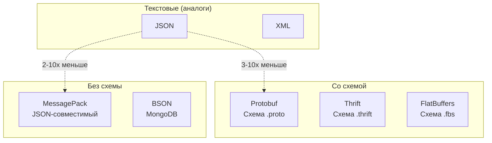

# Глава 21. Бинарные форматы сериализации

## Введение

Текстовые форматы (JSON, XML) удобны для чтения, но неэффективны для больших объёмов данных. **Бинарные форматы сериализации** решают эту проблему: они компактнее, быстрее парсятся и поддерживают строгую типизацию.



---

## 21.1 Зачем нужны бинарные форматы

### Проблемы текстовых форматов

```python
# JSON: 47 байт (с пробелами — больше)
{"name": "Alice", "age": 30, "active": true}

# Проблемы:
# 1. Избыточность: ключи повторяются в каждом объекте
# 2. Парсинг: нужно разбирать текст
# 3. Типы: числа хранятся как строки
```

### Преимущества бинарных форматов

- **Компактность**: меньше места на диске и в сети
- **Скорость**: быстрее сериализация/десериализация
- **Типизация**: явные типы, поддержка схем
- **Эволюция схем**: добавление полей без поломки совместимости

---

## 21.2 Protocol Buffers (protobuf)

**Protocol Buffers** — формат от Google, широко используемый в gRPC.

### Определение схемы

```protobuf
// person.proto
syntax = "proto3";

message Person {
    string name = 1;
    int32 age = 2;
    bool active = 3;
    repeated string emails = 4;
    
    enum PhoneType {
        MOBILE = 0;
        HOME = 1;
        WORK = 2;
    }
    
    message PhoneNumber {
        string number = 1;
        PhoneType type = 2;
    }
    
    repeated PhoneNumber phones = 5;
}
```

### Генерация кода

```bash
protoc --python_out=. person.proto
```

### Использование в Python

```python
from person_pb2 import Person

# Создание
person = Person()
person.name = "Alice"
person.age = 30
person.active = True
person.emails.append("alice@example.com")

phone = person.phones.add()
phone.number = "+1234567890"
phone.type = Person.MOBILE

# Сериализация
binary_data = person.SerializeToString()
print(len(binary_data))  # ~40 байт вместо 100+ в JSON

# Десериализация
person2 = Person()
person2.ParseFromString(binary_data)
print(person2.name)  # "Alice"
```

### Эволюция схемы

```protobuf
message Person {
    string name = 1;
    int32 age = 2;
    bool active = 3;
    string new_field = 6;  // Добавить новое поле — OK
    // int32 age = 2;      // Удалить поле — данные игнорируются
    // string age = 2;     // Изменить тип — НЕЛЬЗЯ!
}
```

---

## 21.3 MessagePack

**MessagePack** — "бинарный JSON", не требует схемы.

### Python

```python
import msgpack

# Сериализация
data = {"name": "Alice", "age": 30, "scores": [95, 87, 92]}
packed = msgpack.packb(data)
print(len(packed))  # ~35 байт

# Десериализация
unpacked = msgpack.unpackb(packed) 
# {'name': 'Alice', 'age': 30, 'scores': [95, 87, 92]}

# Работа с файлами
with open('data.msgpack', 'wb') as f:
    msgpack.pack(data, f)

with open('data.msgpack', 'rb') as f:
    loaded = msgpack.unpack(f)
```

### Типы данных

| MessagePack | Python |
|-------------|--------|
| nil | None |
| bool | bool |
| int | int |
| float | float |
| str | str |
| bin | bytes |
| array | list |
| map | dict |
| ext | extension types |

---

## 21.4 BSON

**BSON** (Binary JSON) — формат MongoDB.

```python
import bson

# Сериализация
data = {
    "name": "Alice",
    "age": 30,
    "_id": bson.ObjectId(),
    "created": datetime.now()
}
binary = bson.encode(data)

# Десериализация
decoded = bson.decode(binary)
```

### Особенности BSON

- Поддержка ObjectId, datetime, binary data
- Не всегда меньше JSON (хранит имена полей)
- Оптимизирован для MongoDB

---

## 21.5 Apache Thrift

**Thrift** — фреймворк от Facebook для кросс-языковой сериализации.

```thrift
// person.thrift
struct Person {
    1: required string name;
    2: optional i32 age;
    3: list<string> emails;
}

service PersonService {
    Person getPerson(1: i32 id);
    void savePerson(1: Person person);
}
```

---

## 21.6 FlatBuffers

**FlatBuffers** — формат от Google для игр и мобильных приложений.

### Особенности

- **Zero-copy**: доступ к данным без десериализации
- Низкое потребление памяти
- Эффективен для больших объёмов данных

```flatbuffers
// person.fbs
table Person {
    name: string;
    age: int;
    emails: [string];
}

root_type Person;
```

---

## 21.7 Сравнение форматов

| Формат | Схема | Размер | Скорость | Совместимость | Применение |
|--------|-------|--------|----------|---------------|------------|
| JSON | Нет | Большой | Медленно | Отличная | API, конфиги |
| MessagePack | Нет | Средний | Быстро | Хорошая | Кэширование |
| Protobuf | Да | Маленький | Быстро | Эволюция схем | gRPC, внутренние API |
| BSON | Нет | Средний | Средне | MongoDB | MongoDB |
| Thrift | Да | Маленький | Быстро | Кросс-языковая | RPC |
| FlatBuffers | Да | Маленький | Очень быстро | Limited | Игры, мобильные |

### Бенчмарк (примерный)

```
Формат        Размер    Сериализация    Десериализация
JSON          100%      1x              1x
MessagePack   60%       3x              3x
Protobuf      50%       5x              5x
FlatBuffers   55%       10x             20x (zero-copy)
```

---

## 21.8 Когда что использовать

### JSON
- Публичные API
- Конфигурационные файлы
- Отладка

### MessagePack
- Замена JSON для производительности
- Кэширование
- Когда не нужна схема

### Protocol Buffers
- gRPC сервисы
- Внутренние API
- Когда важна эволюция схемы

### FlatBuffers
- Игры и мобильные приложения
- Когда критична скорость чтения
- Большие объёмы данных

---

## 21.6 SQLite — файл как полноценная база данных

SQLite — не просто «формат файла», а **полноценная реляционная СУБД**, упакованная в один файл. Это самый распространённый формат баз данных в мире (миллиарды экземпляров — каждый смартфон, каждый браузер).

### Структура файла SQLite

```text
┌──────────────────────────────────────────────────┐
│ Заголовок (100 байт)                             │
│   Magic: "SQLite format 3\000"                   │
│   Размер страницы: 4096 (по умолчанию)           │
│   Версия формата, кодировка, счётчики...         │
├──────────────────────────────────────────────────┤
│ Страница 1: Lock-byte page + schema table        │
├──────────────────────────────────────────────────┤
│ Страница 2: B-tree (таблица или индекс)          │
├──────────────────────────────────────────────────┤
│ Страница 3: ...                                  │
├──────────────────────────────────────────────────┤
│ ...                                              │
├──────────────────────────────────────────────────┤
│ Страница N: Freelist / Overflow                  │
└──────────────────────────────────────────────────┘
```

Весь файл — массив **страниц** фиксированного размера (обычно 4 КБ). Каждая страница — это узел B-дерева, лист, overflow-страница или страница из freelist.

### ACID-гарантии

SQLite обеспечивает полные ACID-гарантии через два механизма журналирования:

**Rollback Journal** (по умолчанию):

```text
1. Перед изменением → копия оригинальных страниц в .db-journal
2. Изменение страниц в основном файле
3. Commit → удаление журнала
4. Crash? → откат из журнала
```

**WAL (Write-Ahead Log)** — современная альтернатива:

```text
1. Изменения записываются в .db-wal (НЕ в основной файл!)
2. Читатели видят снимок БД до или после транзакции
3. Checkpoint → перенос WAL в основной файл
4. Crash? → повтор WAL
```

```python
import sqlite3

# Включить WAL-режим (рекомендуется!)
conn = sqlite3.connect("mydb.sqlite3")
conn.execute("PRAGMA journal_mode=WAL")  # → 'wal'

# WAL преимущества:
# ✅ Читатели НЕ блокируют писателей
# ✅ Писатель НЕ блокирует читателей
# ✅ Быстрее для большинства нагрузок
```

### Исследование файла SQLite

```bash
# Заголовок
xxd -l 16 mydb.sqlite3
# 00000000: 5351 4c69 7465 2066 6f72 6d61 7420 3300  SQLite format 3.

# Анализ структуры (sqlite3_analyzer — отдельная утилита)
sqlite3_analyzer mydb.sqlite3 | head -30
# Показывает: размер таблиц, индексов, фрагментацию, использование страниц

# Или встроенными средствами
sqlite3 mydb.sqlite3 "PRAGMA page_count; PRAGMA page_size; PRAGMA freelist_count;"
```

### Почему SQLite — лучший формат для файлов

| Сценарий | JSON/CSV | SQLite |
|----------|----------|--------|
| Чтение 1 записи из 1 млн | Прочитать весь файл | Индекс: O(log n) |
| Параллельное чтение | Легко | Легко (WAL) |
| Параллельная запись | Невозможно безопасно | Один писатель, но с блокировкой |
| Частичное обновление | Переписать весь файл | Изменить одну страницу |
| Атомарность | Нет (нужен temp+rename) | Встроенная (ACID) |
| Размер | Текст: много дупликатов | Компактнее за счёт B-tree |

!!! quote "Философия SQLite"
    *«SQLite не конкурирует с PostgreSQL. SQLite конкурирует с `fopen()`»* — D. Richard Hipp, автор SQLite. Везде, где вы используете файл для хранения структурированных данных, SQLite — лучший выбор.

---

## Резюме

| Формат | Расширение | Схема | Библиотека Python |
|--------|------------|-------|-------------------|
| MessagePack | `.msgpack` | Нет | `msgpack` |
| Protobuf | `.pb`, `.proto` | Да | `protobuf` |
| BSON | `.bson` | Нет | `bson` (pymongo) |
| Thrift | `.thrift` | Да | `thrift` |
| FlatBuffers | `.fbs` | Да | `flatbuffers` |


??? question "Упражнения"
    **Задание 1.** Сериализуйте Python-словарь в MessagePack и JSON. Сравните размер и скорость (де)сериализации.
    
    **Задание 2.** Создайте `.proto` файл для Protobuf, сгенерируйте Python-код, сериализуйте и десериализуйте сообщение. Сравните размер с JSON.
    
    **Задание 3.** Что произойдёт, если вы добавите новое поле в Protobuf-схему и попытаетесь прочитать старые данные? Продемонстрируйте обратную совместимость.

!!! tip "Следующая глава"
    Разобрались с форматами сериализации. Теперь — **структура бинарных файлов** (ELF, PE, PNG) → [Структура бинарных файлов](22-binary-structure.md)
