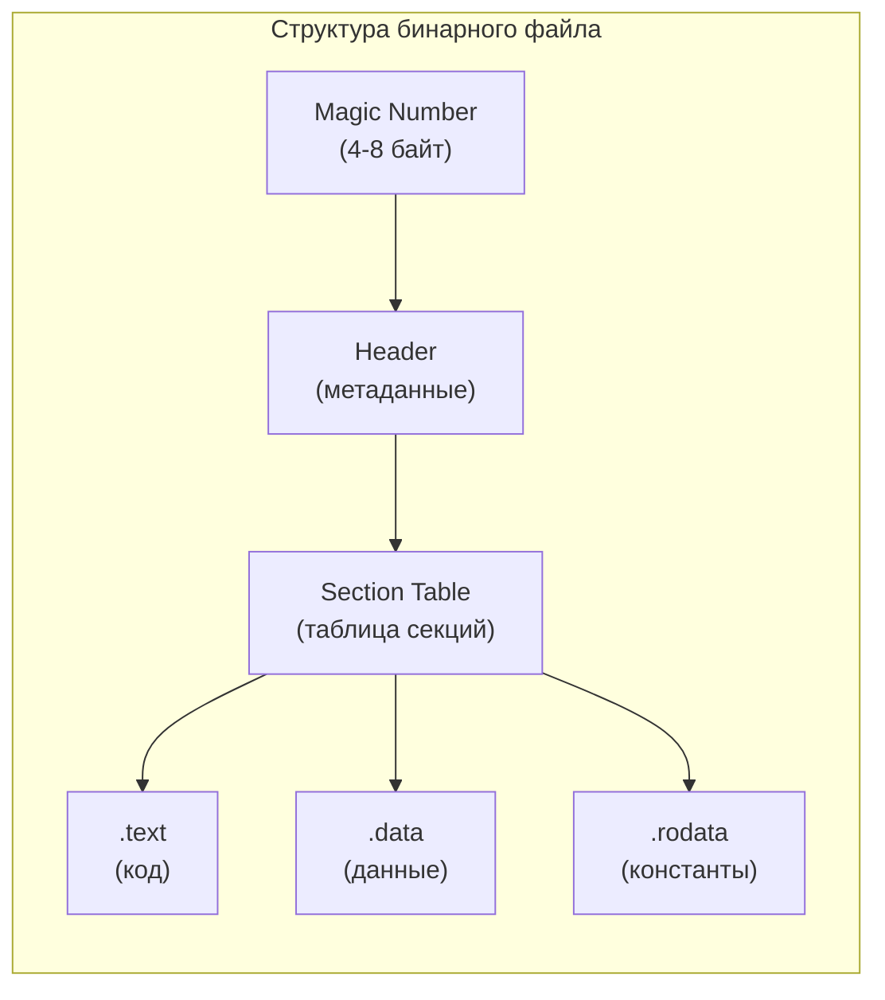

# Глава 22. Структура бинарных файлов

## Введение

Каждый бинарный файл имеет определённую **структуру**: заголовок с метаданными, секции с данными, контрольные суммы. Понимание этой структуры позволяет определять тип файла, извлекать информацию и работать с повреждёнными данными.

!!! warning "Бинарные данные — это НЕ текст"
    Байты в бинарных файлах **не являются кодировками символов**. Сигнатура `FF D8 FF` (JPEG) — это не ASCII, не UTF-8, не какая-либо текстовая кодировка. Это произвольные байтовые значения, заданные спецификацией формата.
    
    Если открыть JPEG в текстовом редакторе, вы увидите «мусор» вроде `ÿØÿà`. Откуда берутся
    эти символы, если кодировки нет? Дело в том, что **редактор всё равно применяет кодировку** —
    обычно Latin-1 (ISO 8859-1), где каждый байт 0x00–0xFF имеет символ. Байт `0xFF` → `ÿ`,
    `0xD8` → `Ø`, `0xE0` → `à`. Это не настоящий текст — это байты, насильно проинтерпретированные
    как символы кодировки, которая к ним не имеет отношения.
    
    ```
    Байты JPEG:  FF    D8    FF    E0
    Latin-1:      ÿ     Ø     ÿ     à      ← «мусор», бессмысленный текст
    UTF-8:        ошибка декодирования      ← 0xFF не валидный UTF-8 байт
    ```



---

## 22.1 Magic Numbers — сигнатуры файлов

**Magic number** (магическое число, сигнатура) — последовательность байтов в начале файла, идентифицирующая его тип.

### Примеры сигнатур

| Формат | Magic bytes (hex) | ASCII | Позиция |
|--------|-------------------|-------|---------|
| PDF | `25 50 44 46` | `%PDF` | 0 |
| PNG | `89 50 4E 47 0D 0A 1A 0A` | `.PNG....` | 0 |
| JPEG | `FF D8 FF` | — | 0 |
| GIF | `47 49 46 38` | `GIF8` | 0 |
| ZIP | `50 4B 03 04` | `PK..` | 0 |
| gzip | `1F 8B` | — | 0 |
| ELF (Linux) | `7F 45 4C 46` | `.ELF` | 0 |
| PE (Windows) | `4D 5A` | `MZ` | 0 |
| Mach-O (macOS) | `FE ED FA CE` или `CF FA ED FE` | — | 0 |
| SQLite | `53 51 4C 69 74 65` | `SQLite` | 0 |
| MP3 (ID3) | `49 44 33` | `ID3` | 0 |
| MP4 | `66 74 79 70` | `ftyp` | 4 |
| WebP | `52 49 46 46 ?? ?? ?? ?? 57 45 42 50` | `RIFF....WEBP` | 0 |

### Проверка сигнатур

```python
def get_file_signature(path, length=16):
    """Читает первые байты файла."""
    with open(path, 'rb') as f:
        return f.read(length)

def identify_file(path):
    """Определяет тип файла по сигнатуре."""
    signatures = {
        b'\x89PNG\r\n\x1a\n': 'PNG',
        b'\xff\xd8\xff': 'JPEG',
        b'GIF87a': 'GIF87',
        b'GIF89a': 'GIF89',
        b'%PDF': 'PDF',
        b'PK\x03\x04': 'ZIP',
        b'\x1f\x8b': 'GZIP',
        b'\x7fELF': 'ELF',
        b'MZ': 'PE/EXE',
        b'SQLite format 3': 'SQLite',
    }
    
    data = get_file_signature(path, 16)
    
    for sig, fmt in signatures.items():
        if data.startswith(sig):
            return fmt
    
    return 'Unknown'

# Использование
print(identify_file('image.png'))  # PNG
print(identify_file('document.pdf'))  # PDF
```

### Команда file

```bash
# Определение типа файла
$ file image.png
image.png: PNG image data, 1920 x 1080, 8-bit/color RGBA

$ file document.pdf
document.pdf: PDF document, version 1.7

$ file /bin/ls
/bin/ls: Mach-O 64-bit executable x86_64

# Просмотр сигнатуры
$ xxd -l 16 image.png
00000000: 8950 4e47 0d0a 1a0a 0000 000d 4948 4452  .PNG........IHDR
```

---

## 22.2 Структура исполняемых файлов

### ELF (Executable and Linkable Format) — Linux

```
┌─────────────────────────────────────┐
│  ELF Header (52/64 bytes)           │
│  - Magic: 7F 45 4C 46               │
│  - Class: 32/64 bit                 │
│  - Endianness                       │
│  - Entry point address              │
├─────────────────────────────────────┤
│  Program Headers                    │
│  - Описание сегментов для загрузки  │
├─────────────────────────────────────┤
│  Section Headers                    │
│  - .text (код)                      │
│  - .data (данные)                   │
│  - .rodata (константы)              │
│  - .bss (неинициализированные)      │
│  - .symtab (символы)                │
│  - ...                              │
└─────────────────────────────────────┘
```

```bash
# Просмотр заголовка ELF
$ readelf -h /bin/ls

# Секции
$ readelf -S /bin/ls

# Символы
$ nm /bin/ls
```

### PE (Portable Executable) — Windows

```
┌─────────────────────────────────────┐
│  DOS Header                         │
│  - Magic: MZ (4D 5A)                │
│  - e_lfanew: смещение PE header     │
├─────────────────────────────────────┤
│  DOS Stub                           │
│  "This program cannot be run..."    │
├─────────────────────────────────────┤
│  PE Header                          │
│  - Signature: PE\0\0                │
│  - Machine type                     │
│  - Number of sections               │
├─────────────────────────────────────┤
│  Optional Header                    │
│  - Entry point                      │
│  - Image base                       │
├─────────────────────────────────────┤
│  Section Table                      │
│  - .text, .data, .rdata, .rsrc     │
└─────────────────────────────────────┘
```

### Mach-O — macOS

```
┌──────────────────────────────────────┐
│  Mach-O Header                       │
│  - magic: 0xFEEDFACE (32) /          │
│           0xFEEDFACF (64)            │
│  - cputype, cpusubtype               │
│  - filetype (execute/dylib/bundle)   │
├──────────────────────────────────────┤
│  Load Commands                       │
│  - LC_SEGMENT_64 (__TEXT, __DATA)    │
│  - LC_DYLD_INFO, LC_SYMTAB           │
│  - LC_LOAD_DYLIB (зависимости)       │
├──────────────────────────────────────┤
│  Segments / Sections                 │
│  - __TEXT: __text, __stubs           │
│  - __DATA: __data, __bss             │
│  - __LINKEDIT: символы, подписи      │
└──────────────────────────────────────┘
```

```bash
# Информация о Mach-O
$ otool -h /bin/ls          # заголовок
$ otool -l /bin/ls          # load commands
$ otool -L /bin/ls          # динамические библиотеки
```

### Universal Binary (Fat Binary)

На macOS один файл может содержать код сразу для нескольких архитектур (например, `x86_64` + `arm64`). Такой файл называется **Universal Binary** (или Fat Binary):

```
┌──────────────────────────────────────┐
│  Fat Header                          │
│  magic: 0xCAFEBABE                   │
│  nfat_arch: 2                        │
├──────────────────────────────────────┤
│  fat_arch[0]: x86_64                 │
│  → offset, size, align              │
├──────────────────────────────────────┤
│  fat_arch[1]: arm64                  │
│  → offset, size, align              │
├══════════════════════════════════════╡
│  Mach-O (x86_64)                    │
│  [полноценный бинарник]             │
├──────────────────────────────────────┤
│  Mach-O (arm64)                     │
│  [полноценный бинарник]             │
└──────────────────────────────────────┘
```

```bash
# Проверка архитектур
$ file /usr/bin/python3
/usr/bin/python3: Mach-O universal binary with 2 architectures:
  x86_64, arm64

$ lipo -info /usr/bin/python3
Architectures in the fat file: x86_64 arm64

# Извлечение одной архитектуры
$ lipo /usr/bin/python3 -thin arm64 -output python3_arm64

# Создание Universal Binary из двух бинарников
$ lipo -create app_x86 app_arm -output app_universal
```

!!! note "Зачем это нужно?"
    При переходе Apple с Intel на Apple Silicon (2020) Universal Binary позволял
    распространять один файл, работающий нативно на обеих архитектурах.
    Rosetta 2 запускает x86_64-код на arm64, но нативный arm64 быстрее.

---

## 22.3 Структура медиафайлов

### PNG

```
┌─────────────────────────────────────┐
│  Signature: 89 50 4E 47 0D 0A 1A 0A │
├─────────────────────────────────────┤
│  IHDR chunk (обязательный первый)   │
│  - Width, Height                    │
│  - Bit depth, Color type            │
├─────────────────────────────────────┤
│  IDAT chunks (сжатые данные)        │
├─────────────────────────────────────┤
│  IEND chunk (конец файла)           │
└─────────────────────────────────────┘
```

```python
import struct

def read_png_info(path):
    with open(path, 'rb') as f:
        # Проверка сигнатуры
        signature = f.read(8)
        assert signature == b'\x89PNG\r\n\x1a\n', "Not a PNG"
        
        # Чтение IHDR
        length = struct.unpack('>I', f.read(4))[0]
        chunk_type = f.read(4)
        assert chunk_type == b'IHDR'
        
        width = struct.unpack('>I', f.read(4))[0]
        height = struct.unpack('>I', f.read(4))[0]
        bit_depth = struct.unpack('B', f.read(1))[0]
        color_type = struct.unpack('B', f.read(1))[0]
        
        return {
            'width': width,
            'height': height,
            'bit_depth': bit_depth,
            'color_type': color_type
        }
```

### JPEG

```
┌─────────────────────────────────────┐
│  SOI (Start of Image): FF D8       │
├─────────────────────────────────────┤
│  APP0 (JFIF): FF E0                 │
│  или APP1 (EXIF): FF E1             │
├─────────────────────────────────────┤
│  DQT (Quantization Tables): FF DB   │
├─────────────────────────────────────┤
│  SOF (Start of Frame): FF C0        │
│  - Image dimensions                 │
├─────────────────────────────────────┤
│  DHT (Huffman Tables): FF C4        │
├─────────────────────────────────────┤
│  SOS (Start of Scan): FF DA         │
│  - Compressed image data            │
├─────────────────────────────────────┤
│  EOI (End of Image): FF D9          │
└─────────────────────────────────────┘
```

---

## 22.4 Работа с бинарными данными в Python

### Модуль struct

```python
import struct

# Упаковка данных
data = struct.pack('>I H B', 0x12345678, 0xABCD, 0x42)
# b'\x124Vx\xab\xcdB'

# Распаковка
values = struct.unpack('>I H B', data)
# (305419896, 43981, 66)

# Форматы
# > - big-endian
# < - little-endian
# I - unsigned int (4 bytes)
# H - unsigned short (2 bytes)
# B - unsigned char (1 byte)
# i - signed int
# h - signed short
# b - signed char
# f - float
# d - double
# s - bytes (e.g., '10s' = 10 bytes)
```

### Чтение бинарных структур

```python
import struct
from collections import namedtuple

# Определение структуры заголовка
PNGHeader = namedtuple('PNGHeader', 
    ['width', 'height', 'bit_depth', 'color_type', 
     'compression', 'filter', 'interlace'])

def read_png_header(path):
    with open(path, 'rb') as f:
        f.seek(16)  # После сигнатуры и длины IHDR
        data = f.read(13)
        values = struct.unpack('>IIBBBBB', data)
        return PNGHeader(*values)

header = read_png_header('image.png')
print(f"Size: {header.width}x{header.height}")
```

### Memory-mapped files

```python
import mmap

with open('large_file.bin', 'rb') as f:
    # Отображение файла в память
    mm = mmap.mmap(f.fileno(), 0, access=mmap.ACCESS_READ)
    
    # Доступ как к байтам
    header = mm[0:16]
    
    # Поиск
    offset = mm.find(b'\x89PNG')
    
    mm.close()
```

---

## 22.5 Инструменты анализа

### hexdump / xxd

```bash
# Hex-дамп файла
$ xxd image.png | head
00000000: 8950 4e47 0d0a 1a0a 0000 000d 4948 4452  .PNG........IHDR
00000010: 0000 0780 0000 0438 0806 0000 00e8 d3c1  .......8........

# Только первые N байт
$ xxd -l 32 image.png

# Создание hex-дампа для включения в код
$ xxd -i small.png > small_png.h
```

### binwalk

```bash
# Анализ встроенных файлов
$ binwalk firmware.bin
DECIMAL       HEXADECIMAL     DESCRIPTION
--------------------------------------------------------------------------------
0             0x0             ELF, 32-bit LSB executable
4096          0x1000          Squashfs filesystem

# Извлечение
$ binwalk -e firmware.bin
```

### strings

```bash
# Извлечение строк из бинарника
$ strings /bin/ls | head

# Минимальная длина строки
$ strings -n 10 binary_file
```

---

## 22.6 Контрольные суммы и целостность

### CRC (Cyclic Redundancy Check)

```python
import zlib

data = b"Hello, World!"
crc = zlib.crc32(data)
print(f"CRC32: {crc:08x}")  # CRC32: ec4ac3d0
```

### Хэши

```python
import hashlib

data = open('file.bin', 'rb').read()

md5 = hashlib.md5(data).hexdigest()
sha1 = hashlib.sha1(data).hexdigest()
sha256 = hashlib.sha256(data).hexdigest()

print(f"MD5:    {md5}")
print(f"SHA1:   {sha1}")
print(f"SHA256: {sha256}")
```

---

## Резюме

| Инструмент | Назначение |
|------------|------------|
| `file` | Определение типа файла |
| `xxd`, `hexdump` | Hex-дамп |
| `strings` | Извлечение строк |
| `binwalk` | Анализ встроенных данных |
| `readelf` | Анализ ELF |
| `otool` | Анализ Mach-O |

| Формат | Утилита анализа |
|--------|-----------------|
| ELF | `readelf`, `objdump`, `nm` |
| PE | `objdump`, `dumpbin` (Windows) |
| Mach-O | `otool`, `nm` |
| PNG | `pngcheck`, `exiftool` |
| JPEG | `exiftool`, `jpeginfo` |


??? question "Упражнения"
    **Задание 1.** Определите magic numbers для 5 разных файлов в вашей системе через `xxd file | head -1`. Сверьте с таблицей magic numbers.
    
    **Задание 2.** Напишите Python-скрипт, читающий заголовок PNG-файла: ширину, высоту, глубину цвета (через `struct.unpack`).
    
    **Задание 3.** Исследуйте ELF-файл через `readelf -h /bin/ls`: найдите архитектуру, точку входа, количество секций.

!!! tip "Следующая глава"
    Изучили бинарные структуры. Теперь — **форматы для больших данных**: Parquet, ORC, Avro → [Big Data форматы](23-bigdata-formats.md)
