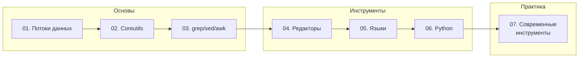

# Часть IV. Работа с файлами и потоками данных

## От теории к практике

В первой главе мы изучили файлы как элементы файловой системы — метаданные, права, дескрипторы. Во второй — как контейнеры данных: кодировки, форматы, структуры. Теперь пора применить знания на практике.

!!! abstract "Ключевая идея главы"
    **Программы работают с последовательностями байт.** Интерпретация (текст, числа, структуры) — отдельный слой. Понимание этого принципа — ключ к эффективной работе с любыми инструментами.

## О чём эта глава

Это практическая часть книги. Мы изучим:

- **Потоки данных** — stdin/stdout/stderr, pipes, перенаправление
- **Coreutils** — базовые утилиты UNIX для работы с файлами  
- **Обработка текста** — grep, sed, awk и их современные альтернативы
- **Редакторы** — от просмотрщиков до полноценных IDE
- **Языки программирования** — итераторы и генераторы для потоковой обработки
- **Python** — глубокое погружение в файловые операции
- **Современные инструменты** — DuckDB, jq, miller и другие

## Карта главы



## Структура главы

| № | Раздел | Описание |
|---|--------|----------|
| 01 | [Потоки данных](26-streams.md) | stdin/stdout/stderr, pipes, file descriptors, SIGPIPE |
| 02 | [Coreutils](27-coreutils.md) | cat, head, tail, sort, uniq, cut, tr, wc и другие |
| 03 | [grep, sed, awk](28-text-processing.md) | Три кита обработки текста |
| 04 | [Редакторы](29-editors.md) | less, vim, nano, hex-редакторы |
| 05 | [Языки программирования](30-languages.md) | Итераторы и генераторы |
| 06 | [Python подробно](31-python-deep.md) | pathlib, io, mmap, encoding |
| 07 | [Современные инструменты](32-modern-tools.md) | jq, DuckDB, miller, csvkit |

## Философия UNIX

Прежде чем погрузиться в инструменты, вспомним принципы, на которых они построены:

```
┌─────────────────────────────────────────────────────────────┐
│  ФИЛОСОФИЯ UNIX                                             │
├─────────────────────────────────────────────────────────────┤
│  1. Делай одну вещь и делай её хорошо                       │
│  2. Пиши программы для совместной работы                    │
│  3. Пиши программы для обработки текстовых потоков          │
│     (это универсальный интерфейс)                           │
└─────────────────────────────────────────────────────────────┘
```

Эти принципы объясняют, почему:
- `cat` только выводит, `grep` только фильтрует, `sort` только сортирует
- Программы соединяются через pipes (`|`)
- Текст (последовательность строк) — lingua franca UNIX

## Строка как единица обработки

В мире UNIX базовая единица обработки — **строка**:

```bash
# Каждая программа читает строки, обрабатывает, выводит строки
cat file.txt | grep "pattern" | sort | uniq
```

Строка заканчивается:
- `\n` (LF) — UNIX, Linux, macOS  
- `\r\n` (CRLF) — Windows
- EOF — конец файла (последняя строка может не иметь `\n`)

!!! warning "Последняя строка"
    Многие утилиты ожидают `\n` в конце каждой строки. Файл без финального `\n` может вести себя неожиданно. POSIX определяет текстовый файл как последовательность строк, где каждая строка заканчивается `\n`.

## Начинаем

Готовы? Начнём с фундамента — [потоков данных](26-streams.md).

---

??? example "Попробуйте сами: задания по Части IV"
    Эти задания объединяют материал нескольких глав. Выполняйте после прочтения всей части.

    **1. ETL-пайплайн в одну строку (практика)**
    Постройте pipeline из coreutils + grep/sed/awk, который: читает CSV-лог → фильтрует по дате → извлекает колонку → сортирует → считает уникальные значения → сохраняет Top-10. Всё в одной строке через `|`.

    **2. Сравнение инструментов (исследование)**
    Найдите лог-файл >100 МБ (или сгенерируйте). Выполните один и тот же поиск через `grep`, `ripgrep`, `awk`, `python`, `duckdb`. Замерьте время через `time`. Оформите результат как таблицу с выводами.

    **3. Интерактивный анализатор логов (кодинг)**
    Напишите Python-скрипт с использованием `argparse`, который: принимает путь к лог-файлу → парсит построчно (не загружая в память) → поддерживает фильтры (по дате, уровню, regex) → выводит статистику (count по уровням, Top-N IP).

    **4. Свой мини-jq (сквозное задание)**
    Реализуйте на Python упрощённый аналог `jq`: читает JSON со stdin, принимает выражение-путь (`.users[].name`), выводит результат. Поддержите: доступ к ключам, индексы массивов, итерацию (`[]`).
