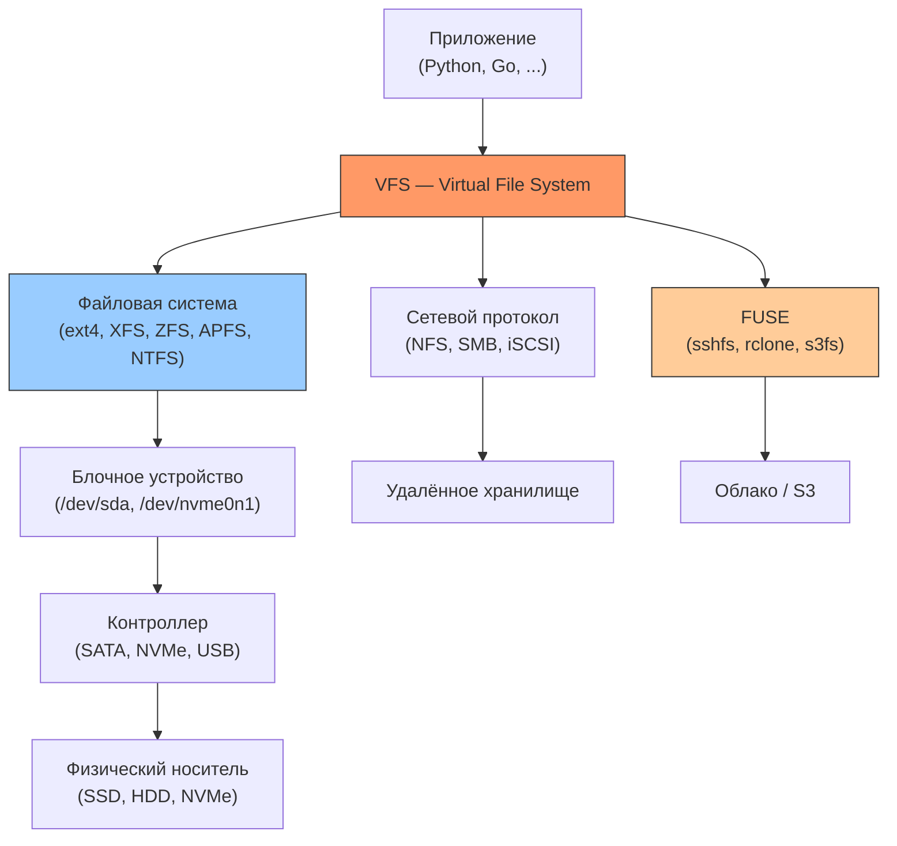

# Часть V. Инфраструктура хранения данных

!!! abstract "О чём эта часть"
    Самая объёмная часть книги (17 глав!) посвящена тому, **где и как** физически хранятся ваши файлы — от магнитных пластин HDD до объектных хранилищ S3 и файлов внутри git-репозиториев.

## От файлов к дискам

В предыдущих частях мы работали с файлами как абстракцией: inode, права доступа, форматы данных. Но под каждым файлом лежит цепочка технологий:

## Карта глав

| № | Глава | Ключевые темы |
|---|-------|--------------|
| 34 | [Архитектура накопителей](34-architecture.md) | HDD vs SSD vs NVMe, IOPS, SMART, безопасное удаление |
| 35 | [Разделы (Partitions)](35-partitions.md) | GPT vs MBR, схемы партиционирования |
| 36 | [UNIX файловые системы](36-unix-fs.md) | inode, суперблок, журналирование |
| 37 | [Windows: NTFS и ReFS](37-windows-fs.md) | MFT, альтернативные потоки, ReFS |
| 38 | [BSD и APFS](38-bsd-fs.md) | UFS2, HAMMER2, APFS (клоны, снапшоты) |
| 39 | [Linux: ext4 и XFS](39-linux-fs.md) | Журнал, extents, квоты |
| 40 | [ZFS](40-zfs.md) | Пулы, CoW, дедупликация, снапшоты |
| 41 | [Btrfs](41-btrfs.md) | Субтома, снапшоты, RAID, сжатие |
| 42 | [mdadm (RAID)](42-mdadm.md) | Уровни RAID, сборка, мониторинг |
| 43 | [LVM](43-lvm.md) | PV/VG/LV, снапшоты, расширение |
| 44 | [Сетевые протоколы](44-protocols.md) | NFS, SMB/CIFS, iSCSI |
| 45 | [S3 и объектное хранение](45-s3.md) | REST API, Signed URLs, Lifecycle, MinIO |
| 46 | [HTTP и файлы](46-http.md) | Range Requests, CDN, кэширование |
| 47 | [Git как файловая система](47-git-fs.md) | Объекты, контент-адресация, packfiles |
| 48 | [Plan 9 и 9P](48-plan9.md) | «Всё — файл» в чистом виде |
| 49 | [Контейнеры и OverlayFS](49-containers.md) | Docker layers, overlay2, namespaces |
| 50 | [Токенизация](50-tokenization.md) | Файлы для LLM, BPE, tiktoken |

## Что мы изучим

1. **Архитектура накопителей** — как устроены HDD, SSD, NVMe. Почему IOPS важны для баз данных, а последовательное чтение — для видео

2. **Блочные устройства и разделы** — GPT vs MBR, схемы партиционирования, LVM для гибкого управления

3. **Файловые системы** — ext4, XFS, Btrfs, ZFS, APFS, NTFS. Журналирование, снапшоты, RAID, дедупликация

4. **Сетевое хранение** — NFS, SMB/CIFS, iSCSI. Как монтировать удалённые файловые системы

5. **Облачное и специальное хранение** — S3, HTTP Range Requests, Git internals, контейнеры, токенизация

## Практическая ценность

Эта часть поможет:

- **Выбрать** файловую систему для задачи (→ сравнительная таблица в Главе 39)
- **Понять**, почему база данных тормозит на HDD и как это исправить
- **Настроить** LVM для расширения дисков без простоя
- **Спроектировать** схему хранения для production-системы
- **Разобраться** в Git на уровне объектов — не заклинания, а понимание

---

??? example "Попробуйте сами: задания по Части V"
    Эти задания объединяют материал нескольких глав. Выполняйте после прочтения всей части.

    **1. Аудит хранилища (исследование)**
    Исследуйте свою систему: `lsblk`, `df -Th`, `mount`, `cat /proc/filesystems`. Составьте схему: физические диски → разделы → файловые системы → точки монтирования. Какие ФС используются и почему?

    **2. Файловая система в файле (практика)**
    Создайте файл-образ через `dd`, отформатируйте его в ext4 (или другую ФС), смонтируйте через loop device. Создайте файлы, размонуйте, исследуйте образ через `debugfs` или `fsck`. Что произойдёт, если вы повредите несколько байт образа?

    **3. Бенчмарк I/O (кодинг)**
    Напишите скрипт, который замеряет: последовательную запись (dd-like), случайное чтение 4K блоков, latency fsync. Сравните результаты на HDD vs SSD (или tmpfs vs реальный диск). Визуализируйте результаты.

    **4. Проект хранилища (сквозное задание)**
    Спроектируйте схему хранения для веб-сервиса с 10 ТБ данных: выберите ФС, схему partition/LVM, стратегию бэкапов (снапшоты), мониторинг (SMART). Обоснуйте каждое решение, ссылаясь на материал глав 34–50.
