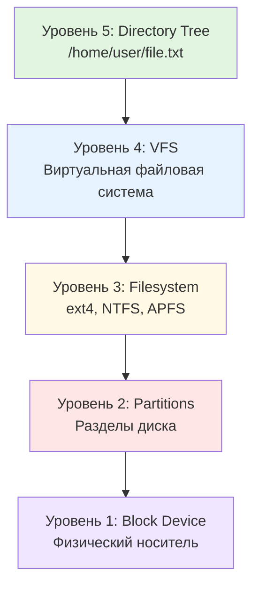
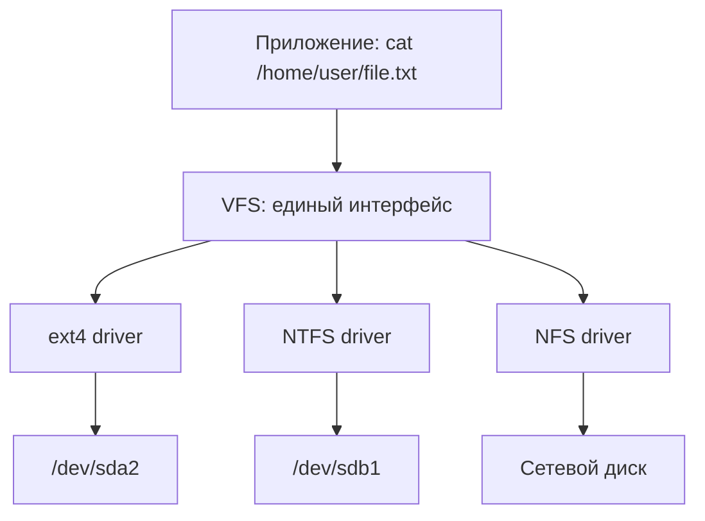
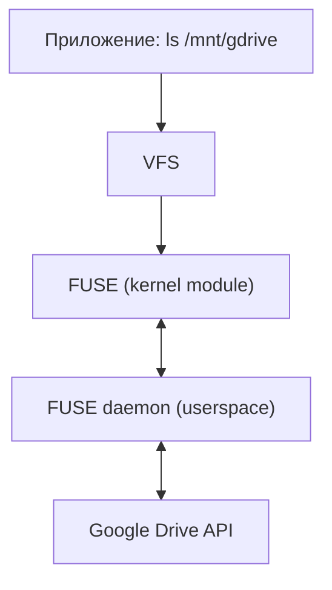
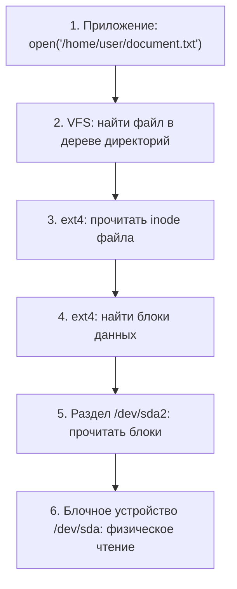

# Глава 34. Файловые системы: архитектура хранения

!!! abstract "О главе"
    Это **архитектурный обзор** всех пяти уровней хранения. Каждый уровень подробно раскрывается в последующих главах: разделы (Глава 35), файловые системы (Главы 36–41), RAID (Глава 42), LVM (Глава 43).

## Введение

Когда мы говорим "файл хранится на диске", за этой простой фразой скрывается **многоуровневая архитектура**. Данные проходят путь от физического носителя через несколько слоёв абстракции, прежде чем предстать перед нами как файл с именем и содержимым.

В этой главе мы разберём **пять уровней** архитектуры хранения:



## Уровень 1: Block Device (блочное устройство)

### Что это?

**Блочное устройство** (block device), в обиходе называемое просто **диском** — это физический носитель данных, который читает и пишет данные **блоками** фиксированного размера (обычно 512 байт или 4 КБ).

!!! info "Терминология: почему диск называется диском?"
    Исторически данные хранились на вращающихся магнитных **дисках** (пластинах). Отсюда термины:
    
    - **Disk** — сам носитель (от физической формы пластин HDD)
    - **Drive** — устройство с приводом (механизмом вращения)
    - **Винчестер** (Winchester) — устаревшее название HDD, от кодового имени первого герметичного жёсткого диска IBM 3340 (1973), чьи характеристики "30-30" напоминали калибр винтовки Winchester 30-30
    
    Хотя SSD не содержит вращающихся частей, термин "диск" сохранился по традиции.

### Типы накопителей: подробный разбор

#### HDD (Hard Disk Drive) — жёсткий диск

**HDD** — накопитель на магнитных пластинах с механической головкой чтения/записи.

| Характеристика | Типичные значения |
|----------------|-------------------|
| **Ёмкость** | 500 ГБ — 20+ ТБ |
| **Форм-фактор** | 3.5" (десктоп), 2.5" (ноутбук) |
| **Интерфейс** | SATA III (6 Гбит/с), SAS |
| **Скорость вращения (RPM)** | 5400, 7200, 10000, 15000 об/мин |
| **Последовательное чтение** | 100-250 МБ/с |
| **Случайный доступ (IOPS)** | 75-200 IOPS |
| **Задержка доступа** | 5-15 мс |

!!! note "RPM и производительность"
    **RPM** (Revolutions Per Minute) — скорость вращения шпинделя. Чем выше RPM, тем быстрее головка достигает нужного сектора:
    
    - **5400 RPM** — тихие, холодные, для хранения данных
    - **7200 RPM** — стандарт для десктопов
    - **10000-15000 RPM** — серверные, максимальная скорость, но шумные и горячие

#### SSD (Solid State Drive) — твердотельный накопитель

**SSD** — накопитель на микросхемах флеш-памяти NAND без движущихся частей.

| Характеристика | SATA SSD | NVMe SSD |
|----------------|----------|----------|
| **Ёмкость** | 120 ГБ — 8 ТБ | 250 ГБ — 8+ ТБ |
| **Форм-фактор** | 2.5", M.2 | M.2, U.2, PCIe карта |
| **Интерфейс** | SATA III (6 Гбит/с) | PCIe 3.0/4.0/5.0 (до 128 Гбит/с) |
| **Последовательное чтение** | 500-550 МБ/с | 3000-7500 МБ/с |
| **Последовательная запись** | 400-520 МБ/с | 2000-6500 МБ/с |
| **Случайный доступ (IOPS)** | 50 000-100 000 | 500 000-1 000 000+ |
| **Задержка доступа** | 0.1 мс | 0.02 мс |

!!! info "Почему SATA SSD ограничен 550 МБ/с?"
    **SATA** (Serial ATA) — интерфейс, разработанный для HDD. Максимальная пропускная способность SATA III — 6 Гбит/с ≈ 600 МБ/с (с учётом накладных расходов ~550 МБ/с). Это потолок для любого SATA-устройства.
    
    **NVMe** (Non-Volatile Memory Express) — протокол, разработанный специально для флеш-памяти. Использует шину PCIe напрямую, обходя ограничения SATA.

#### Сравнительная таблица накопителей

| Устройство | Тип памяти | Интерфейс | Ёмкость | Чтение | IOPS | Особенности |
|:-----------|:----------|:---------:|--------:|-------:|-----:|:------------|
| **HDD 7200** | Магнит. пластины | SATA | 1–20 ТБ | 150–200 МБ/с | 100 | Дёшево, много места |
| **HDD 5400** | Магнит. пластины | SATA | 1–8 ТБ | 100–150 МБ/с | 75 | Тихий, холодный |
| **SSD SATA** | NAND | SATA | 0.12–8 ТБ | 550 МБ/с | 90K | Ограничен SATA |
| **SSD NVMe** | NAND | PCIe | 0.25–8 ТБ | 3–7 ГБ/с | 1M | Макс. скорость |
| **USB Flash** | NAND | USB 3.x | 8–512 ГБ | 100–400 МБ/с | 5K | Портативность |
| **SD Card** | NAND | SD/UHS | 8–1024 ГБ | 90–300 МБ/с | 3K | Камеры, телефоны |
| **eMMC** | NAND | MMC | 16–256 ГБ | 100–400 МБ/с | 10K | Встроенная память |

!!! info "IOPS — ключевая метрика для баз данных"
    **IOPS** (Input/Output Operations Per Second) — количество операций чтения/записи в секунду. 
    
    Для последовательного чтения больших файлов важна **пропускная способность** (МБ/с).
    Для баз данных, виртуализации, случайного доступа важен **IOPS**.
    
    HDD: ~100 IOPS (головка должна физически переместиться)
    SSD: ~100 000-1 000 000 IOPS (электронный доступ к любой ячейке)

### Блочные устройства в Unix/Linux: `/dev/`

В Unix/Linux блочные устройства представлены как **специальные файлы** в директории `/dev/`:

```bash
# Просмотр блочных устройств
$ ls -l /dev/sd* /dev/nvme* /dev/mmcblk* 2>/dev/null
brw-rw---- 1 root disk   8,   0 Feb  4 10:00 /dev/sda      # SATA SSD
brw-rw---- 1 root disk   8,   1 Feb  4 10:00 /dev/sda1     # Раздел 1
brw-rw---- 1 root disk   8,   2 Feb  4 10:00 /dev/sda2     # Раздел 2
brw-rw---- 1 root disk   8,  16 Feb  4 10:00 /dev/sdb      # HDD
brw-rw---- 1 root disk   8,  17 Feb  4 10:00 /dev/sdb1     # Раздел
brw-rw---- 1 root disk 259,   0 Feb  4 10:00 /dev/nvme0n1  # NVMe SSD
brw-rw---- 1 root disk 259,   1 Feb  4 10:00 /dev/nvme0n1p1
brw-rw---- 1 root disk 179,   0 Feb  4 10:00 /dev/mmcblk0  # SD карта
brw-rw---- 1 root disk 179,   1 Feb  4 10:00 /dev/mmcblk0p1

# Детальная информация о блочных устройствах
$ lsblk -o NAME,SIZE,TYPE,FSTYPE,MOUNTPOINT,MODEL,ROTA,RO
NAME        SIZE TYPE FSTYPE MOUNTPOINT  MODEL              ROTA RO
sda       238.5G disk                    Samsung SSD 860       0  0
├─sda1      512M part vfat   /boot/efi                         0  0
└─sda2      238G part ext4   /                                 0  0
sdb         3.6T disk                    WDC WD40EFRX         1  0
├─sdb1        2T part ext4   /data                             1  0
└─sdb2      1.6T part ext4   /backup                           1  0
nvme0n1       1T disk                    Samsung 980 PRO       0  0
├─nvme0n1p1 512M part vfat   /boot                             0  0
└─nvme0n1p2 999G part btrfs  /home                             0  0
mmcblk0      32G disk                                          0  0
└─mmcblk0p1  32G part ext4   /media/sdcard                     0  0
sr0        1024M rom                     DVD-RW                1  0
```

!!! note "ROTA — определение типа накопителя"
    Колонка `ROTA` (rotational) показывает: `1` = HDD (вращается), `0` = SSD/Flash (не вращается).

### Именование устройств в разных ОС

#### Linux: схема именования

| Префикс | Тип устройства | Пример | Расшифровка |
|---------|----------------|--------|-------------|
| `sd*` | SATA/SCSI/USB диски | `/dev/sda`, `/dev/sdb` | **S**CSI **D**isk |
| `nvme*` | NVMe накопители | `/dev/nvme0n1` | NVMe контроллер 0, namespace 1 |
| `hd*` | Старые IDE/PATA | `/dev/hda` | **H**ard **D**isk (устаревшее) |
| `mmcblk*` | SD/MMC карты | `/dev/mmcblk0` | **MMC** **Bl**oc**k** device |
| `vd*` | Виртуальные диски (KVM) | `/dev/vda` | **V**irtIO **D**isk |
| `xvd*` | Xen виртуальные диски | `/dev/xvda` | **X**en **V**irtual **D**isk |
| `loop*` | Loop-устройства (образы) | `/dev/loop0` | Файл как блочное устройство |
| `sr*` | CD/DVD-ROM | `/dev/sr0` | **S**CSI **R**OM |

**Разделы:**
- SATA/SCSI: `/dev/sda1`, `/dev/sda2`, ...
- NVMe: `/dev/nvme0n1p1`, `/dev/nvme0n1p2`, ... (p = partition)
- MMC: `/dev/mmcblk0p1`, `/dev/mmcblk0p2`, ...

#### FreeBSD: схема именования

```bash
# FreeBSD использует другую систему
$ geom disk list
Geom name: ada0
...
Geom name: da0
...

$ ls /dev/ada* /dev/da* /dev/nvd*
/dev/ada0       # SATA диск (ATA Direct Access)
/dev/ada0p1     # GPT раздел 1
/dev/ada0p2     # GPT раздел 2
/dev/da0        # USB/SCSI диск (Direct Access)
/dev/nvd0       # NVMe диск
/dev/nvd0p1     # NVMe раздел
```

| Префикс | Тип устройства | Пример |
|---------|----------------|--------|
| `ada*` | SATA/ATA диски | `/dev/ada0` |
| `da*` | SCSI/USB диски | `/dev/da0` |
| `nvd*` | NVMe (legacy драйвер) | `/dev/nvd0` |
| `nda*` | NVMe (CAM драйвер) | `/dev/nda0` |
| `mmcsd*` | SD/MMC карты | `/dev/mmcsd0` |

#### OpenBSD: схема именования

```bash
# OpenBSD имеет свою систему с дисковыми метками
$ sysctl hw.disknames
hw.disknames=sd0:,sd1:,cd0:

$ disklabel sd0
# /dev/sd0:
type: SCSI
disk: SCSI disk
...
16 partitions:
#    size   offset fstype
 a:  4.0G       64 4.2BSD  # /
 b:  8.0G  8388672 swap
 d: 50.0G 25165888 4.2BSD  # /usr
```

| Префикс | Тип устройства | Пример |
|---------|----------------|--------|
| `sd*` | SCSI/SATA/USB/NVMe | `/dev/sd0` |
| `wd*` | IDE диски (устаревшее) | `/dev/wd0` |
| `cd*` | CD/DVD | `/dev/cd0` |

!!! note "OpenBSD: партиции vs разделы"
    OpenBSD использует **disklabel** поверх MBR/GPT. Буквы a-p обозначают партиции внутри disklabel:
    - `a` — обычно root
    - `b` — swap
    - `c` — весь диск (raw)
    - `d-p` — пользовательские

### Windows: физические диски

В Windows блочные устройства называются **Physical Drives**:

```powershell
# PowerShell: список физических дисков
PS> Get-PhysicalDisk | Format-Table Number,FriendlyName,MediaType,Size,HealthStatus

Number FriendlyName             MediaType   Size         HealthStatus
------ ------------             ---------   ----         ------------
0      Samsung SSD 970 EVO Plus SSD         1000204886016 Healthy
1      WDC WD40EFRX-68N         HDD         4000787030016 Healthy
2      Generic USB Flash        Unspecified 32212254720   Healthy

# Информация о диске с IOPS и RPM (для HDD)
PS> Get-PhysicalDisk | Select-Object FriendlyName,MediaType,SpindleSpeed,Size

FriendlyName              MediaType SpindleSpeed          Size
------------              --------- ------------          ----
Samsung SSD 970 EVO Plus  SSD                  0 1000204886016
WDC WD40EFRX-68N          HDD               5400 4000787030016
```

### Характеристики блочного устройства

| Характеристика | Описание | Примеры значений |
|----------------|----------|------------------|
| **Размер блока (sector size)** | Минимальная единица чтения/записи | 512 байт (legacy), 4 КБ (Advanced Format) |
| **Ёмкость** | Общий размер устройства | 256 ГБ, 1 ТБ, 4 ТБ |
| **Тип носителя** | HDD, SSD, NVMe, USB Flash | См. таблицу выше |
| **Интерфейс** | Способ подключения | SATA, NVMe/PCIe, USB, SAS |
| **RPM** | Скорость вращения (только HDD) | 5400, 7200, 10000, 15000 |
| **IOPS** | Операций ввода-вывода в секунду | HDD: ~100, SSD: ~100K, NVMe: ~1M |
| **Пропускная способность** | Последовательное чтение/запись | 150 МБ/с (HDD) — 7 ГБ/с (NVMe) |
| **Задержка (latency)** | Время доступа к случайному блоку | 10 мс (HDD), 0.1 мс (SSD), 0.02 мс (NVMe) |

### Бенчмаркинг: измерение характеристик I/O

Как проверить реальные характеристики диска? Каждая метрика измеряется по-разному:

| Метрика | Что измеряем | Инструмент | Команда |
|---------|-------------|------------|---------|
| **Throughput (МБ/с)** | Последовательное чтение/запись больших блоков | dd, hdparm | `dd bs=1M`, `hdparm -Tt` |
| **IOPS** | Случайные операции малыми блоками (4K) | fio | `fio --rw=randread --bs=4k` |
| **Latency (мс)** | Задержка одной операции | fio, ioping | `ioping -c 10 /dev/sda` |

#### Формула: IOPS ↔ Throughput

**Throughput и IOPS связаны через размер блока:**

$$
\text{Throughput} = \text{IOPS} \times \text{Block Size}
$$

| IOPS | Block Size | Throughput |
|------|-----------|------------|
| 100 (HDD) | 4 KB | 100 × 4 KB = **0.4 MB/s** |
| 100 (HDD) | 1 MB | 100 × 1 MB = **100 MB/s** |
| 100,000 (SSD) | 4 KB | 100K × 4 KB = **400 MB/s** |
| 100,000 (SSD) | 1 MB | Упирается в интерфейс (~550 MB/s SATA) |

!!! note "Почему HDD медленный для мелких файлов?"
    HDD даёт ~100 IOPS (физическое перемещение головки).
    
    - При блоке 4 KB: 100 × 4 KB = 400 KB/s — **ужасно медленно!**
    - При блоке 1 MB: 100 × 1 MB = 100 MB/s — нормально
    
    SSD даёт ~100,000 IOPS:
    
    - При блоке 4 KB: 100 000 × 4 KB = 400 MB/s — **в 1000 раз быстрее!**
    
    Вот почему базы данных и node_modules **летают** на SSD.

#### Обратная формула

Если знаете throughput и хотите IOPS:

$$
\text{IOPS} = \frac{\text{Throughput}}{\text{Block Size}}
$$

Например: диск показывает 500 MB/s при блоках 128 KB:

$$
\text{IOPS} = \frac{500 \text{ MB/s}}{128 \text{ KB}} = \frac{500 \times 1024}{128} \approx 4000 \text{ IOPS}
$$

#### Быстрые тесты

```bash
# Тест чтения из кэша и с диска (Linux)
$ sudo hdparm -Tt /dev/sda
 Timing cached reads:   12345 MB in  2.00 seconds = 6172 MB/sec   # RAM кэш
 Timing buffered disk reads: 550 MB in  3.01 seconds = 182 MB/sec # Реальный диск

# Тест записи с dd (создаёт файл 1GB)
$ dd if=/dev/zero of=/tmp/testfile bs=1M count=1024 conv=fdatasync
1073741824 bytes copied, 3.45 s, 311 MB/sec

# Очистить кэш перед тестом чтения
$ sudo sh -c "echo 3 > /proc/sys/vm/drop_caches"
$ dd if=/tmp/testfile of=/dev/null bs=1M
1073741824 bytes copied, 2.89 s, 371 MB/sec
```

!!! warning "Кэш искажает результаты"
    Без очистки кэша (`drop_caches`) вы измеряете скорость RAM, а не диска!
    Флаг `conv=fdatasync` заставляет dd дождаться записи на диск.

#### Профессиональный бенчмаркинг с fio

**fio** (Flexible I/O Tester) — стандарт для тестирования дисков:

```bash
# Последовательное чтение (throughput)
$ fio --name=seq_read --rw=read --bs=1M --size=1G --numjobs=1 --filename=/tmp/fiotest
   read: IOPS=523, BW=523MiB/s

# Последовательная запись
$ fio --name=seq_write --rw=write --bs=1M --size=1G --numjobs=1 --filename=/tmp/fiotest

# Случайное чтение 4K (IOPS) — критично для баз данных
$ fio --name=rand_read --rw=randread --bs=4k --size=256M --numjobs=4 --filename=/tmp/fiotest
   read: IOPS=95.2k, BW=372MiB/s, lat avg=42.01 usec

# Смешанная нагрузка 70% чтение / 30% запись
$ fio --name=mixed --rw=randrw --rwmixread=70 --bs=4k --size=256M --filename=/tmp/fiotest
```

#### Измерение latency

```bash
# ioping — ping для дисков
$ ioping -c 5 /dev/sda
4 KiB <<< /dev/sda (block device 238.5 GiB): request=1 time=82.5 us
4 KiB <<< /dev/sda: request=2 time=91.2 us
--- /dev/sda ping statistics ---
5 requests completed in 456.3 us, 20 KiB read
min/avg/max/mdev = 72.1 us / 91.3 us / 112.4 us / 14.8 us
```

#### Windows и macOS

```powershell
# Windows: встроенный тест
> winsat disk -drive C
Disk  Sequential 64.0 Read                  531.52 MB/s
Disk  Random 16.0 Read                      215.41 MB/s

# Или GUI: CrystalDiskMark, AS SSD Benchmark
```

```bash
# macOS: dd работает, но без drop_caches
$ dd if=/dev/zero of=/tmp/testfile bs=1m count=1024
$ dd if=/tmp/testfile of=/dev/null bs=1m

# Или GUI: Disk Speed Test (App Store), Blackmagic Disk Speed Test
```

!!! tip "Что тестировать?"
    - **Видеомонтаж, копирование** → последовательное чтение/запись (МБ/с)
    - **Базы данных, виртуализация** → случайный 4K (IOPS)
    - **Интерактивная работа** → latency (мс/мкс)

### LBA: абстракция блочного доступа

**LBA (Logical Block Addressing)** — ключевая абстракция, скрывающая физику носителя от ОС.

```
┌─────────────────────────────────────────────────────────────┐
│  ДИСК КАК "ЧЁРНЫЙ ЯЩИК"                                     │
├─────────────────────────────────────────────────────────────┤
│                                                             │
│    ОС видит:   [ Блок 0 ][ Блок 1 ][ Блок 2 ]...[ Блок N ]  │
│                                                             │
│    Команды:    "Прочитай блок #12345"                       │
│                "Запиши данные в блок #67890"                │
│                                                             │
│    Физика скрыта: головки HDD, ячейки NAND, wear leveling   │
└─────────────────────────────────────────────────────────────┘
```

**Почему это важно:**

| Носитель | Физика | LBA скрывает |
|----------|--------|-------------|
| **HDD** | Вращающиеся пластины, магнитные головки | Цилиндры, секторы, дорожки |
| **SSD** | NAND flash, контроллер | Стирание блоков, wear leveling |
| **NVMe** | Параллельные каналы flash | Очереди команд, контроллер |

Для ОС все эти устройства выглядят одинаково: массив блоков с номерами 0, 1, 2, ..., N.

!!! warning "Прямая запись на блочное устройство"
    Можно писать напрямую на блочное устройство, минуя файловую систему:
    
    ```bash
    # ⚠️ ОПАСНО! Перезапишет весь диск
    sudo dd if=/dev/zero of=/dev/sda bs=4M
    ```
    
    Это используется для создания загрузочных флешек, клонирования дисков, но **уничтожит все данные**!

### Инструменты для работы с блочными устройствами

Помимо `dd`, существует множество утилит для низкоуровневой работы с дисками:

```bash
# Информация о блочных устройствах
$ lsblk -o NAME,SIZE,TYPE,FSTYPE,MODEL     # Дерево дисков и разделов
$ blkid                                     # UUID и типы ФС разделов
$ hdparm -I /dev/sda                        # Детальная информация о диске
$ smartctl -a /dev/sda                      # S.M.A.R.T. диагностика

# Тестирование производительности
$ fio --name=test --rw=randread --bs=4k --numjobs=4 --size=1G
$ hdparm -Tt /dev/sda                       # Быстрый тест скорости

# Клонирование и образы
$ dd if=/dev/sda of=/dev/sdb bs=64K status=progress   # Клонирование диска
$ dcfldd if=/dev/sda of=disk.img hash=sha256          # dd с хешированием
$ ddrescue /dev/sda disk.img logfile                  # Восстановление с повреждённого диска

# Резервное копирование на уровне файловой системы
$ dump -0uf /backup/root.dump /                       # Полный бэкап / (уровень 0)
$ dump -1uf /backup/root.1.dump /                     # Инкрементальный (уровень 1)
$ restore -tf /backup/root.dump                       # Просмотр содержимого
$ restore -rf /backup/root.dump                       # Восстановление

# Безопасное стирание
$ shred -v -n 3 /dev/sda                    # Перезапись случайными данными
$ blkdiscard /dev/sda                       # TRIM для SSD (быстрое стирание)

# Работа с loop-устройствами (файл как диск)
$ losetup /dev/loop0 disk.img               # Подключить образ
$ losetup -d /dev/loop0                     # Отключить
```

!!! tip "dd vs dcfldd vs ddrescue"
    - **dd** — базовая утилита, минимум возможностей
    - **dcfldd** — dd с прогрессом, хешированием, верификацией (для форензики)
    - **ddrescue** — умеет обходить bad-блоки, для восстановления данных

---

### Loop devices: файл как блочное устройство

**Loop device** (loopback device) — это виртуальное блочное устройство, которое использует обычный файл как "диск". Это позволяет:

- Монтировать ISO-образы без записи на CD/DVD
- Создавать и тестировать файловые системы в файле
- Работать с образами дисков (`.img`, `.raw`)
- Создавать шифрованные контейнеры

```
┌─────────────────────────────────────────────────────────────┐
│                     Как работает loop device                │
├─────────────────────────────────────────────────────────────┤
│                                                             │
│    Файл disk.img         Loop device          Монтирование  │
│   ┌───────────────┐     ┌───────────┐        ┌──────────┐   │
│   │ обычный файл  │ ──▶ │/dev/loop0 │ ──▶    │ /mnt/img │   │
│   │ в файловой    │     │  (блочное │        │(директо- │   │
│   │ системе       │     │ устройство│        │   рия)   │   │
│   └───────────────┘     └───────────┘        └──────────┘   │
│                                                             │
│   losetup                               mount               │
│                                                             │
└─────────────────────────────────────────────────────────────┘
```

#### Базовые операции

```bash
# Создание файла-образа
$ truncate -s 100M disk.img              # Создать sparse-файл 100MB (быстро)
$ dd if=/dev/zero of=disk.img bs=1M count=100  # Или заполненный нулями

# Подключение к loop device
$ sudo losetup /dev/loop0 disk.img       # Явно указать устройство
$ sudo losetup -f disk.img               # Автоматически найти свободный
$ sudo losetup -f --show disk.img        # Найти и показать какой занял
/dev/loop0

# Просмотр подключённых loop devices
$ losetup -l
NAME       SIZELIMIT OFFSET AUTOCLEAR RO BACK-FILE
/dev/loop0         0      0         0  0 /home/user/disk.img

# Создание ФС и монтирование
$ sudo mkfs.ext4 /dev/loop0
$ sudo mount /dev/loop0 /mnt/img
$ df -h /mnt/img

# Отключение
$ sudo umount /mnt/img
$ sudo losetup -d /dev/loop0
```

#### Монтирование ISO-образов

```bash
# Скачали ISO — хотим посмотреть содержимое
$ sudo mount -o loop ubuntu.iso /mnt/iso    # Автоматически создаст loop

# Или вручную
$ sudo losetup -f --show ubuntu.iso
/dev/loop1
$ sudo mount -o ro /dev/loop1 /mnt/iso      # Только чтение (ISO read-only)

# Просмотр
$ ls /mnt/iso
boot  casper  dists  EFI  install  pool  ...
```

#### Образ с разделами

```bash
# Образ диска может содержать таблицу разделов
$ sudo losetup -f --show disk-with-partitions.img
/dev/loop0

# Просканировать разделы внутри образа
$ sudo partprobe /dev/loop0
# или
$ sudo kpartx -av /dev/loop0
add map loop0p1 (253:0): 0 204800 linear /dev/loop0 2048
add map loop0p2 (253:1): 0 1843200 linear /dev/loop0 206848

# Теперь можно монтировать отдельные разделы
$ sudo mount /dev/mapper/loop0p1 /mnt/part1

# Отключение
$ sudo kpartx -d /dev/loop0
$ sudo losetup -d /dev/loop0
```

#### Пример: создание образа с файловой системой

```bash
#!/bin/bash
# Создаём образ диска с ext4 и тестируем

IMG="test-disk.img"
MNT="/mnt/test"

# 1. Создаём sparse-файл 500MB
truncate -s 500M "$IMG"

# 2. Подключаем к loop
LOOP=$(sudo losetup -f --show "$IMG")
echo "Using: $LOOP"

# 3. Создаём файловую систему
sudo mkfs.ext4 -L "TestDisk" "$LOOP"

# 4. Монтируем
sudo mkdir -p "$MNT"
sudo mount "$LOOP" "$MNT"

# 5. Работаем с файлами
sudo cp -r /etc/passwd /etc/hosts "$MNT/"
ls -la "$MNT"

# 6. Чистим
sudo umount "$MNT"
sudo losetup -d "$LOOP"

echo "Image created: $IMG"
```

#### Шифрованный образ с GPG

GPG позволяет создать зашифрованный контейнер для конфиденциальных данных:

```bash
#!/bin/bash
# Создание шифрованного образа с GPG

IMG="secret.img"
IMG_GPG="secret.img.gpg"
MNT="/mnt/secret"

# === СОЗДАНИЕ ===

# 1. Создаём образ и ФС
truncate -s 100M "$IMG"
LOOP=$(sudo losetup -f --show "$IMG")
sudo mkfs.ext4 "$LOOP"

# 2. Монтируем и добавляем данные
sudo mkdir -p "$MNT"
sudo mount "$LOOP" "$MNT"
sudo cp ~/.ssh/id_rsa "$MNT/private_key"
echo "Секретные заметки" | sudo tee "$MNT/notes.txt"

# 3. Отмонтируем
sudo umount "$MNT"
sudo losetup -d "$LOOP"

# 4. Шифруем GPG (симметричное шифрование с паролем)
gpg --symmetric --cipher-algo AES256 -o "$IMG_GPG" "$IMG"

# 5. Безопасно удаляем оригинал
shred -u "$IMG"

echo "Encrypted image: $IMG_GPG"


# === ИСПОЛЬЗОВАНИЕ ===

# 1. Расшифровываем во временный файл
gpg -d -o /tmp/decrypted.img "$IMG_GPG"

# 2. Монтируем
LOOP=$(sudo losetup -f --show /tmp/decrypted.img)
sudo mount "$LOOP" "$MNT"

# 3. Работаем...
cat "$MNT/notes.txt"

# 4. Отмонтируем и чистим
sudo umount "$MNT"
sudo losetup -d "$LOOP"
shred -u /tmp/decrypted.img
```

!!! warning "GPG vs LUKS"
    **GPG** подходит для редко используемых архивов — каждый раз весь образ расшифровывается в файл.
    
    **LUKS** (Linux Unified Key Setup) — полноценное блочное шифрование, работает "на лету":
    ```bash
    # Создание LUKS-контейнера (рекомендуется для частого использования)
    $ sudo cryptsetup luksFormat /dev/loop0
    $ sudo cryptsetup open /dev/loop0 secret
    $ sudo mkfs.ext4 /dev/mapper/secret
    $ sudo mount /dev/mapper/secret /mnt/secret
    ```

#### Практические применения loop devices

| Задача | Команда |
|--------|---------|
| Смонтировать ISO | `mount -o loop image.iso /mnt/iso` |
| Тестировать ФС без диска | `losetup + mkfs + mount` |
| Создать swap в файле | `dd + losetup + mkswap + swapon` |
| Распаковать образ Raspberry Pi | `losetup + kpartx + mount` |
| Форензика: исследовать образ | `losetup -r` (read-only) |
| Создать шифрованный контейнер | `losetup + cryptsetup` или GPG |

## Уровень 2: Partitions (разделы диска)

!!! info "Подробнее"
    Детальное сравнение MBR vs GPT, практическая разметка дисков — в [Главе 35. Разделы](35-partitions.md).

### Что это?

**Раздел** (partition) — это логическое деление блочного устройства на независимые области. Каждый раздел может иметь свою файловую систему.

!!! warning "Разделы не обязательны!"
    Можно создать файловую систему **напрямую** на блочном устройстве, без таблицы разделов:
    
    ```bash
    # Создаём ext4 прямо на /dev/sdb (весь диск, без разделов)
    $ sudo mkfs.ext4 /dev/sdb
    
    # Монтируем
    $ sudo mount /dev/sdb /mnt/disk
    ```
    
    Это называется **superfloppy** или **whole-disk filesystem**. Используется для:
    
    - Простых флешек и SD-карт
    - Виртуальных дисков
    - Временных хранилищ
    

### Зачем нужны разделы?

1. **Разделение данных** — ОС на одном разделе, данные на другом. При переустановке ОС данные сохраняются.
2. **Мультизагрузка** — несколько ОС на одном диске (Windows + Linux, разные дистрибутивы).
3. **Изоляция** — заполнение `/home` не повлияет на `/` (система продолжит работать).
4. **Разные файловые системы** — ext4 для Linux, FAT32 для EFI, swap для подкачки.
5. **Производительность** — оптимизация под разные нагрузки (база данных на отдельном разделе).
6. **Безопасность** — шифрование только определённых разделов, разные права монтирования.

### Схемы разделов (Partition Tables)

#### MBR (Master Boot Record) — устаревшая

MBR хранится в первых 512 байтах диска и содержит:
- **Загрузочный код** (446 байт) — bootstrap loader
- **Таблицу разделов** (64 байта) — 4 записи по 16 байт
- **Сигнатуру** (2 байта) — `0x55AA`

| Характеристика | Значение |
|----------------|----------|
| Максимум разделов | 4 **primary** (первичных) или 3 primary + 1 **extended** |
| Extended раздел | Контейнер для **logical** (логических) разделов |
| Макс. размер диска | 2 ТБ (2^32 × 512 байт) |
| Макс. размер раздела | 2 ТБ |
| Загрузка | BIOS/Legacy |

!!! info "Primary, Extended, Logical"
    - **Primary partition** (первичный) — до 4 штук, загрузочный
    - **Extended partition** (расширенный) — контейнер, занимает 1 слот primary
    - **Logical partition** (логический) — внутри extended, количество не ограничено (практически)
    
    ```
    MBR Disk:
    ├── Primary 1 (/dev/sda1)      ← Загрузочный
    ├── Primary 2 (/dev/sda2)
    ├── Primary 3 (/dev/sda3)
    └── Extended (/dev/sda4)       ← Контейнер
        ├── Logical 1 (/dev/sda5)
        ├── Logical 2 (/dev/sda6)
        └── Logical 3 (/dev/sda7)
    ```

#### GPT (GUID Partition Table) — современная

GPT — часть стандарта UEFI, хранит информацию в начале И конце диска (backup).

| Характеристика | Значение |
|----------------|----------|
| Максимум разделов | 128 (стандартно), теоретически неограниченно |
| Макс. размер диска | 9.4 ZB (зеттабайт, 2^64 × 512 байт) |
| Макс. размер раздела | 9.4 ZB |
| Идентификация | GUID (128-бит UUID) для каждого раздела |
| Загрузка | UEFI (с Protective MBR для совместимости) |
| Целостность | CRC32 checksums |

!!! note "Тип раздела (Partition Type GUID)"
    GPT хранит тип файловой системы/назначение в метаданных раздела:
    
    | GUID | Назначение |
    |------|-----------|
    | `C12A7328-...` | EFI System Partition |
    | `0FC63DAF-...` | Linux filesystem |
    | `EBD0A0A2-...` | Microsoft basic data (NTFS) |
    | `0657FD6D-...` | Linux swap |
    
    Это позволяет ОС понять назначение раздела до его монтирования.

### Работа с разделами в разных ОС

#### Linux

```bash
# Просмотр разделов
$ sudo fdisk -l /dev/sda
Disk /dev/sda: 238.5 GiB, 256060514304 bytes, 500118192 sectors
Disklabel type: gpt

Device       Start       End   Sectors  Size Type
/dev/sda1     2048   1050623   1048576  512M EFI System
/dev/sda2  1050624 500118158 499067535  238G Linux filesystem

# Интерактивное редактирование (GPT)
$ sudo gdisk /dev/sda

# Или с помощью parted
$ sudo parted /dev/sda print
Model: ATA Samsung SSD 970 (scsi)
Partition Table: gpt
Number  Start   End     Size    File system  Name  Flags
 1      1049kB  538MB   537MB   fat32              boot, esp
 2      538MB   256GB   256GB   ext4

# Просмотр UUID разделов
$ blkid
/dev/sda1: UUID="ABCD-1234" TYPE="vfat" PARTLABEL="EFI"
/dev/sda2: UUID="a1b2c3d4-..." TYPE="ext4" PARTLABEL="Linux"
```

#### FreeBSD

```bash
# GPT разделы
$ gpart show ada0
=>       40  500118192  ada0  GPT  (238G)
         40     532480     1  efi  (260M)
     532520  499585672     2  freebsd-ufs  (238G)

# Создание раздела
$ gpart add -t freebsd-ufs -l data ada0
```

#### OpenBSD

```bash
# Disklabel (поверх MBR/GPT)
$ disklabel sd0
# /dev/sd0c:
type: SCSI
16 partitions:
#   size   offset  fstype
 a: 4.0G       64  4.2BSD    # /
 b: 8.0G  8388672  swap
 c: 238G        0  unused    # Весь диск (raw)
 d: 50.0G 25165888 4.2BSD    # /usr

# Редактирование
$ disklabel -E sd0
```

#### Windows

```powershell
# Список разделов
PS> Get-Partition | Format-Table DiskNumber,PartitionNumber,Size,Type,DriveLetter

DiskNumber PartitionNumber       Size Type     DriveLetter
---------- ---------------       ---- ----     -----------
         0               1  512.00 MB System
         0               2  237.96 GB Basic    C
         1               1    3.64 TB Basic    D

# Создать раздел
PS> New-Partition -DiskNumber 1 -UseMaximumSize -DriveLetter E

# diskpart (CLI)
> diskpart
DISKPART> list disk
DISKPART> select disk 0
DISKPART> list partition
```

### Типичная схема разделов

#### Linux:

```
/dev/sda
├── /dev/sda1  512 MB   EFI System Partition (FAT32)
├── /dev/sda2  50 GB    / (root) (ext4)
├── /dev/sda3  8 GB     swap
└── /dev/sda4  180 GB   /home (ext4)
```

#### Windows:

```
Disk 0
├── Partition 1  512 MB   EFI System (FAT32)
├── Partition 2  128 MB   Microsoft Reserved
├── Partition 3  237 GB   C: (NTFS)
└── Partition 4  1 GB     Recovery (NTFS)
```

## Уровень 3: Filesystem (файловая система)

!!! info "Подробнее"
    Детальное описание конкретных файловых систем: [Глава 36 (UNIX)](36-unix-fs.md), [Глава 37 (Windows)](37-windows-fs.md), [Глава 38 (BSD)](38-bsd-fs.md), [Глава 39 (Linux)](39-linux-fs.md), [Глава 40 (ZFS)](40-zfs.md), [Глава 41 (Btrfs)](41-btrfs.md).

### Что это?

**Файловая система** — это способ организации и хранения данных на разделе (или блочном устройстве). Она определяет:

- Как хранятся **файлы и директории** (структуры данных, деревья)
- Как хранятся **метаданные** (размер, права, даты, владелец)
- Как организован **поиск файлов** (индексы, B-trees)
- Как обеспечивается **целостность данных** (журнал, checksums)
- **Ограничения**: максимальный размер файла, длина имени, количество файлов

### Компоненты файловой системы

```
┌─────────────────────────────────────────────────────────────┐
│  АНАТОМИЯ ФАЙЛОВОЙ СИСТЕМЫ                                  │
├─────────────────────────────────────────────────────────────┤
│                                                             │
│  ┌─────────────┐  Информация о ФС: размер блока, UUID,      │
│  │ Superblock  │  количество inodes, свободное место        │
│  └─────────────┘                                            │
│                                                             │
│  ┌─────────────┐  Какие блоки заняты, какие свободны        │
│  │ Block Bitmap│  (битовая карта или B-tree)                │
│  └─────────────┘                                            │
│                                                             │
│  ┌─────────────┐  Метаданные файлов: права, размер,         │
│  │ Inode Table │  указатели на блоки данных                 │
│  └─────────────┘                                            │
│                                                             │
│  ┌─────────────┐  Связь имя → inode                         │
│  │ Directories │  (таблицы или B-tree)                      │
│  └─────────────┘                                            │
│                                                             │
│  ┌─────────────┐  Защита от сбоев: pending операции         │
│  │ Journal     │                                            │
│  └─────────────┘                                            │
│                                                             │
│  ┌─────────────┐  Собственно содержимое файлов              │
│  │ Data Blocks │                                            │
│  └─────────────┘                                            │
│                                                             │
└─────────────────────────────────────────────────────────────┘
```

### Почему выбор файловой системы важен?

Параметры ФС влияют на:

| Параметр | Что определяет | Примеры |
|----------|---------------|---------|
| **Размер блока** | Минимальная единица хранения. Большой блок = быстрее для больших файлов, но больше waste для мелких | 1 КБ, 4 КБ, 64 КБ |
| **Структура индексов** | Скорость поиска файлов в директориях | Линейный список, Hash, B-tree |
| **Максимальный размер файла** | Ограничение на размер одного файла | FAT32: 4 ГБ, ext4: 16 ТБ, XFS: 8 EB |
| **Максимальный размер ФС** | Ограничение на размер раздела | FAT32: 2 ТБ, ext4: 1 EB, XFS: 8 EB |
| **Количество файлов** | Лимит на общее число файлов (inode limit) | ext4: задаётся при создании |

!!! tip "Пример: много мелких файлов"
    При миллионах мелких файлов (node_modules, maildir):
    
    - **ext4**: может кончиться inode при создании ФС с дефолтными параметрами
    - **XFS/Btrfs**: динамическое выделение inode, проблем нет
    - **B-tree директории**: быстрый поиск vs линейный O(n) в старых ФС

### Основные файловые системы

#### Linux / BSD

| ФС | Описание | Особенности | Ограничения |
|----|----------|-------------|-------------|
| **ext4** | Extended FS 4 | Стандарт Linux, журнал, надёжность | Макс файл 16 ТБ, ФС 1 EB |
| **XFS** | SGI, high-performance | Большие файлы, параллельный I/O | Нельзя уменьшить, только расширить |
| **Btrfs** | B-tree FS | CoW, снапшоты, сжатие, RAID | Менее зрелый чем ext4/XFS |
| **ZFS** | Sun/Oracle → OpenZFS | Интеграция с томами, checksums, RAID-Z | Требует RAM, лицензия (не в Linux kernel) |
| **F2FS** | Samsung | Оптимизирована для Flash/SSD | Для embedded, мобильных |
| **UFS/FFS** | BSD стандарт | FreeBSD/OpenBSD native | Soft updates или журнал |

#### Windows

| ФС | Описание | Особенности |
|----|----------|-------------|
| **NTFS** | New Technology FS | Журнал, ACL, сжатие, шифрование, hard/soft links |
| **ReFS** | Resilient FS | Для серверов, checksums, self-healing |
| **FAT32** | File Allocation Table | Совместимость со всеми ОС, макс файл 4 ГБ |
| **exFAT** | Extended FAT | Для флешек, без ограничения 4 ГБ |

#### macOS

| ФС | Описание | Особенности |
|----|----------|-------------|
| **APFS** | Apple FS (2017+) | CoW, шифрование, снапшоты, space sharing |
| **HFS+** | Hierarchical FS Plus | Устаревшая (до macOS 10.13) |

#### BSD-специфичные

| ФС | Описание | ОС |
|----|----------|-----|
| **UFS2** | Unix File System 2 | FreeBSD (default), OpenBSD |
| **FFS** | Fast File System | OpenBSD (вариант UFS) |
| **Hammer2** | Modern CoW FS | DragonFly BSD |

### Скорость vs Отказоустойчивость: уровни решений

```
┌─────────────────────────────────────────────────────────────┐
│  ГДЕ РЕШАТЬ ПРОБЛЕМЫ СКОРОСТИ И НАДЁЖНОСТИ?                 │
├─────────────────────────────────────────────────────────────┤
│                                                             │
│  Уровень 1: АППАРАТНЫЙ RAID                                 │
│  ────────────────────────────                               │
│  • RAID-контроллер с батарейкой (BBU)                       │
│  • RAID 1, 5, 6, 10                                         │
│  • Прозрачно для ОС                                         │
│  • Дорого, надёжно, быстро                                  │
│                                                             │
│  Уровень 2: ПРОГРАММНЫЙ RAID (mdadm, LVM)                   │
│  ─────────────────────────────────────────                  │
│  • Linux: mdadm, LVM                                        │
│  • FreeBSD: graid, gmirror, gstripe                         │
│  • Дёшево, гибко, требует CPU                               │
│                                                             │
│  Уровень 3: ФАЙЛОВАЯ СИСТЕМА                                │
│  ───────────────────────────────                            │
│  • ZFS, Btrfs: встроенный RAID (RAID-Z, Btrfs RAID)         │
│  • Checksums на уровне ФС (защита от bit rot)               │
│  • Снапшоты, дедупликация                                   │
│                                                             │
└─────────────────────────────────────────────────────────────┘
```

### ZFS: файловая система нового поколения

ZFS заслуживает отдельного упоминания как пример интегрированного подхода:

```bash
# Создание пула из дисков с RAID-Z (аналог RAID-5)
$ zpool create tank raidz sda sdb sdc

# Создание файловой системы
$ zfs create tank/home
$ zfs create tank/data

# Снапшоты
$ zfs snapshot tank/home@backup-2024-02-06
$ zfs rollback tank/home@backup-2024-02-06

# Сжатие и дедупликация
$ zfs set compression=lz4 tank/data
$ zfs set dedup=on tank/backup

# Отправка снапшота на другой сервер
$ zfs send tank/home@backup | ssh server zfs recv backup/home
```

**Ключевые концепции ZFS:**

| Концепция | Описание |
|-----------|----------|
| **Storage Pool** | Объединение дисков в единый пул |
| **RAID-Z1/Z2/Z3** | Аналог RAID-5/6 с 1/2/3 дисками чётности |
| **Copy-on-Write** | Атомарность операций, нет fsck |
| **Checksums** | Проверка целостности каждого блока |
| **Self-healing** | Автоматическое восстановление из зеркала |
| **ARC** | Adaptive Replacement Cache (требует RAM) |

!!! info "ZFS vs Btrfs"
    **ZFS**: более зрелый, портирован из Solaris, не в mainline Linux (лицензия CDDL), требует много RAM.
    
    **Btrfs**: нативный Linux, в mainline kernel, менее зрелый RAID-5/6, меньше требований к RAM.

### Создание файловой системы

#### Linux:

```bash
# Создать ext4 на разделе /dev/sda2
$ sudo mkfs.ext4 /dev/sda2
mke2fs 1.46.5 (30-Dec-2021)
Creating filesystem with 62383441 4k blocks and 15597568 inodes
Filesystem UUID: a1b2c3d4-e5f6-7890-abcd-ef1234567890
Superblock backups stored on blocks: 
	32768, 98304, 163840, 229376, 294912

# Создать XFS
$ sudo mkfs.xfs /dev/sda3

# Создать Btrfs
$ sudo mkfs.btrfs /dev/sda4
```

#### Windows:

```powershell
# Форматировать диск C: в NTFS
PS> Format-Volume -DriveLetter C -FileSystem NTFS -NewFileSystemLabel "Windows"

# Форматировать в exFAT
PS> Format-Volume -DriveLetter D -FileSystem exFAT
```

### Ключевые концепции файловых систем

#### 1. Журналирование (Journaling)

Журналирование защищает от потери данных при сбоях:

```
1. Запись в журнал: "Собираюсь записать файл X"
2. Запись данных файла X
3. Запись в журнал: "Файл X записан успешно"
```

При сбое на шаге 2 система при загрузке откатит изменения.

**Файловые системы с журналированием:** ext4, XFS, NTFS, APFS

#### 2. Copy-on-Write (CoW)

При изменении файла создаётся новая копия блока, старая остаётся:

```
Было:          Стало:
Block 1 ──→    Block 1 (старая версия)
               Block 2 (новая версия) ──→ файл указывает сюда
```

**Преимущества:**
- Мгновенные снапшоты
- Защита от повреждений
- Дедупликация данных

**Файловые системы с CoW:** Btrfs, ZFS, APFS

#### 3. Снапшоты (Snapshots)

Моментальный снимок состояния файловой системы:

```bash
# Btrfs: создать снапшот
$ sudo btrfs subvolume snapshot / /snapshots/root-2024-02-04

# ZFS: создать снапшот
$ sudo zfs snapshot tank/home@2024-02-04

# APFS (macOS): Time Machine использует снапшоты
$ tmutil listlocalsnapshots /
com.apple.TimeMachine.2024-02-04-120000.local
```

## Уровень 4: VFS (Virtual File System)

### Что это?

**VFS** — это слой абстракции в ядре ОС, который предоставляет **единый интерфейс** для работы с разными файловыми системами.

### Зачем нужен VFS?

Без VFS каждая программа должна была бы знать, как работать с ext4, NTFS, FAT32 и т.д. VFS скрывает эти детали:



### Монтирование (Mounting)

**Монтирование** — это процесс подключения файловой системы к дереву директорий.

#### Linux: точки монтирования

```bash
# Просмотр смонтированных ФС
$ mount | grep ^/dev
/dev/sda2 on / type ext4 (rw,relatime)
/dev/sda1 on /boot/efi type vfat (rw,relatime)
/dev/sdb1 on /mnt/data type ntfs (rw,relatime)

# Монтировать раздел
$ sudo mount /dev/sdb1 /mnt/usb

# Размонтировать
$ sudo umount /mnt/usb

# Автоматическое монтирование при загрузке: /etc/fstab
$ cat /etc/fstab
UUID=a1b2c3d4-... / ext4 defaults 0 1
UUID=e5f6g7h8-... /boot/efi vfat defaults 0 2
UUID=i9j0k1l2-... /home ext4 defaults 0 2
```

#### Windows: буквы дисков

В Windows каждый раздел получает **букву диска**:

```powershell
# Список дисков
PS> Get-PSDrive -PSProvider FileSystem

Name           Used (GB)     Free (GB) Provider      Root
----           ---------     --------- --------      ----
C                 187.73         50.23 FileSystem    C:\
D                  50.00        150.00 FileSystem    D:\

# Назначить букву диска
PS> Set-Partition -DiskNumber 1 -PartitionNumber 2 -NewDriveLetter E
```

!!! note "Философское различие"
    **Unix/Linux:** Единое дерево директорий, начинающееся с `/`. Все диски монтируются в это дерево.
    
    **Windows:** Каждый диск — отдельное дерево с буквой (`C:\`, `D:\`, etc.)

### Bind Mounts: директория в двух местах

**Bind mount** позволяет "примонтировать" директорию в другое место дерева. Это НЕ symlink и НЕ копия — это та же самая директория, доступная по двум путям.

```bash
# Монтируем /home/user/project в /var/www/html
$ sudo mount --bind /home/user/project /var/www/html

# Теперь /var/www/html показывает содержимое /home/user/project
$ ls /var/www/html
index.html  style.css  # То же, что в /home/user/project

# Изменения видны в обоих местах
$ touch /home/user/project/new_file.txt
$ ls /var/www/html/new_file.txt
new_file.txt  # Появился!
```

**Отличия от symlink:**

| Аспект | Bind Mount | Symlink |
|--------|-----------|--------|
| Уровень | Ядро (VFS) | Файловая система |
| Виден в `ls -l` | Нет | Да (`l` тип) |
| Переживает reboot | Нет (без fstab) | Да |
| Chroot/container | Работает | Может сломаться |

**Применение:**
- Docker volumes
- chroot окружения
- Разработка (код в home, сервер в /var/www)

### FUSE: файловые системы в userspace

**FUSE** (Filesystem in Userspace) — механизм, позволяющий создавать файловые системы без написания кода ядра.



**Примеры FUSE файловых систем:**

| ФС | Назначение |
|----|-----------|
| **sshfs** | Монтирование удалённых директорий через SSH |
| **rclone mount** | Облачные хранилища (Google Drive, S3, Dropbox) |
| **encfs, gocryptfs** | Шифрование директорий |
| **ntfs-3g** | Чтение/запись NTFS в Linux |
| **s3fs** | Amazon S3 как файловая система |
| **curlftpfs** | FTP как файловая система |

```bash
# Примеры использования FUSE

# SSH как файловая система
$ sshfs user@server:/home/user /mnt/remote
$ ls /mnt/remote  # Файлы с удалённого сервера
$ fusermount -u /mnt/remote  # Размонтировать

# Google Drive
$ rclone mount gdrive: /mnt/gdrive --daemon

# Зашифрованная директория
$ gocryptfs ~/.encrypted ~/private
```

!!! tip "Когда использовать FUSE"
    - Доступ к облачным хранилищам как к локальным папкам
    - Прототипирование новых ФС (проще чем kernel module)
    - Кроссплатформенность (Linux, macOS, FreeBSD)

## Уровень 5: Directory Tree (дерево директорий)

### Что это?

**Дерево директорий** — это иерархическая структура, которую видит пользователь.

### Unix/Linux: единое дерево

```
/                          (корень)
├── bin/                   (исполняемые файлы)
├── boot/                  (загрузчик и ядро)
├── dev/                   (устройства)
├── etc/                   (конфигурационные файлы)
├── home/                  (домашние директории)
│   ├── alice/
│   └── bob/
├── mnt/                   (точки монтирования)
├── proc/                  (псевдофайловая система)
├── root/                  (домашняя директория root)
├── sys/                   (псевдофайловая система)
├── tmp/                   (временные файлы)
├── usr/                   (пользовательские программы)
│   ├── bin/
│   ├── lib/
│   └── share/
└── var/                   (изменяемые данные)
    ├── log/
    └── tmp/
```

### FreeBSD: похожая структура с отличиями

```
/                          (корень)
├── bin/                   (базовые утилиты)
├── boot/                  (загрузчик, kernel)
│   └── kernel/            (модули ядра)
├── etc/                   (системные конфиги)
├── home/ или /usr/home/   (домашние директории)
├── rescue/                (статически слинкованные утилиты для recovery)
├── root/                  (домашняя root)
├── tmp/                   (временные файлы)
├── usr/                   
│   ├── bin/               (пользовательские утилиты)
│   ├── local/             (порты и пакеты)
│   │   ├── bin/
│   │   └── etc/
│   ├── ports/             (дерево портов)
│   └── src/               (исходники системы)
└── var/
    ├── db/pkg/            (база пакетов)
    └── log/
```

### OpenBSD: минималистичная структура

```
/                          (корень)
├── bin/                   (базовые утилиты)
├── bsd                    (ядро)
├── bsd.mp                 (SMP ядро)
├── bsd.rd                 (ramdisk ядро для установки)
├── dev/                   (устройства)
├── etc/                   (конфигурация)
├── home/                  (домашние директории)
├── root/                  (домашняя root)
├── sbin/                  (системные утилиты)
├── tmp/                   (временные, очищается при загрузке)
├── usr/
│   ├── bin/
│   ├── local/             (пакеты из портов)
│   ├── ports/             (дерево портов)
│   ├── share/
│   ├── src/               (исходники базовой системы)
│   └── xenocara/          (исходники X.org)
└── var/
    ├── log/
    └── www/               (DocumentRoot для httpd)
```

!!! note "Философские различия BSD"
    - **Базовая система отделена от пакетов**: `/usr/bin` (система) vs `/usr/local/bin` (пакеты)
    - **Исходники в дереве**: `/usr/src` — исходники ОС, можно пересобрать систему
    - **Порты**: `/usr/ports` — система сборки из исходников

### Windows: множество деревьев

```
C:\                        (системный диск)
├── Program Files\
├── Program Files (x86)\
├── Users\
│   ├── Alice\
│   └── Bob\
├── Windows\
│   ├── System32\
│   └── SysWOW64\
└── ProgramData\

D:\                        (диск с данными)
├── Documents\
├── Photos\
└── Videos\
```

## Собираем всё вместе

Давайте проследим путь от файла до физического диска:

### Пример: чтение файла `/home/user/document.txt`



### Детальный процесс:

1. **Приложение** вызывает `open("/home/user/document.txt")`
2. **VFS** разбирает путь:
   - `/` — корень (смонтирован с `/dev/sda2`)
   - `/home` — директория
   - `/home/user` — директория
   - `/home/user/document.txt` — файл
3. **ext4 driver** читает inode файла:
   - Размер: 1024 байта
   - Права: `-rw-r--r--`
   - Блоки данных: 12345, 12346
4. **ext4 driver** читает блоки 12345 и 12346
5. **Раздел `/dev/sda2`** преобразует номера блоков в физические адреса
6. **Блочное устройство `/dev/sda`** читает данные с диска

## Практические команды

### Linux: просмотр информации о файловых системах

```bash
# Использование дискового пространства
$ df -h
Filesystem      Size  Used Avail Use% Mounted on
/dev/sda2       234G  180G   42G  82% /
/dev/sda1       511M  5.3M  506M   2% /boot/efi

# Детальная информация о ФС
$ sudo dumpe2fs /dev/sda2 | head -20
Filesystem volume name:   <none>
Filesystem UUID:          a1b2c3d4-e5f6-7890-abcd-ef1234567890
Filesystem magic number:  0xEF53
Filesystem features:      has_journal ext_attr resize_inode dir_index

# Проверка файловой системы (только на размонтированной!)
$ sudo fsck /dev/sda2

# S.M.A.R.T. диагностика диска
$ sudo smartctl -a /dev/sda
```

### FreeBSD

```bash
# Использование дискового пространства
$ df -h
Filesystem      Size  Used  Avail Capacity  Mounted on
/dev/ada0p2     228G  180G    30G    86%    /
devfs           1.0K  1.0K     0B   100%    /dev

# Информация о разделах
$ gpart show
=>       40  500118192  ada0  GPT  (238G)
         40     532480     1  efi  (260M)
     532520  499585672     2  freebsd-ufs  (238G)

# Информация о UFS
$ dumpfs /dev/ada0p2 | head -20

# Проверка ФС
$ fsck_ufs /dev/ada0p2

# ZFS (если используется)
$ zpool status
$ zfs list
```

### OpenBSD

```bash
# Использование дискового пространства
$ df -h
Filesystem     Size    Used   Avail Capacity  Mounted on
/dev/sd0a      3.9G    1.8G    1.9G    49%    /
/dev/sd0d       49G     25G     22G    54%    /usr
/dev/sd0e      147G     80G     60G    57%    /home

# Информация о разделах (disklabel)
$ disklabel sd0

# Проверка ФС
$ fsck_ffs /dev/sd0a

# Информация о диске
$ sysctl hw.disknames
$ sysctl hw.diskcount
```

### Windows

```powershell
# Информация о томах
PS> Get-Volume
DriveLetter FileSystemLabel FileSystem DriveType HealthStatus SizeRemaining     Size
----------- --------------- ---------- --------- ------------ -------------     ----
C           Windows         NTFS       Fixed     Healthy           50.23 GB 237.96 GB

# Проверка диска
PS> Repair-Volume -DriveLetter C -Scan

# chkdsk (из cmd)
> chkdsk C: /F
```

## Резюме

Файловая система — это **многоуровневая архитектура**:

1. **Block Device** — физический носитель (HDD, SSD)
2. **Partitions** — логическое деление диска (GPT, MBR)
3. **Filesystem** — организация данных (ext4, NTFS, APFS)
4. **VFS** — единый интерфейс для разных ФС
5. **Directory Tree** — иерархия директорий

Понимание этих уровней помогает:
- Правильно выбирать файловую систему
- Оптимизировать производительность
- Диагностировать проблемы
- Понимать, почему файлы ведут себя так, а не иначе


??? question "Упражнения"
    **Задание 1.** Выполните `lsblk` и `fdisk -l` (Linux) или `diskutil list` (macOS). Нарисуйте схему ваших дисков: устройства → разделы → файловые системы.
    
    **Задание 2.** Создайте loop-устройство из файла: `dd if=/dev/zero of=disk.img bs=1M count=100 && losetup /dev/loop0 disk.img`. Создайте на нём ФС и смонтируйте.
    
    **Задание 3.** Замерьте IOPS вашего диска: `fio --name=test --rw=randread --bs=4k --numjobs=1 --runtime=10`. Сравните с теоретическими характеристиками.

!!! tip "Следующая глава"
    Теперь, когда мы понимаем архитектуру хранения, разберёмся с **разделами и таблицами разделов** → [Разделы и GPT/MBR](35-partitions.md)
