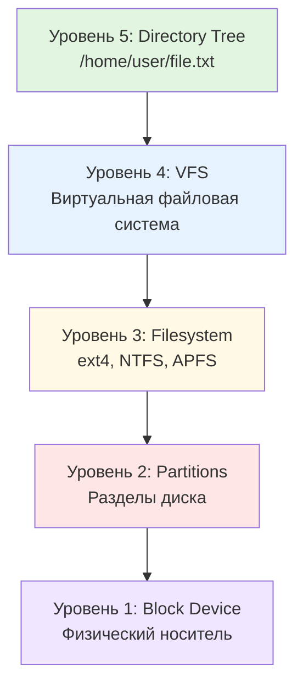
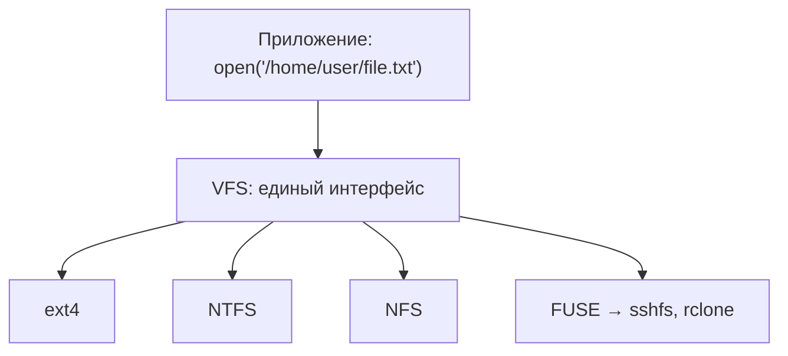
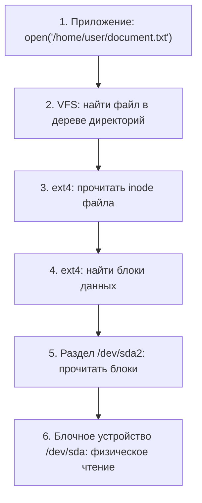

# Глава 34. Файловые системы: архитектура хранения

!!! abstract "О главе"
    Это **архитектурный обзор** всех пяти уровней хранения. Каждый уровень подробно раскрывается в последующих главах: разделы (Глава 35), файловые системы (Главы 36–41), RAID (Глава 42), LVM (Глава 43).

## Введение

Когда мы говорим "файл хранится на диске", за этой простой фразой скрывается **многоуровневая архитектура**. Данные проходят путь от физического носителя через несколько слоёв абстракции, прежде чем предстать перед нами как файл с именем и содержимым.

В этой главе мы разберём **пять уровней** архитектуры хранения:



## Уровень 1: Block Device (блочное устройство)

### Что это?

**Блочное устройство** (block device), в обиходе называемое просто **диском** — это физический носитель данных, который читает и пишет данные **блоками** фиксированного размера (обычно 512 байт или 4 КБ).

!!! info "Терминология: почему диск называется диском?"
    Исторически данные хранились на вращающихся магнитных **дисках** (пластинах). Отсюда термины:
    
    - **Disk** — сам носитель (от физической формы пластин HDD)
    - **Drive** — устройство с приводом (механизмом вращения)
    - **Винчестер** (Winchester) — устаревшее название HDD, от кодового имени первого герметичного жёсткого диска IBM 3340 (1973), чьи характеристики "30-30" напоминали калибр винтовки Winchester 30-30
    
    Хотя SSD не содержит вращающихся частей, термин "диск" сохранился по традиции.

### Типы накопителей: подробный разбор

#### HDD (Hard Disk Drive) — жёсткий диск

**HDD** — накопитель на магнитных пластинах с механической головкой чтения/записи.

| Характеристика | Типичные значения |
|----------------|-------------------|
| **Ёмкость** | 500 ГБ — 20+ ТБ |
| **Форм-фактор** | 3.5" (десктоп), 2.5" (ноутбук) |
| **Интерфейс** | SATA III (6 Гбит/с), SAS |
| **Скорость вращения (RPM)** | 5400, 7200, 10000, 15000 об/мин |
| **Последовательное чтение** | 100-250 МБ/с |
| **Случайный доступ (IOPS)** | 75-200 IOPS |
| **Задержка доступа** | 5-15 мс |

!!! note "RPM и производительность"
    **RPM** (Revolutions Per Minute) — скорость вращения шпинделя. Чем выше RPM, тем быстрее головка достигает нужного сектора:
    
    - **5400 RPM** — тихие, холодные, для хранения данных
    - **7200 RPM** — стандарт для десктопов
    - **10000-15000 RPM** — серверные, максимальная скорость, но шумные и горячие

#### SSD (Solid State Drive) — твердотельный накопитель

**SSD** — накопитель на микросхемах флеш-памяти NAND без движущихся частей.

| Характеристика | SATA SSD | NVMe SSD |
|----------------|----------|----------|
| **Ёмкость** | 120 ГБ — 8 ТБ | 250 ГБ — 8+ ТБ |
| **Форм-фактор** | 2.5", M.2 | M.2, U.2, PCIe карта |
| **Интерфейс** | SATA III (6 Гбит/с) | PCIe 3.0/4.0/5.0 (до 128 Гбит/с) |
| **Последовательное чтение** | 500-550 МБ/с | 3000-7500 МБ/с |
| **Последовательная запись** | 400-520 МБ/с | 2000-6500 МБ/с |
| **Случайный доступ (IOPS)** | 50 000-100 000 | 500 000-1 000 000+ |
| **Задержка доступа** | 0.1 мс | 0.02 мс |

!!! info "Почему SATA SSD ограничен 550 МБ/с?"
    **SATA** (Serial ATA) — интерфейс, разработанный для HDD. Максимальная пропускная способность SATA III — 6 Гбит/с ≈ 600 МБ/с (с учётом накладных расходов ~550 МБ/с). Это потолок для любого SATA-устройства.
    
    **NVMe** (Non-Volatile Memory Express) — протокол, разработанный специально для флеш-памяти. Использует шину PCIe напрямую, обходя ограничения SATA.

#### Сравнительная таблица накопителей

| Устройство | Тип памяти | Интерфейс | Ёмкость | Чтение | IOPS | Особенности |
|:-----------|:----------|:---------:|--------:|-------:|-----:|:------------|
| **HDD 7200** | Магнит. пластины | SATA | 1–20 ТБ | 150–200 МБ/с | 100 | Дёшево, много места |
| **HDD 5400** | Магнит. пластины | SATA | 1–8 ТБ | 100–150 МБ/с | 75 | Тихий, холодный |
| **SSD SATA** | NAND | SATA | 0.12–8 ТБ | 550 МБ/с | 90K | Ограничен SATA |
| **SSD NVMe** | NAND | PCIe | 0.25–8 ТБ | 3–7 ГБ/с | 1M | Макс. скорость |
| **USB Flash** | NAND | USB 3.x | 8–512 ГБ | 100–400 МБ/с | 5K | Портативность |
| **SD Card** | NAND | SD/UHS | 8–1024 ГБ | 90–300 МБ/с | 3K | Камеры, телефоны |
| **eMMC** | NAND | MMC | 16–256 ГБ | 100–400 МБ/с | 10K | Встроенная память |

!!! info "IOPS — ключевая метрика для баз данных"
    **IOPS** (Input/Output Operations Per Second) — количество операций чтения/записи в секунду. 
    
    Для последовательного чтения больших файлов важна **пропускная способность** (МБ/с).
    Для баз данных, виртуализации, случайного доступа важен **IOPS**.
    
    HDD: ~100 IOPS (головка должна физически переместиться)
    SSD: ~100 000-1 000 000 IOPS (электронный доступ к любой ячейке)

### Блочные устройства в Unix/Linux: `/dev/`

В Unix/Linux блочные устройства представлены как **специальные файлы** в директории `/dev/`:

```bash
# Просмотр блочных устройств
$ ls -l /dev/sd* /dev/nvme* /dev/mmcblk* 2>/dev/null
brw-rw---- 1 root disk   8,   0 Feb  4 10:00 /dev/sda      # SATA SSD
brw-rw---- 1 root disk   8,   1 Feb  4 10:00 /dev/sda1     # Раздел 1
brw-rw---- 1 root disk   8,   2 Feb  4 10:00 /dev/sda2     # Раздел 2
brw-rw---- 1 root disk   8,  16 Feb  4 10:00 /dev/sdb      # HDD
brw-rw---- 1 root disk   8,  17 Feb  4 10:00 /dev/sdb1     # Раздел
brw-rw---- 1 root disk 259,   0 Feb  4 10:00 /dev/nvme0n1  # NVMe SSD
brw-rw---- 1 root disk 259,   1 Feb  4 10:00 /dev/nvme0n1p1
brw-rw---- 1 root disk 179,   0 Feb  4 10:00 /dev/mmcblk0  # SD карта
brw-rw---- 1 root disk 179,   1 Feb  4 10:00 /dev/mmcblk0p1

# Детальная информация о блочных устройствах
$ lsblk -o NAME,SIZE,TYPE,FSTYPE,MOUNTPOINT,MODEL,ROTA,RO
NAME        SIZE TYPE FSTYPE MOUNTPOINT  MODEL              ROTA RO
sda       238.5G disk                    Samsung SSD 860       0  0
├─sda1      512M part vfat   /boot/efi                         0  0
└─sda2      238G part ext4   /                                 0  0
sdb         3.6T disk                    WDC WD40EFRX         1  0
├─sdb1        2T part ext4   /data                             1  0
└─sdb2      1.6T part ext4   /backup                           1  0
nvme0n1       1T disk                    Samsung 980 PRO       0  0
├─nvme0n1p1 512M part vfat   /boot                             0  0
└─nvme0n1p2 999G part btrfs  /home                             0  0
mmcblk0      32G disk                                          0  0
└─mmcblk0p1  32G part ext4   /media/sdcard                     0  0
sr0        1024M rom                     DVD-RW                1  0
```

!!! note "ROTA — определение типа накопителя"
    Колонка `ROTA` (rotational) показывает: `1` = HDD (вращается), `0` = SSD/Flash (не вращается).

### Именование устройств в разных ОС

#### Linux: схема именования

| Префикс | Тип устройства | Пример | Расшифровка |
|---------|----------------|--------|-------------|
| `sd*` | SATA/SCSI/USB диски | `/dev/sda`, `/dev/sdb` | **S**CSI **D**isk |
| `nvme*` | NVMe накопители | `/dev/nvme0n1` | NVMe контроллер 0, namespace 1 |
| `hd*` | Старые IDE/PATA | `/dev/hda` | **H**ard **D**isk (устаревшее) |
| `mmcblk*` | SD/MMC карты | `/dev/mmcblk0` | **MMC** **Bl**oc**k** device |
| `vd*` | Виртуальные диски (KVM) | `/dev/vda` | **V**irtIO **D**isk |
| `xvd*` | Xen виртуальные диски | `/dev/xvda` | **X**en **V**irtual **D**isk |
| `loop*` | Loop-устройства (образы) | `/dev/loop0` | Файл как блочное устройство |
| `sr*` | CD/DVD-ROM | `/dev/sr0` | **S**CSI **R**OM |

**Разделы:**
- SATA/SCSI: `/dev/sda1`, `/dev/sda2`, ...
- NVMe: `/dev/nvme0n1p1`, `/dev/nvme0n1p2`, ... (p = partition)
- MMC: `/dev/mmcblk0p1`, `/dev/mmcblk0p2`, ...

#### FreeBSD: схема именования

```bash
# FreeBSD использует другую систему
$ geom disk list
Geom name: ada0
...
Geom name: da0
...

$ ls /dev/ada* /dev/da* /dev/nvd*
/dev/ada0       # SATA диск (ATA Direct Access)
/dev/ada0p1     # GPT раздел 1
/dev/ada0p2     # GPT раздел 2
/dev/da0        # USB/SCSI диск (Direct Access)
/dev/nvd0       # NVMe диск
/dev/nvd0p1     # NVMe раздел
```

| Префикс | Тип устройства | Пример |
|---------|----------------|--------|
| `ada*` | SATA/ATA диски | `/dev/ada0` |
| `da*` | SCSI/USB диски | `/dev/da0` |
| `nvd*` | NVMe (legacy драйвер) | `/dev/nvd0` |
| `nda*` | NVMe (CAM драйвер) | `/dev/nda0` |
| `mmcsd*` | SD/MMC карты | `/dev/mmcsd0` |

#### OpenBSD: схема именования

```bash
# OpenBSD имеет свою систему с дисковыми метками
$ sysctl hw.disknames
hw.disknames=sd0:,sd1:,cd0:

$ disklabel sd0
# /dev/sd0:
type: SCSI
disk: SCSI disk
...
16 partitions:
#    size   offset fstype
 a:  4.0G       64 4.2BSD  # /
 b:  8.0G  8388672 swap
 d: 50.0G 25165888 4.2BSD  # /usr
```

| Префикс | Тип устройства | Пример |
|---------|----------------|--------|
| `sd*` | SCSI/SATA/USB/NVMe | `/dev/sd0` |
| `wd*` | IDE диски (устаревшее) | `/dev/wd0` |
| `cd*` | CD/DVD | `/dev/cd0` |

!!! note "OpenBSD: партиции vs разделы"
    OpenBSD использует **disklabel** поверх MBR/GPT. Буквы a-p обозначают партиции внутри disklabel:
    - `a` — обычно root
    - `b` — swap
    - `c` — весь диск (raw)
    - `d-p` — пользовательские

### Windows: физические диски

В Windows блочные устройства называются **Physical Drives**:

```powershell
# PowerShell: список физических дисков
PS> Get-PhysicalDisk | Format-Table Number,FriendlyName,MediaType,Size,HealthStatus

Number FriendlyName             MediaType   Size         HealthStatus
------ ------------             ---------   ----         ------------
0      Samsung SSD 970 EVO Plus SSD         1000204886016 Healthy
1      WDC WD40EFRX-68N         HDD         4000787030016 Healthy
2      Generic USB Flash        Unspecified 32212254720   Healthy

# Информация о диске с IOPS и RPM (для HDD)
PS> Get-PhysicalDisk | Select-Object FriendlyName,MediaType,SpindleSpeed,Size

FriendlyName              MediaType SpindleSpeed          Size
------------              --------- ------------          ----
Samsung SSD 970 EVO Plus  SSD                  0 1000204886016
WDC WD40EFRX-68N          HDD               5400 4000787030016
```

### Характеристики блочного устройства

| Характеристика | Описание | Примеры значений |
|----------------|----------|------------------|
| **Размер блока (sector size)** | Минимальная единица чтения/записи | 512 байт (legacy), 4 КБ (Advanced Format) |
| **Ёмкость** | Общий размер устройства | 256 ГБ, 1 ТБ, 4 ТБ |
| **Тип носителя** | HDD, SSD, NVMe, USB Flash | См. таблицу выше |
| **Интерфейс** | Способ подключения | SATA, NVMe/PCIe, USB, SAS |
| **RPM** | Скорость вращения (только HDD) | 5400, 7200, 10000, 15000 |
| **IOPS** | Операций ввода-вывода в секунду | HDD: ~100, SSD: ~100K, NVMe: ~1M |
| **Пропускная способность** | Последовательное чтение/запись | 150 МБ/с (HDD) — 7 ГБ/с (NVMe) |
| **Задержка (latency)** | Время доступа к случайному блоку | 10 мс (HDD), 0.1 мс (SSD), 0.02 мс (NVMe) |

### Бенчмаркинг: измерение характеристик I/O

Как проверить реальные характеристики диска? Каждая метрика измеряется по-разному:

| Метрика | Что измеряем | Инструмент | Команда |
|---------|-------------|------------|---------|
| **Throughput (МБ/с)** | Последовательное чтение/запись больших блоков | dd, hdparm | `dd bs=1M`, `hdparm -Tt` |
| **IOPS** | Случайные операции малыми блоками (4K) | fio | `fio --rw=randread --bs=4k` |
| **Latency (мс)** | Задержка одной операции | fio, ioping | `ioping -c 10 /dev/sda` |

#### Формула: IOPS ↔ Throughput

**Throughput и IOPS связаны через размер блока:**

$$
\text{Throughput} = \text{IOPS} \times \text{Block Size}
$$

| IOPS | Block Size | Throughput |
|------|-----------|------------|
| 100 (HDD) | 4 KB | 100 × 4 KB = **0.4 MB/s** |
| 100 (HDD) | 1 MB | 100 × 1 MB = **100 MB/s** |
| 100,000 (SSD) | 4 KB | 100K × 4 KB = **400 MB/s** |
| 100,000 (SSD) | 1 MB | Упирается в интерфейс (~550 MB/s SATA) |

!!! note "Почему HDD медленный для мелких файлов?"
    HDD даёт ~100 IOPS (физическое перемещение головки).
    
    - При блоке 4 KB: 100 × 4 KB = 400 KB/s — **ужасно медленно!**
    - При блоке 1 MB: 100 × 1 MB = 100 MB/s — нормально
    
    SSD даёт ~100,000 IOPS:
    
    - При блоке 4 KB: 100 000 × 4 KB = 400 MB/s — **в 1000 раз быстрее!**
    
    Вот почему базы данных и node_modules **летают** на SSD.

#### Обратная формула

Если знаете throughput и хотите IOPS:

$$
\text{IOPS} = \frac{\text{Throughput}}{\text{Block Size}}
$$

Например: диск показывает 500 MB/s при блоках 128 KB:

$$
\text{IOPS} = \frac{500 \text{ MB/s}}{128 \text{ KB}} = \frac{500 \times 1024}{128} \approx 4000 \text{ IOPS}
$$

#### Быстрые тесты

```bash
# Тест чтения из кэша и с диска (Linux)
$ sudo hdparm -Tt /dev/sda
 Timing cached reads:   12345 MB in  2.00 seconds = 6172 MB/sec   # RAM кэш
 Timing buffered disk reads: 550 MB in  3.01 seconds = 182 MB/sec # Реальный диск

# Тест записи с dd (создаёт файл 1GB)
$ dd if=/dev/zero of=/tmp/testfile bs=1M count=1024 conv=fdatasync
1073741824 bytes copied, 3.45 s, 311 MB/sec

# Очистить кэш перед тестом чтения
$ sudo sh -c "echo 3 > /proc/sys/vm/drop_caches"
$ dd if=/tmp/testfile of=/dev/null bs=1M
1073741824 bytes copied, 2.89 s, 371 MB/sec
```

!!! warning "Кэш искажает результаты"
    Без очистки кэша (`drop_caches`) вы измеряете скорость RAM, а не диска!
    Флаг `conv=fdatasync` заставляет dd дождаться записи на диск.

#### Профессиональный бенчмаркинг с fio

**fio** (Flexible I/O Tester) — стандарт для тестирования дисков:

```bash
# Последовательное чтение (throughput)
$ fio --name=seq_read --rw=read --bs=1M --size=1G --numjobs=1 --filename=/tmp/fiotest
   read: IOPS=523, BW=523MiB/s

# Последовательная запись
$ fio --name=seq_write --rw=write --bs=1M --size=1G --numjobs=1 --filename=/tmp/fiotest

# Случайное чтение 4K (IOPS) — критично для баз данных
$ fio --name=rand_read --rw=randread --bs=4k --size=256M --numjobs=4 --filename=/tmp/fiotest
   read: IOPS=95.2k, BW=372MiB/s, lat avg=42.01 usec

# Смешанная нагрузка 70% чтение / 30% запись
$ fio --name=mixed --rw=randrw --rwmixread=70 --bs=4k --size=256M --filename=/tmp/fiotest
```

#### Измерение latency

```bash
# ioping — ping для дисков
$ ioping -c 5 /dev/sda
4 KiB <<< /dev/sda (block device 238.5 GiB): request=1 time=82.5 us
4 KiB <<< /dev/sda: request=2 time=91.2 us
--- /dev/sda ping statistics ---
5 requests completed in 456.3 us, 20 KiB read
min/avg/max/mdev = 72.1 us / 91.3 us / 112.4 us / 14.8 us
```

#### Windows и macOS

```powershell
# Windows: встроенный тест
> winsat disk -drive C
Disk  Sequential 64.0 Read                  531.52 MB/s
Disk  Random 16.0 Read                      215.41 MB/s

# Или GUI: CrystalDiskMark, AS SSD Benchmark
```

```bash
# macOS: dd работает, но без drop_caches
$ dd if=/dev/zero of=/tmp/testfile bs=1m count=1024
$ dd if=/tmp/testfile of=/dev/null bs=1m

# Или GUI: Disk Speed Test (App Store), Blackmagic Disk Speed Test
```

!!! tip "Что тестировать?"
    - **Видеомонтаж, копирование** → последовательное чтение/запись (МБ/с)
    - **Базы данных, виртуализация** → случайный 4K (IOPS)
    - **Интерактивная работа** → latency (мс/мкс)

### LBA: абстракция блочного доступа

**LBA (Logical Block Addressing)** — ключевая абстракция, скрывающая физику носителя от ОС.

```
┌─────────────────────────────────────────────────────────────┐
│  ДИСК КАК "ЧЁРНЫЙ ЯЩИК"                                     │
├─────────────────────────────────────────────────────────────┤
│                                                             │
│    ОС видит:   [ Блок 0 ][ Блок 1 ][ Блок 2 ]...[ Блок N ]  │
│                                                             │
│    Команды:    "Прочитай блок #12345"                       │
│                "Запиши данные в блок #67890"                │
│                                                             │
│    Физика скрыта: головки HDD, ячейки NAND, wear leveling   │
└─────────────────────────────────────────────────────────────┘
```

**Почему это важно:**

| Носитель | Физика | LBA скрывает |
|----------|--------|-------------|
| **HDD** | Вращающиеся пластины, магнитные головки | Цилиндры, секторы, дорожки |
| **SSD** | NAND flash, контроллер | Стирание блоков, wear leveling |
| **NVMe** | Параллельные каналы flash | Очереди команд, контроллер |

Для ОС все эти устройства выглядят одинаково: массив блоков с номерами 0, 1, 2, ..., N.

!!! warning "Прямая запись на блочное устройство"
    Можно писать напрямую на блочное устройство, минуя файловую систему:
    
    ```bash
    # ⚠️ ОПАСНО! Перезапишет весь диск
    sudo dd if=/dev/zero of=/dev/sda bs=4M
    ```
    
    Это используется для создания загрузочных флешек, клонирования дисков, но **уничтожит все данные**!

### Инструменты для работы с блочными устройствами

Помимо `dd`, существует множество утилит для низкоуровневой работы с дисками:

```bash
# Информация о блочных устройствах
$ lsblk -o NAME,SIZE,TYPE,FSTYPE,MODEL     # Дерево дисков и разделов
$ blkid                                     # UUID и типы ФС разделов
$ hdparm -I /dev/sda                        # Детальная информация о диске
$ smartctl -a /dev/sda                      # S.M.A.R.T. диагностика

# Тестирование производительности
$ fio --name=test --rw=randread --bs=4k --numjobs=4 --size=1G
$ hdparm -Tt /dev/sda                       # Быстрый тест скорости

# Клонирование и образы
$ dd if=/dev/sda of=/dev/sdb bs=64K status=progress   # Клонирование диска
$ dcfldd if=/dev/sda of=disk.img hash=sha256          # dd с хешированием
$ ddrescue /dev/sda disk.img logfile                  # Восстановление с повреждённого диска

# Резервное копирование на уровне файловой системы
$ dump -0uf /backup/root.dump /                       # Полный бэкап / (уровень 0)
$ dump -1uf /backup/root.1.dump /                     # Инкрементальный (уровень 1)
$ restore -tf /backup/root.dump                       # Просмотр содержимого
$ restore -rf /backup/root.dump                       # Восстановление

# Безопасное стирание
$ shred -v -n 3 /dev/sda                    # Перезапись случайными данными
$ blkdiscard /dev/sda                       # TRIM для SSD (быстрое стирание)

# Работа с loop-устройствами (файл как диск)
$ losetup /dev/loop0 disk.img               # Подключить образ
$ losetup -d /dev/loop0                     # Отключить
```

!!! tip "dd vs dcfldd vs ddrescue"
    - **dd** — базовая утилита, минимум возможностей
    - **dcfldd** — dd с прогрессом, хешированием, верификацией (для форензики)
    - **ddrescue** — умеет обходить bad-блоки, для восстановления данных

---

### Loop devices: файл как блочное устройство

**Loop device** (loopback device) — это виртуальное блочное устройство, которое использует обычный файл как "диск". Это позволяет:

- Монтировать ISO-образы без записи на CD/DVD
- Создавать и тестировать файловые системы в файле
- Работать с образами дисков (`.img`, `.raw`)
- Создавать шифрованные контейнеры

```
┌─────────────────────────────────────────────────────────────┐
│                     Как работает loop device                │
├─────────────────────────────────────────────────────────────┤
│                                                             │
│    Файл disk.img         Loop device          Монтирование  │
│   ┌───────────────┐     ┌───────────┐        ┌──────────┐   │
│   │ обычный файл  │ ──▶ │/dev/loop0 │ ──▶    │ /mnt/img │   │
│   │ в файловой    │     │  (блочное │        │(директо- │   │
│   │ системе       │     │ устройство│        │   рия)   │   │
│   └───────────────┘     └───────────┘        └──────────┘   │
│                                                             │
│   losetup                               mount               │
│                                                             │
└─────────────────────────────────────────────────────────────┘
```

#### Базовые операции

```bash
# Создание файла-образа
$ truncate -s 100M disk.img              # Создать sparse-файл 100MB (быстро)
$ dd if=/dev/zero of=disk.img bs=1M count=100  # Или заполненный нулями

# Подключение к loop device
$ sudo losetup /dev/loop0 disk.img       # Явно указать устройство
$ sudo losetup -f disk.img               # Автоматически найти свободный
$ sudo losetup -f --show disk.img        # Найти и показать какой занял
/dev/loop0

# Просмотр подключённых loop devices
$ losetup -l
NAME       SIZELIMIT OFFSET AUTOCLEAR RO BACK-FILE
/dev/loop0         0      0         0  0 /home/user/disk.img

# Создание ФС и монтирование
$ sudo mkfs.ext4 /dev/loop0
$ sudo mount /dev/loop0 /mnt/img
$ df -h /mnt/img

# Отключение
$ sudo umount /mnt/img
$ sudo losetup -d /dev/loop0
```

#### Монтирование ISO-образов

```bash
# Скачали ISO — хотим посмотреть содержимое
$ sudo mount -o loop ubuntu.iso /mnt/iso    # Автоматически создаст loop

# Или вручную
$ sudo losetup -f --show ubuntu.iso
/dev/loop1
$ sudo mount -o ro /dev/loop1 /mnt/iso      # Только чтение (ISO read-only)

# Просмотр
$ ls /mnt/iso
boot  casper  dists  EFI  install  pool  ...
```

#### Образ с разделами

```bash
# Образ диска может содержать таблицу разделов
$ sudo losetup -f --show disk-with-partitions.img
/dev/loop0

# Просканировать разделы внутри образа
$ sudo partprobe /dev/loop0
# или
$ sudo kpartx -av /dev/loop0
add map loop0p1 (253:0): 0 204800 linear /dev/loop0 2048
add map loop0p2 (253:1): 0 1843200 linear /dev/loop0 206848

# Теперь можно монтировать отдельные разделы
$ sudo mount /dev/mapper/loop0p1 /mnt/part1

# Отключение
$ sudo kpartx -d /dev/loop0
$ sudo losetup -d /dev/loop0
```

#### Пример: создание образа с файловой системой

```bash
#!/bin/bash
# Создаём образ диска с ext4 и тестируем

IMG="test-disk.img"
MNT="/mnt/test"

# 1. Создаём sparse-файл 500MB
truncate -s 500M "$IMG"

# 2. Подключаем к loop
LOOP=$(sudo losetup -f --show "$IMG")
echo "Using: $LOOP"

# 3. Создаём файловую систему
sudo mkfs.ext4 -L "TestDisk" "$LOOP"

# 4. Монтируем
sudo mkdir -p "$MNT"
sudo mount "$LOOP" "$MNT"

# 5. Работаем с файлами
sudo cp -r /etc/passwd /etc/hosts "$MNT/"
ls -la "$MNT"

# 6. Чистим
sudo umount "$MNT"
sudo losetup -d "$LOOP"

echo "Image created: $IMG"
```

#### Шифрованный образ с GPG

GPG позволяет создать зашифрованный контейнер для конфиденциальных данных:

```bash
#!/bin/bash
# Создание шифрованного образа с GPG

IMG="secret.img"
IMG_GPG="secret.img.gpg"
MNT="/mnt/secret"

# === СОЗДАНИЕ ===

# 1. Создаём образ и ФС
truncate -s 100M "$IMG"
LOOP=$(sudo losetup -f --show "$IMG")
sudo mkfs.ext4 "$LOOP"

# 2. Монтируем и добавляем данные
sudo mkdir -p "$MNT"
sudo mount "$LOOP" "$MNT"
sudo cp ~/.ssh/id_rsa "$MNT/private_key"
echo "Секретные заметки" | sudo tee "$MNT/notes.txt"

# 3. Отмонтируем
sudo umount "$MNT"
sudo losetup -d "$LOOP"

# 4. Шифруем GPG (симметричное шифрование с паролем)
gpg --symmetric --cipher-algo AES256 -o "$IMG_GPG" "$IMG"

# 5. Безопасно удаляем оригинал
shred -u "$IMG"

echo "Encrypted image: $IMG_GPG"


# === ИСПОЛЬЗОВАНИЕ ===

# 1. Расшифровываем во временный файл
gpg -d -o /tmp/decrypted.img "$IMG_GPG"

# 2. Монтируем
LOOP=$(sudo losetup -f --show /tmp/decrypted.img)
sudo mount "$LOOP" "$MNT"

# 3. Работаем...
cat "$MNT/notes.txt"

# 4. Отмонтируем и чистим
sudo umount "$MNT"
sudo losetup -d "$LOOP"
shred -u /tmp/decrypted.img
```

!!! warning "GPG vs LUKS"
    **GPG** подходит для редко используемых архивов — каждый раз весь образ расшифровывается в файл.
    
    **LUKS** (Linux Unified Key Setup) — полноценное блочное шифрование, работает "на лету":
    ```bash
    # Создание LUKS-контейнера (рекомендуется для частого использования)
    $ sudo cryptsetup luksFormat /dev/loop0
    $ sudo cryptsetup open /dev/loop0 secret
    $ sudo mkfs.ext4 /dev/mapper/secret
    $ sudo mount /dev/mapper/secret /mnt/secret
    ```

#### Практические применения loop devices

| Задача | Команда |
|--------|---------|
| Смонтировать ISO | `mount -o loop image.iso /mnt/iso` |
| Тестировать ФС без диска | `losetup + mkfs + mount` |
| Создать swap в файле | `dd + losetup + mkswap + swapon` |
| Распаковать образ Raspberry Pi | `losetup + kpartx + mount` |
| Форензика: исследовать образ | `losetup -r` (read-only) |
| Создать шифрованный контейнер | `losetup + cryptsetup` или GPG |

## Уровень 2: Partitions (разделы диска)

!!! info "Подробнее"
    Детальное сравнение MBR vs GPT, практическая разметка дисков, инструменты для разных ОС — в [Главе 35. Разделы](35-partitions.md).

**Раздел** (partition) — это логическое деление блочного устройства на независимые области. Каждый раздел может иметь свою файловую систему.

```
┌──────────────────────────────────────────────────┐
│              Физический диск /dev/sda              │
├──────────┬──────────┬──────────┬─────────────────┤
│ Раздел 1 │ Раздел 2 │ Раздел 3 │    Раздел 4     │
│ EFI/FAT32│  / ext4  │   swap   │  /home ext4     │
│  512 MB  │   50 GB  │   8 GB   │   180 GB        │
└──────────┴──────────┴──────────┴─────────────────┘
```

**Зачем нужны разделы?** Изоляция данных от ОС, мультизагрузка, разные ФС для разных задач, безопасность (шифрование отдельных разделов).

Две схемы таблиц разделов:

| | MBR (устаревшая) | GPT (современная) |
|-|-------------------|-------------------|
| **Макс. разделов** | 4 primary (+ logical) | 128 |
| **Макс. размер** | 2 ТБ | 9.4 ZB |
| **Загрузка** | BIOS/Legacy | UEFI |
| **Резервная копия** | Нет | Да (в конце диска) |
| **Целостность** | Нет | CRC32 checksums |

## Уровень 3: Filesystem (файловая система)

!!! info "Подробнее"
    Детальное описание конкретных файловых систем: [Глава 36 (UNIX/Linux)](36-unix-fs.md), [Глава 37 (Windows)](37-windows-fs.md), [Глава 38 (BSD)](38-bsd-fs.md), [Глава 39 (Linux-специфичные)](39-linux-fs.md), [Глава 40 (ZFS)](40-zfs.md), [Глава 41 (Btrfs)](41-btrfs.md).

**Файловая система** — способ организации и хранения данных на разделе. Она определяет: как хранятся файлы и метаданные, как обеспечивается целостность, какие существуют ограничения.

### Компоненты файловой системы

```
┌─────────────────────────────────────────────────────────────┐
│  АНАТОМИЯ ФАЙЛОВОЙ СИСТЕМЫ                                  │
├─────────────────────────────────────────────────────────────┤
│  ┌─────────────┐  Информация о ФС: размер блока, UUID,      │
│  │ Superblock  │  количество inodes, свободное место        │
│  └─────────────┘                                            │
│  ┌─────────────┐  Какие блоки заняты, какие свободны        │
│  │ Block Bitmap│  (битовая карта или B-tree)                │
│  └─────────────┘                                            │
│  ┌─────────────┐  Метаданные файлов: права, размер,         │
│  │ Inode Table │  указатели на блоки данных                 │
│  └─────────────┘                                            │
│  ┌─────────────┐  Связь имя → inode                         │
│  │ Directories │  (таблицы или B-tree)                      │
│  └─────────────┘                                            │
│  ┌─────────────┐  Защита от сбоев: pending операции         │
│  │ Journal     │                                            │
│  └─────────────┘                                            │
│  ┌─────────────┐  Собственно содержимое файлов              │
│  │ Data Blocks │                                            │
│  └─────────────┘                                            │
└─────────────────────────────────────────────────────────────┘
```

### Основные файловые системы

| ФС | ОС | Ключевые особенности |
|----|-----|---------------------|
| **ext4** | Linux | Стандарт Linux, журнал, до 16 ТБ/файл |
| **XFS** | Linux | Большие файлы, параллельный I/O |
| **Btrfs** | Linux | CoW, снапшоты, сжатие, RAID |
| **ZFS** | FreeBSD, Linux | Объединяет тома и ФС, checksums, RAID-Z |
| **UFS2/FFS** | FreeBSD, OpenBSD | Native BSD, soft updates |
| **NTFS** | Windows | Журнал, ACL, сжатие, шифрование |
| **APFS** | macOS | CoW, шифрование, space sharing |
| **F2FS** | Linux | Оптимизирована для Flash/SSD |

### Три ключевых концепции

**Журналирование** — запись намерений перед изменением данных. При сбое система откатывает незавершённые операции. Используется в ext4, XFS, NTFS.

**Copy-on-Write (CoW)** — при изменении файла создаётся новая копия блока, старая остаётся нетронутой. Это даёт мгновенные снапшоты и защиту от повреждений. Используется в Btrfs, ZFS, APFS.

**Снапшоты** — моментальный снимок состояния ФС. Благодаря CoW снапшот занимает ~0 места (пока данные не изменятся). Незаменимы для бэкапов и отката обновлений.

### Скорость vs Отказоустойчивость

```
┌─────────────────────────────────────────────────────────────┐
│  ГДЕ РЕШАТЬ ПРОБЛЕМЫ СКОРОСТИ И НАДЁЖНОСТИ?                 │
├─────────────────────────────────────────────────────────────┤
│                                                             │
│  Уровень 1: АППАРАТНЫЙ RAID                                 │
│  • RAID-контроллер с батарейкой (BBU)                       │
│  • Прозрачно для ОС, дорого, надёжно                        │
│                                                             │
│  Уровень 2: ПРОГРАММНЫЙ RAID (mdadm → Глава 42, LVM → 43) │
│  • Дёшево, гибко, требует CPU                               │
│                                                             │
│  Уровень 3: ФАЙЛОВАЯ СИСТЕМА (ZFS → Глава 40, Btrfs → 41) │
│  • Встроенный RAID, checksums, снапшоты                     │
│                                                             │
└─────────────────────────────────────────────────────────────┘
```

## Уровень 4: VFS (Virtual File System)

!!! info "Подробнее"
    VFS, монтирование, bind mounts, FUSE — в [Главе 36. Классические ФС UNIX](36-unix-fs.md).

**VFS** — слой абстракции в ядре, предоставляющий **единый интерфейс** (`open`, `read`, `write`, `close`) для работы с любыми файловыми системами.



Благодаря VFS:

- Одна команда `cp` копирует файлы между ext4, NTFS и NFS
- **Монтирование** подключает ФС к любой точке дерева каталогов (`mount /dev/sdb1 /mnt`)
- **Bind mounts** делают одну директорию доступной по двум путям (основа Docker volumes)
- **FUSE** позволяет писать ФС как обычные программы (sshfs, rclone mount, encfs)

## Уровень 5: Directory Tree (дерево каталогов)

!!! info "Подробнее"
    Стандартная иерархия каталогов Unix (FHS) — в [Главе 36](36-unix-fs.md). Специфика BSD — в [Главе 38](38-bsd-fs.md).

**Дерево каталогов** — это иерархическая структура, которую видит пользователь. В Unix всё начинается с единого корня `/`:

```
/                          (корень)
├── bin/                   (базовые утилиты)
├── etc/                   (конфигурация)
├── home/                  (домашние каталоги)
├── dev/                   (устройства)
├── proc/, sys/            (псевдо-ФС: ядро и процессы)
├── tmp/                   (временные файлы)
├── usr/                   (программы и библиотеки)
└── var/                   (логи, кэш, изменяемые данные)
```

В Windows — множество независимых деревьев (`C:\`, `D:\`, ...), каждое привязано к разделу.

## Собираем всё вместе

Давайте проследим путь от файла до физического диска:

### Пример: чтение файла `/home/user/document.txt`



### Детальный процесс:

1. **Приложение** вызывает `open("/home/user/document.txt")`
2. **VFS** разбирает путь:
   - `/` — корень (смонтирован с `/dev/sda2`)
   - `/home` — директория
   - `/home/user` — директория
   - `/home/user/document.txt` — файл
3. **ext4 driver** читает inode файла:
   - Размер: 1024 байта
   - Права: `-rw-r--r--`
   - Блоки данных: 12345, 12346
4. **ext4 driver** читает блоки 12345 и 12346
5. **Раздел `/dev/sda2`** преобразует номера блоков в физические адреса
6. **Блочное устройство `/dev/sda`** читает данные с диска

## Практические команды

## Практические команды

Быстрая шпаргалка по командам для работы с уровнями архитектуры:

```bash
# === Block Devices ===
lsblk -o NAME,SIZE,TYPE,FSTYPE,MOUNTPOINT,MODEL   # Дерево дисков
blkid                                               # UUID и типы ФС
hdparm -Tt /dev/sda                                 # Быстрый тест скорости
smartctl -a /dev/sda                                # S.M.A.R.T. диагностика

# === Partitions ===
fdisk -l /dev/sda                                   # Просмотр разделов
parted /dev/sda print                               # Подробнее о разделах

# === Filesystems ===
df -h                                               # Использование дискового пространства
mount | grep ^/dev                                  # Смонтированные ФС
dumpe2fs /dev/sda2 | head -20                       # Информация о ext4
fsck /dev/sda2                                      # Проверка ФС (⚠️ только unmounted!)
```

!!! tip "Команды для других ОС"
    - **FreeBSD**: `gpart show`, `zpool status`, `fsck_ufs`
    - **OpenBSD**: `disklabel sd0`, `fsck_ffs`, `sysctl hw.disknames`
    - **Windows**: `Get-Volume`, `Get-Partition`, `Repair-Volume -DriveLetter C -Scan`

---

## 34.13 Безопасное удаление данных на SSD

На **HDD** утилита `shred` перезаписывает сектора файла случайными данными — это работает, потому что данные записываются «на место». На **SSD** это **бесполезно**.

### Почему shred не работает на SSD

```text
HDD: Запись → Данные перезаписаны на тех же секторах → Восстановление невозможно ✅

SSD: Запись → FTL (Flash Translation Layer) записывает в НОВЫЙ блок
     Старый блок помечен как «мусор», но данные ещё там!
     shred перезаписывает → FTL снова пишет в новый блок
     Оригинальные данные могут остаться в «мусорных» блоках ❌
```

**FTL** (Flash Translation Layer) — контроллер SSD, который управляет wear leveling и сборкой мусора. Он решает, **куда** физически записать данные, и программа не может это контролировать.

### Правильные способы

| Метод | Команда | Что делает |
|-------|---------|-----------|
| **ATA Secure Erase** | `hdparm --security-erase` | Команда контроллеру — стереть все ячейки |
| **NVMe Format** | `nvme format /dev/nvme0 -s 1` | Криптографическое стирание (сброс ключа) |
| **blkdiscard** | `blkdiscard /dev/sda` | TRIM всего устройства (быстро, но менее надёжно) |
| **Шифрование** | LUKS → уничтожить заголовок | Данные остаются, но без ключа — мусор |

```bash
# ⚠️ ОСТОРОЖНО: Эти команды УНИЧТОЖАЮТ ВСЕ данные на диске!

# NVMe: криптографическое стирание (самый надёжный для NVMe)
sudo nvme format /dev/nvme0n1 -s 2  # -s 2 = crypto erase

# SATA SSD: ATA Secure Erase
sudo hdparm --user-master u --security-set-pass p /dev/sda
sudo hdparm --security-erase p /dev/sda

# Универсальный: blkdiscard (TRIM)
sudo blkdiscard /dev/sda
```

!!! tip "Лучшая стратегия: шифрование"
    Зашифруйте диск при установке (LUKS, BitLocker, FileVault). Тогда «безопасное удаление» = уничтожение ключа шифрования. Это мгновенно и надёжно работает на **любом** носителе.

---

## Резюме

Файловая система — это **многоуровневая архитектура**:

1. **Block Device** — физический носитель (HDD, SSD)
2. **Partitions** — логическое деление диска (GPT, MBR)
3. **Filesystem** — организация данных (ext4, NTFS, APFS)
4. **VFS** — единый интерфейс для разных ФС
5. **Directory Tree** — иерархия директорий

Понимание этих уровней помогает:
- Правильно выбирать файловую систему
- Оптимизировать производительность
- Диагностировать проблемы
- Понимать, почему файлы ведут себя так, а не иначе


??? question "Упражнения"
    **Задание 1.** Выполните `lsblk` и `fdisk -l` (Linux) или `diskutil list` (macOS). Нарисуйте схему ваших дисков: устройства → разделы → файловые системы.
    
    **Задание 2.** Создайте loop-устройство из файла: `dd if=/dev/zero of=disk.img bs=1M count=100 && losetup /dev/loop0 disk.img`. Создайте на нём ФС и смонтируйте.
    
    **Задание 3.** Замерьте IOPS вашего диска: `fio --name=test --rw=randread --bs=4k --numjobs=1 --runtime=10`. Сравните с теоретическими характеристиками.

!!! tip "Следующая глава"
    Теперь, когда мы понимаем архитектуру хранения, разберёмся с **разделами и таблицами разделов** → [Разделы и GPT/MBR](35-partitions.md)
