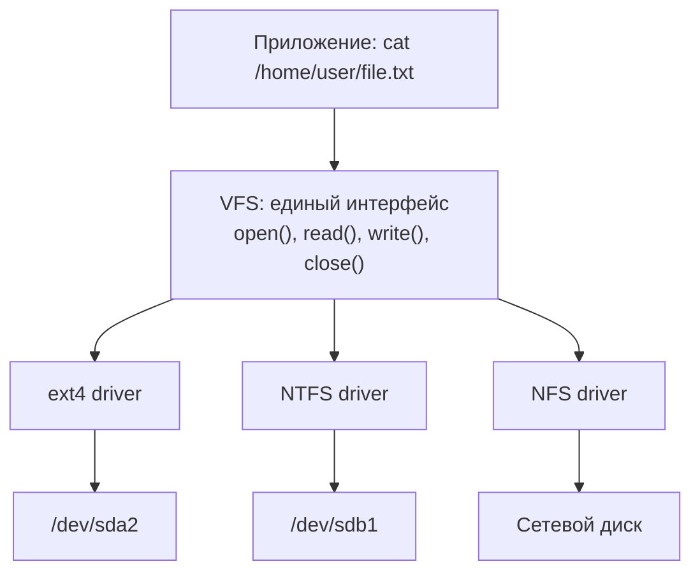

# Глава 36. Классические файловые системы UNIX

## Введение

UNIX-подобные системы используют **иерархическую файловую систему** с единым корнем `/`. Понимание классических ФС помогает разобраться в современных решениях, которые унаследовали их концепции.

---

## 36.1 Историческая эволюция

```
1969  ──▶  PDP-7 FS (оригинальная UNIX ФС)
1974  ──▶  UNIX V6 FS (первая документированная)
1978  ──▶  UNIX V7 FS (512 байт блоки)
1983  ──▶  BSD FFS (Fast File System)
1984  ──▶  System V FS (S5FS)
1991  ──▶  ext (Linux)
1993  ──▶  ext2
2001  ──▶  ext3 (журналирование)
2008  ──▶  ext4
```

---

## 36.2 Berkeley Fast File System (FFS/UFS)

### Ключевые инновации

FFS (также известная как UFS) представила революционные идеи:

1. **Группы цилиндров**: данные размещаются близко к метаданным
2. **Большие блоки**: 4-8 KB вместо 512 байт
3. **Фрагменты**: эффективное хранение малых файлов
4. **Ротационные задержки**: учёт физики жёстких дисков

### Структура UFS

```
┌────────────────────────────────────────┐
│  Boot Block (16 KB)                    │
├────────────────────────────────────────┤
│  Superblock                            │
├────────────────────────────────────────┤
│  Cylinder Group 0                      │
│  ├── Backup Superblock                 │
│  ├── Cylinder Group Descriptor         │
│  ├── Inode Bitmap                      │
│  ├── Block Bitmap                      │
│  ├── Inode Table                       │
│  └── Data Blocks                       │
├────────────────────────────────────────┤
│  Cylinder Group 1                      │
├────────────────────────────────────────┤
│  ...                                   │
└────────────────────────────────────────┘
```

### Работа с UFS (FreeBSD)

```bash
# Создание UFS2
newfs /dev/da0p1

# Монтирование
mount -t ufs /dev/da0p1 /mnt

# Проверка
fsck_ufs /dev/da0p1

# Включение soft updates
tunefs -n enable /dev/da0p1
```

---

## 36.3 ext2/ext3/ext4 (Linux)

### ext2 — Extended Filesystem 2

```
Год создания: 1993
Максимальный размер файла: 2 TB
Максимальный размер ФС: 32 TB
Размер блока: 1-4 KB
```

**Структура ext2:**

```
┌──────────────────────────────────────┐
│  Boot Block (1 KB)                   │
├──────────────────────────────────────┤
│  Block Group 0                       │
│  ├── Superblock                      │
│  ├── Group Descriptors               │
│  ├── Block Bitmap (1 блок)           │
│  ├── Inode Bitmap (1 блок)           │
│  ├── Inode Table                     │
│  └── Data Blocks                     │
├──────────────────────────────────────┤
│  Block Group 1                       │
├──────────────────────────────────────┤
│  ...                                 │
└──────────────────────────────────────┘
```

### ext3 — добавление журнала

```bash
# Три режима журналирования:

# journal (полный) - журнал метаданных и данных
tune2fs -o journal_data /dev/sda1

# ordered (по умолчанию) - данные до метаданных
tune2fs -o journal_data_ordered /dev/sda1

# writeback (быстрый) - только метаданные
tune2fs -o journal_data_writeback /dev/sda1
```

### ext4 — современный стандарт

**Улучшения ext4:**

| Возможность | ext3 | ext4 |
|-------------|------|------|
| Максимальный файл | 2 TB | 16 TB |
| Максимальная ФС | 32 TB | 1 EB |
| Подкаталогов | 32000 | 64000 |
| Extents | ❌ | ✅ |
| Multiblock allocation | ❌ | ✅ |
| Delayed allocation | ❌ | ✅ |
| Наносекунды в timestamps | ❌ | ✅ |

```bash
# Создание ext4
mkfs.ext4 /dev/sdb1

# С параметрами
mkfs.ext4 -b 4096 -L "DATA" -O ^has_journal /dev/sdb1

# Просмотр информации
dumpe2fs /dev/sdb1 | less

# Изменение параметров
tune2fs -L "NEW_LABEL" /dev/sdb1
tune2fs -c 30 -i 2w /dev/sdb1  # проверка каждые 30 монтирований или 2 недели
```

---

## 36.4 XFS

**XFS** создана SGI в 1993 году для IRIX, портирована в Linux в 2001.

### Особенности XFS

- **Журналирование метаданных**
- **Allocation Groups** для параллелизма
- **Extents** для эффективного хранения
- **Delayed allocation**
- **Online resize** (только увеличение)
- **Online defragmentation**

```bash
# Создание XFS
mkfs.xfs /dev/sdb1

# С параметрами
mkfs.xfs -f -L "XFSDATA" -d agcount=4 /dev/sdb1

# Информация
xfs_info /mount/point

# Расширение (online)
xfs_growfs /mount/point

# Дефрагментация
xfs_fsr /mount/point

# Проверка (только unmounted)
xfs_repair /dev/sdb1
```

### Сравнение ext4 vs XFS

| Критерий | ext4 | XFS |
|----------|------|-----|
| Мелкие файлы | Лучше | Хуже |
| Большие файлы | Хорошо | Лучше |
| Параллельный I/O | Хорошо | Лучше |
| Уменьшение размера | ✅ | ❌ |
| Recovery время | Дольше | Быстрее |

---

## 36.5 Монтирование и fstab

### Команда mount

```bash
# Простое монтирование
sudo mount /dev/sdb1 /mnt

# С опциями
sudo mount -t ext4 -o noatime,nodiratime /dev/sdb1 /mnt

# Только для чтения
sudo mount -o ro /dev/sdb1 /mnt

# Перемонтирование
sudo mount -o remount,rw /mnt
```

### /etc/fstab

```bash
# <устройство>  <точка>  <тип>  <опции>  <dump>  <pass>

UUID=550e8400-e29b-41d4-a716-446655440000  /        ext4  defaults              0  1
UUID=550e8400-e29b-41d4-a716-446655440001  /home    ext4  defaults,noatime      0  2
UUID=550e8400-e29b-41d4-a716-446655440002  /data    xfs   defaults,nofail       0  2
LABEL=SWAP                                  none     swap  sw                    0  0
```

**Важные опции:**

| Опция | Значение |
|-------|----------|
| defaults | rw,suid,dev,exec,auto,nouser,async |
| noatime | Не обновлять время доступа |
| nodiratime | Не обновлять время доступа к каталогам |
| nofail | Не останавливать загрузку при ошибке |
| noexec | Запретить выполнение файлов |
| nosuid | Игнорировать SUID/SGID биты |

---

## 36.6 Проверка и восстановление

### fsck

```bash
# Проверка ext4
sudo fsck.ext4 /dev/sdb1

# Автоматическое исправление
sudo fsck.ext4 -y /dev/sdb1

# Проверка всех ФС из fstab
sudo fsck -A
```

### Восстановление superblock

```bash
# Найти резервные копии superblock
sudo dumpe2fs /dev/sdb1 | grep -i superblock

# Использовать резервную копию
sudo e2fsck -b 32768 /dev/sdb1
```

---

## 36.7 VFS (Virtual File System)

### Что это?

**VFS** — это слой абстракции в ядре ОС, который предоставляет **единый интерфейс** для работы с разными файловыми системами. Без VFS каждая программа должна была бы знать, как работать с ext4, NTFS, FAT32 и т.д.



VFS определяет набор операций, которые должен реализовать каждый драйвер ФС:

| Операция VFS | Что делает | Пример syscall |
|-------------|-----------|----------------|
| `lookup` | Найти файл по имени | `open("/etc/hosts")` |
| `read` | Прочитать данные | `read(fd, buf, size)` |
| `write` | Записать данные | `write(fd, buf, size)` |
| `readdir` | Прочитать содержимое директории | `ls /home` |
| `mkdir` | Создать директорию | `mkdir("new_dir")` |
| `unlink` | Удалить файл | `rm file.txt` |
| `stat` | Получить метаданные | `stat("/etc/hosts")` |

!!! note "Философское различие Unix vs Windows"
    **Unix/Linux:** Единое дерево директорий, начинающееся с `/`. Все диски монтируются в это дерево.
    
    **Windows:** Каждый диск — отдельное дерево с буквой (`C:\`, `D:\`, etc.)

### Bind Mounts: директория в двух местах

**Bind mount** позволяет «примонтировать» директорию в другое место дерева. Это НЕ symlink и НЕ копия — это та же самая директория, доступная по двум путям:

```bash
# Монтируем /home/user/project в /var/www/html
$ sudo mount --bind /home/user/project /var/www/html

# Теперь /var/www/html показывает содержимое /home/user/project
$ ls /var/www/html
index.html  style.css  # То же, что в /home/user/project

# Изменения видны в обоих местах
$ touch /home/user/project/new_file.txt
$ ls /var/www/html/new_file.txt
new_file.txt  # Появился!
```

**Отличия от symlink:**

| Аспект | Bind Mount | Symlink |
|--------|-----------|--------|
| Уровень | Ядро (VFS) | Файловая система |
| Виден в `ls -l` | Нет | Да (`l` тип) |
| Переживает reboot | Нет (без fstab) | Да |
| Chroot/container | Работает | Может сломаться |

**Типичное применение:**

- **Docker volumes** — bind mount хостовой директории в контейнер
- **chroot окружения** — `/dev`, `/proc`, `/sys` монтируются внутрь chroot
- **Разработка** — код в `$HOME`, а веб-сервер ищет в `/var/www`

```bash
# Постоянный bind mount через fstab
/home/user/project  /var/www/html  none  bind  0  0
```

---

## 36.8 FUSE — файловые системы в user-space

Обычно файловые системы работают **в ядре** — для написания новой ФС нужно писать kernel-модуль на C. **FUSE** (Filesystem in Userspace) позволяет создавать ФС как обычную программу:

```text
ls /mnt/myfs/
     │
     ▼
┌──────────────┐
│   VFS (ядро) │
└──────┬───────┘
       ▼
┌──────────────┐     ┌───────────────────────┐
│ FUSE (ядро)  │────→│ Ваша программа (user) │
└──────────────┘     │  Python, Go, Rust...  │
                     └───────────────────────┘
```

### Популярные FUSE-файловые системы

| Проект | Что делает | Установка |
|--------|-----------|-----------|
| **sshfs** | Монтирует удалённую ФС через SSH | `brew install sshfs` / `apt install sshfs` |
| **rclone mount** | Монтирует 40+ облачных хранилищ (Google Drive, S3, Dropbox) | `rclone mount gdrive: /mnt/gdrive` |
| **s3fs-fuse** | Монтирует S3-бакет как директорию | `s3fs bucket /mnt/s3 -o passwd_file=~/.s3cred` |
| **ntfs-3g** | NTFS на Linux/macOS (через FUSE) | Часто предустановлен |
| **apfs-fuse** | Чтение APFS на Linux | `apfs-fuse /dev/sda2 /mnt/apfs` |
| **encfs** | Шифрованная ФС поверх обычной | `encfs ~/.encrypted ~/decrypted` |

```bash
# sshfs — самое полезное применение FUSE
sshfs user@server:/data /mnt/server
ls /mnt/server/  # Файлы с удалённого сервера!
umount /mnt/server

# rclone — любое облако как директория
rclone mount google-drive: /mnt/gdrive --daemon
```

### Python: создание простейшей FUSE-ФС

```python
# pip install fusepy
from fuse import FUSE, FuseOSError, Operations
import errno, stat, time

class HelloFS(Operations):
    """ФС с одним файлом /hello, содержащим 'Hello, FUSE!'"""
    
    def getattr(self, path, fh=None):
        if path == "/":
            return dict(st_mode=stat.S_IFDIR | 0o755, st_nlink=2)
        elif path == "/hello":
            content = b"Hello, FUSE!\n"
            return dict(st_mode=stat.S_IFREG | 0o444, 
                       st_size=len(content), st_nlink=1)
        raise FuseOSError(errno.ENOENT)
    
    def readdir(self, path, fh):
        return [".", "..", "hello"]
    
    def read(self, path, size, offset, fh):
        if path == "/hello":
            content = b"Hello, FUSE!\n"
            return content[offset:offset + size]
        raise FuseOSError(errno.ENOENT)

# Монтирование: python hello_fs.py /mnt/hello
FUSE(HelloFS(), "/mnt/hello", foreground=True)
```

!!! tip "Идеи для FUSE-ФС"
    - **Wiki-FS**: директории = категории, файлы = статьи из Wikipedia API
    - **SQL-FS**: `cat /mnt/db/users/123.json` → SELECT из базы данных
    - **Git-FS**: монтирование любого коммита как read-only директории
    - **Tar-FS**: `archivemount archive.tar.gz /mnt/archive` — уже существует!

---

## 36.9 Стандартная иерархия каталогов Unix

Unix-подобные системы используют **единое дерево** с корнем `/`. Стандарт **FHS** (Filesystem Hierarchy Standard) определяет назначение каждого каталога:

```
/                          (корень — единственная точка входа)
├── bin/                   (базовые утилиты: ls, cp, cat)
├── boot/                  (загрузчик и ядро)
├── dev/                   (устройства: /dev/sda, /dev/null)
├── etc/                   (конфигурация: /etc/fstab, /etc/passwd)
├── home/                  (домашние каталоги пользователей)
│   ├── alice/
│   └── bob/
├── mnt/ и /media/         (точки монтирования)
├── proc/                  (псевдо-ФС: информация о процессах)
├── root/                  (домашний каталог root)
├── sys/                   (псевдо-ФС: информация о системе/устройствах)
├── tmp/                   (временные файлы, очищается при загрузке)
├── usr/                   (пользовательские программы)
│   ├── bin/               (основные команды)
│   ├── lib/               (библиотеки)
│   ├── local/             (локально установленное ПО)
│   └── share/             (архитектурно-независимые данные)
└── var/                   (изменяемые данные)
    ├── log/               (логи: syslog, auth.log)
    ├── mail/              (почтовые ящики)
    └── tmp/               (временные, переживают reboot)
```

### Исторический контекст: /usr и /var

!!! info "Почему /usr?"
    Название `/usr` — сокращение от «Unix System Resources», а не «user». Исторически в ранних UNIX использовался второй диск для пользовательских программ. Сегодня многие дистрибутивы объединяют `/bin` → `/usr/bin` и `/sbin` → `/usr/sbin` (**UsrMerge**).

| Каталог | Содержимое | Особенности |
|---------|-----------|-------------|
| `/bin`, `/sbin` | Базовые утилиты | В современных системах → symlink на `/usr/bin` |
| `/usr/local` | Локально собранное ПО | Не затрагивается пакетным менеджером |
| `/opt` | Крупные пакеты (Java, Chrome) | Каждый пакет в своём подкаталоге |
| `/var/run` → `/run` | PID-файлы, сокеты | tmpfs, очищается при загрузке |
| `/proc/self` | Текущий процесс | Symlink на `/proc/<PID>` |

### Различия между дистрибутивами

**FreeBSD** добавляет `/rescue/` (статически слинкованные утилиты для восстановления), `/usr/ports/` (дерево портов) и `/usr/src/` (исходники системы). Базовая система чётко отделена от пакетов: `/usr/bin` — система, `/usr/local/bin` — пакеты.

**OpenBSD** содержит ядро прямо в корне (`/bsd`, `/bsd.mp`, `/bsd.rd`), `/usr/xenocara/` (исходники X.org), а `/var/www/` используется как DocumentRoot для встроенного httpd.

---

## Резюме

| ФС | Журнал | Max файл | Max ФС | Лучше для |
|----|--------|----------|--------|-----------|
| ext2 | ❌ | 2 TB | 32 TB | Flash, /boot |
| ext3 | ✅ | 2 TB | 32 TB | Legacy |
| ext4 | ✅ | 16 TB | 1 EB | Универсальное |
| XFS | ✅ | 8 EB | 8 EB | Большие файлы |
| UFS2 | Soft Updates | 32 PB | 32 PB | FreeBSD |

??? question "Упражнения"
    **Задание 1.** Создайте ext4 файловую систему на loop-устройстве: `mkfs.ext4 /dev/loop0`. Смонтируйте и исследуйте через `dumpe2fs`.
    
    **Задание 2.** Сравните XFS и ext4: создайте обе ФС на одинаковых устройствах, скопируйте одинаковые данные, сравните `df`, скорость операций.
    
    **Задание 3.** Проверьте журнал ext4: `debugfs /dev/loop0` → `logdump`. Какая информация хранится в журнале?

!!! tip "Следующая глава"
    Продолжим изучение файловых систем — **Windows: NTFS и ReFS** → [Windows FS](37-windows-fs.md)
