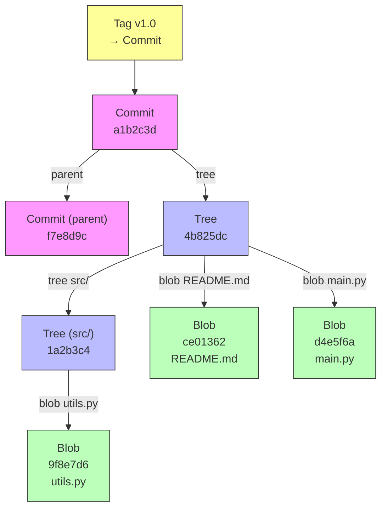

# Глава 47. Git как файловая система

## Введение

Git — не просто система контроля версий. Под капотом это **контент-адресное хранилище** (content-addressable storage), построенное поверх обычной файловой системы. Каждый объект идентифицируется SHA-1 хэшем своего содержимого — точно так же, как inode идентифицирует файл в ext4.

Изучение внутренностей Git — отличный способ понять, как можно реализовать файловую систему в user space, используя только файлы и директории.

---

## 47.1 Объектная модель Git

Git хранит всё в `.git/objects/` — плоское хранилище, где имя файла = хэш содержимого.

### Схема объектов



### Четыре типа объектов

| Объект | Аналог в ФС | Назначение |
|--------|-------------|------------|
| **blob** | inode + data blocks | Содержимое файла (без имени!) |
| **tree** | directory entry | Список имён → blob/tree |
| **commit** | snapshot / checkpoint | Указатель на tree + метаданные |
| **tag** | — | Именованный указатель на commit |

```bash
# Инспекция объектов
$ git cat-file -t HEAD                # Тип: commit
$ git cat-file -p HEAD                # Содержимое коммита
tree 4b825dc642cb6eb9a060e54bf899d15f...
parent a1b2c3d4e5f6...
author Alice <alice@example.com> 1700000000 +0300
committer Alice <alice@example.com> 1700000000 +0300

Initial commit

$ git cat-file -p HEAD^{tree}          # Содержимое корневого tree
100644 blob a1b2c3d...    README.md
100644 blob d4e5f6a...    main.py
040000 tree b7c8d9e...    src/
```

### Blob — файл без имени

В отличие от обычной ФС, blob хранит **только содержимое**. Имя файла живёт в tree-объекте. Это значит, что два файла с одинаковым содержимым — это один blob:

```bash
$ echo "Hello" > a.txt && echo "Hello" > b.txt && git add .
$ git ls-tree HEAD
100644 blob ce013625...  a.txt
100644 blob ce013625...  b.txt   # Тот же хэш — один blob на диске
```

Это **автоматическая дедупликация** — в ext4 для этого пришлось бы вручную создавать hard links.

### Tree — директория

Tree-объект — это список записей `(mode, type, hash, name)`, точный аналог directory entry в UNIX:

```
$ git ls-tree HEAD
100644 blob ce013625...  README.md      # обычный файл
100755 blob f7a8b9c...  script.sh      # исполняемый файл
040000 tree 1a2b3c4...  src/            # поддиректория
120000 blob 5d6e7f8...  link.txt        # символическая ссылка
```

Обратите внимание на mode — это те же UNIX permissions (`100644` = `-rw-r--r--`).

---

## 47.2 Контент-адресация

### Как вычисляется хэш

```bash
# Git хэширует так:
$ echo -n "blob 6\0Hello\n" | sha1sum
ce013625030ba8dba906f756967f9e9ca394464a

# Формат: "<тип> <размер>\0<содержимое>"
# Это можно проверить:
$ echo "Hello" | git hash-object --stdin
ce013625030ba8dba906f756967f9e9ca394464a
```

### Свойства контент-адресации

| Свойство | Описание |
|----------|----------|
| **Дедупликация** | Одинаковое содержимое → один объект |
| **Целостность** | Изменение данных → изменение хэша → обнаружение |
| **Иммутабельность** | Объекты не изменяются, только создаются новые |
| **Кэшируемость** | Хэш = вечный ключ кэша |

!!! note "SHA-1 → SHA-256"
    Git постепенно переходит на SHA-256 (`git init --object-format=sha256`).
    Это не меняет архитектуру — только длину хэша.

---

## 47.3 Хранение на диске

### Loose objects

Только что созданные объекты хранятся как отдельные zlib-сжатые файлы:

```
.git/objects/
├── ce/
│   └── 013625030ba8dba906f756967f9e9ca394464a  ← blob "Hello\n"
├── 4b/
│   └── 825dc642cb6eb9a060e54bf899d15f...        ← tree
├── info/
└── pack/
```

Первые 2 символа хэша = директория, остальные = имя файла. Это **fanout** — тот же приём, что в ФС для распределения нагрузки по директориям.

### Packfiles — дельта-сжатие

При `git gc` loose-объекты упаковываются в **packfile**:

```bash
$ git gc
$ ls .git/objects/pack/
pack-abc123.idx    # Индекс: хэш → offset в pack
pack-abc123.pack   # Данные: объекты + дельты

$ git count-objects -vH
count: 0           # Все loose-объекты упакованы
in-pack: 1234
size-pack: 12.34 MiB

# Инспекция packfile
$ git verify-pack -v .git/objects/pack/*.idx | head
```

Внутри packfile похожие блобы хранятся как **база + дельта** (дифф). Это аналог дедупликации на уровне ФС (ZFS block-level dedup, Btrfs extent sharing), но реализованное в user space.

| Уровень | Механизм | Где |
|---------|----------|-----|
| Блочная ФС | Block-level dedup | ZFS, Btrfs |
| Git loose | Файловая дедупликация по хэшу | `.git/objects/` |
| Git packfile | Дельта-сжатие между версиями | `.git/objects/pack/` |

---

## 47.4 Reflog и ветки — «файловая система поверх файловой системы»

```
.git/
├── HEAD                    # Текущая ветка (символическая ссылка!)
│                           # ref: refs/heads/main
├── refs/
│   ├── heads/
│   │   ├── main            # Файл: содержит хэш commit
│   │   └── feature         # Файл: содержит хэш commit
│   ├── tags/
│   │   └── v1.0            # Файл: содержит хэш tag/commit
│   └── remotes/
│       └── origin/
│           └── main        # Файл: хэш последнего известного commit
└── logs/                   # Reflog — история перемещений HEAD
    ├── HEAD
    └── refs/heads/main
```

HEAD — это буквально **символическая ссылка** (текстовый файл с `ref: refs/heads/main`), а ветки — это файлы с 40-символьным хэшем. Вся система ссылок Git построена на обычных файлах.

---

## 47.5 Git vs традиционная ФС

| Аспект | ext4/XFS | Git |
|--------|----------|-----|
| Адресация | inode number (позиционная) | SHA-1 хэш (контентная) |
| Дедупликация | Нет (или ручная через hard links) | Автоматическая |
| Версионирование | Нет (нужен LVM snapshot) | Встроенное (commits) |
| Целостность | Журнал + fsck | Хэши на каждый объект |
| Имена файлов | В directory entry | В tree-объекте |
| Мутабельность | Файлы изменяемые | Объекты иммутабельные |
| Сжатие | Прозрачное (Btrfs, ZFS) | zlib (loose) + delta (pack) |
| Права доступа | Полный UNIX mode | Только 644/755/symlink |

---

## 47.6 Другие контент-адресные системы

Git — не единственный пример. Идея контент-адресации оказалась настолько мощной, что её используют повсюду:

| Система | Как использует |
|---------|---------------|
| **Docker** | Image layers — каждый слой = tar-архив, адресуемый по SHA-256 |
| **Nix/Guix** | `/nix/store/<hash>-<name>` — пакеты адресуются по хэшу входных данных |
| **IPFS** | Распределённая ФС: файлы адресуются по CID (content identifier) |
| **OSTree** | «Git для ОС» — деплой ОС через контент-адресный репозиторий |
| **Perkeep** (ex-Camlistore) | Персональное хранилище с контент-адресацией |
| **Mercurial (revlog)** | Вариация на тему: revlog хранит дельты в append-only файлах |

```bash
# Docker: инспекция слоёв образа
$ docker image inspect alpine --format '{{.RootFS.Layers}}'
[sha256:ded7a220bb05... sha256:a1b2c3d4e5f6...]

# Nix: пакет адресуется хэшем
$ ls /nix/store/ | head -3
0123abcd-python3-3.11.5
4567efgh-gcc-13.2.0
89abcdef-glibc-2.38
```

---

## 47.7 Практические примеры

### Восстановление «удалённого» файла

В Git объекты **никогда не удаляются** сразу (до `git gc --prune`):

```bash
# "Удалили" файл и закоммитили
$ git rm important.txt && git commit -m "oops"

# Но blob всё ещё на диске!
$ git fsck --unreachable --no-reflogs
unreachable blob a1b2c3d4...

# Восстанавливаем
$ git cat-file -p a1b2c3d4 > important.txt
```

### git diff — сравнение через дерево объектов

```bash
# git diff сравнивает деревья, а не файлы напрямую
$ git diff HEAD~1 HEAD --stat
 README.md | 5 +++--
 main.py   | 10 ++++++++++
 2 files changed, 13 insertions(+), 2 deletions(-)

# Под капотом: сравнение двух tree-объектов
$ git diff-tree -r HEAD~1 HEAD
:100644 100644 abc123... def456... M  README.md
:000000 100644 000000... 789abc... A  main.py
```

### Исследование .git вручную

```bash
# Размер репозитория
$ du -sh .git/
152M    .git/

# Самые большие объекты в packfile
$ git verify-pack -v .git/objects/pack/*.idx \
  | sort -k 3 -n -r | head -5

# Найти, какой файл соответствует blob
$ git rev-list --all --objects | grep <hash>
```

---

## 47.8 Упражнения

!!! example "Практика"
    **Задание 1.** Создайте два файла с одинаковым содержимым и убедитесь, что Git создаёт один blob:
    ```bash
    $ echo "test" > a.txt && echo "test" > b.txt
    $ git add . && git ls-files -s
    ```

    **Задание 2.** Исследуйте packfile: выполните `git gc`, затем `git verify-pack -v` и найдите дельта-цепочки (объекты с `depth > 0`).

    **Задание 3.** Реализуйте минимальный контент-адресный store на Python:
    ```python
    import hashlib, zlib, os

    def store(data: bytes, store_dir=".mystore"):
        h = hashlib.sha1(data).hexdigest()
        path = os.path.join(store_dir, h[:2], h[2:])
        os.makedirs(os.path.dirname(path), exist_ok=True)
        with open(path, "wb") as f:
            f.write(zlib.compress(data))
        return h

    def retrieve(h: str, store_dir=".mystore"):
        path = os.path.join(store_dir, h[:2], h[2:])
        with open(path, "rb") as f:
            return zlib.decompress(f.read())
    ```

    **Задание 4.** Сравните `git cat-file -p` и `debugfs` (ext4): найдите параллели между объектами Git и структурами ФС.

!!! tip "Следующая глава"
    Ещё одна «файловая система поверх файловой системы» — **Plan 9: всё есть файл** → [Plan 9](48-plan9.md)
